# Contents
Module 1 : <a href="https://github.com/SAP-samples/build-apps-enablement/blob/main/BuildShow/251_TA_BTP-Build_Code_Using-Joule/251-1_Build_Code.md">Build Code </a>
Module 2 : <a href="https://github.com/SAP-samples/build-apps-enablement/blob/main/BuildShow/251-A_TA_BTP-Build_Code_ProcessAutomation/251A_Build_Process_Automation_optional.md"><b>Build Process Automation</b></a> 
Module 3 :<a href="https://github.com/SAP-samples/build-apps-enablement/blob/main/BuildShow/252_TA_BTP-Build_Code_Build-Apps/252-0_Build_Apps.md"> Build Apps</a> 

# Module 2 

### Create an SAP Build Process Automation project from a template

1. Click <a href ="https://sap-build-academy-devtest.eu10.build.cloud.sap/lobby"> Lobby</a> to open the entry page of SAP Build Process Automation.
 <i>Verify once that you are logged in with the right user id and copy the id for use later. </i>  
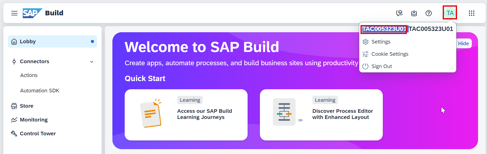

2. In the Lobby, use the search field to look for the project named PM-Bonus Redemption Process(EU). Hint: Switch to the options ‘All projects’ to find the template project.   
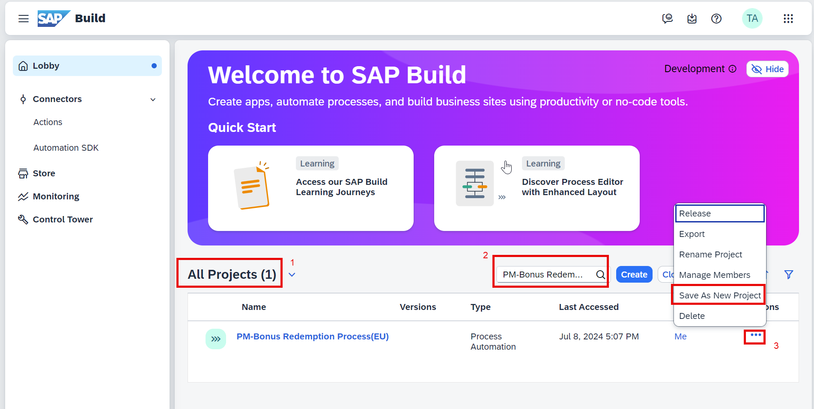

3. Prefix the user id (previously copied in step 1.1) and ‘Save As New’ project.  
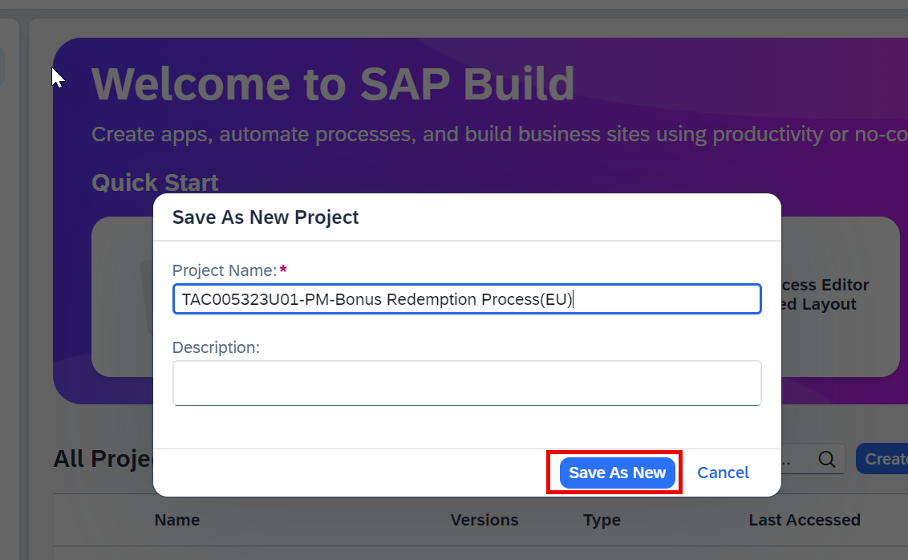

4. Open the project and go to the Redemption process, expand, and explore it.  
<b><u>NOTE</b></u>:  This process demonstrates a simple workflow that adds the conditional logic to decline a 'redemption only' purchase and approve any redemption only with a minimum value of the purchase. Here, the Decline and Approval is done via a Form notification.   
<i><b><u>Disclaimer</u></b>: The use case is intentionally kept simple for purpose of this tutorial to showcase the decline as a notification only. The redemption would still pass as we have not built any complex logic around it yet.  </i>
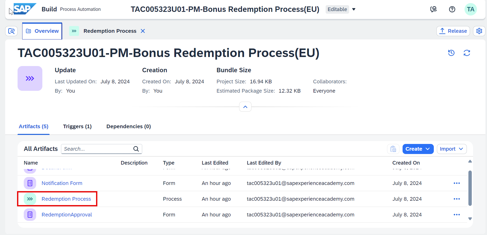  
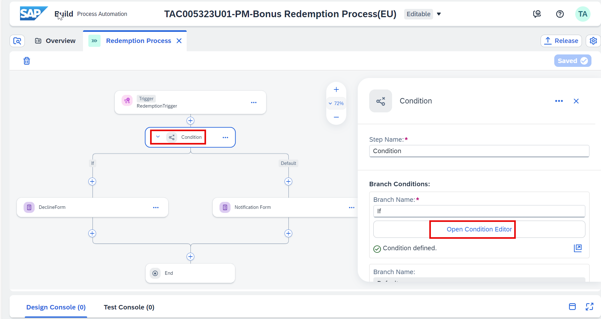  
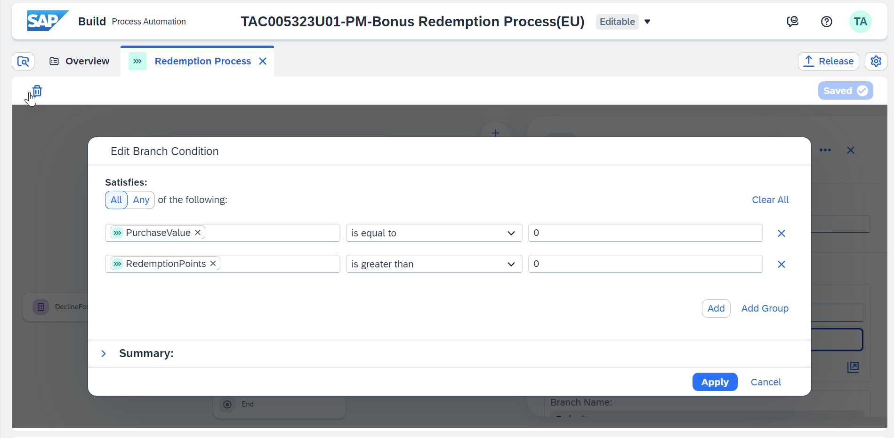

5. In the DeclineForm (General tab -> scroll to Users) change the mail id to <your user-id (in lower case only)>@sapexperienceacademy.com. eg:tac005323u01@sapexperienceacademy.com  
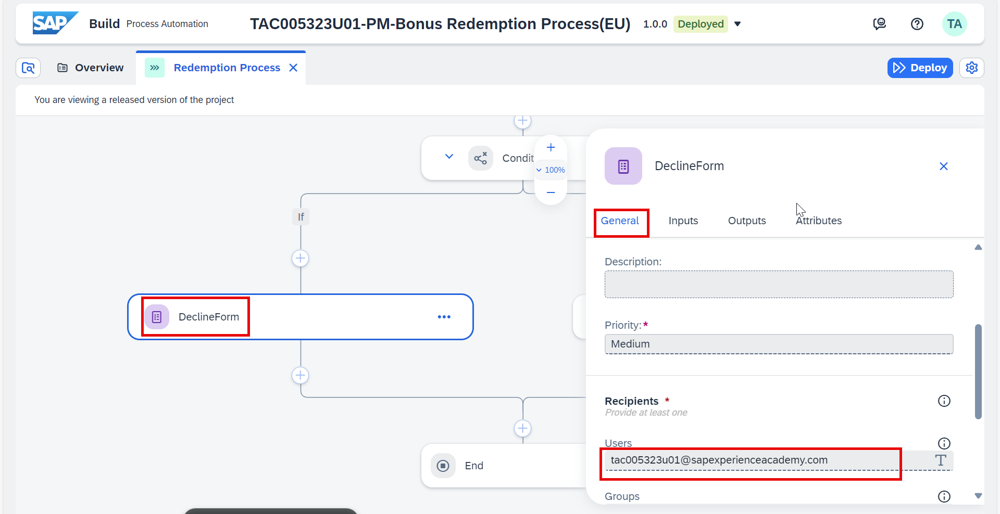

6. In the Notification Form (General tab -> scroll to Users) change the mail id to <your user-id (in lower case only)>@sapexperienceacademy.com   
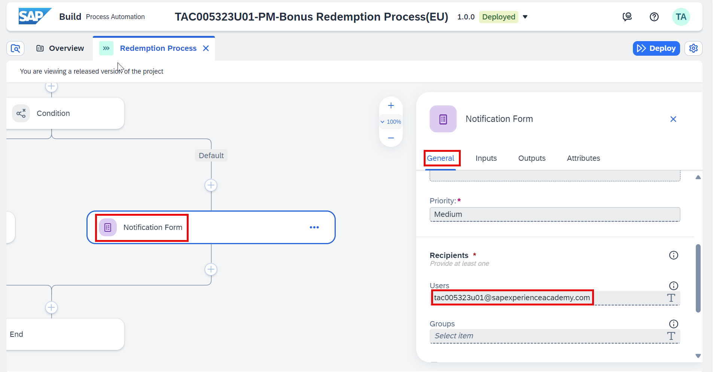

7. Save and Release the project with default settings  
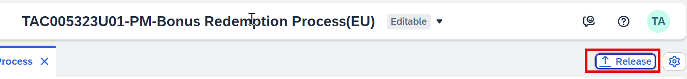

8. Deploy the project in Public environment.   
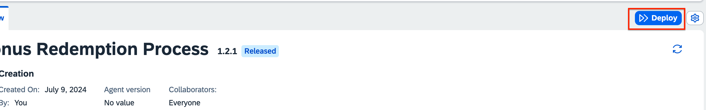

9. Return to the SAP Lobby and Publish this process to SAP Build Library.   
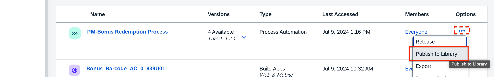

10. Test the process.
    1. Go to Monitoring tab .    
    2. Select Processes and Workflows   
    3. Search for your process.    
    4. Click on **Start New Instance** and replace it with the correct json object and click on **Start New Instance and Close**:     
       a. To trigger the Notification Form 
       {
        "redemption": {
            "CustomerNumber": "ABC",
            "RedemptionPoints": 100,
            "PurchaseValue": 10
        }

    }.   
       (OR)
        b. To trigger the Decline Form 
       {
        "redemption": {
            "CustomerNumber": "ABC",
            "RedemptionPoints": 100,
            "PurchaseValue": 0
        }

    }.  

11. Click on Start
12. Integration of this process with SAP Build Apps is not covered as part of this exercise. Refer to the blog post with this information for some inspiration to extend the SAP Build Apps to trigger this process: https://community.sap.com/t5/sap-builders-blog-posts/what-s-new-in-sap-build-seamless-integration-of-processes-and-apps/ba-p/13675739

**[Next Module 3: SAP Build Apps](../252_TA_BTP-Build_Code_Build-Apps/252-0_Build_Apps.md) >**

 
