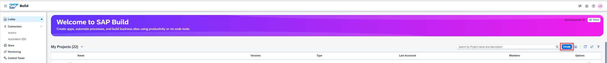
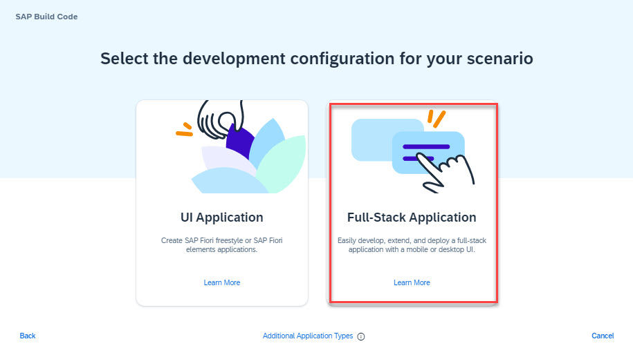
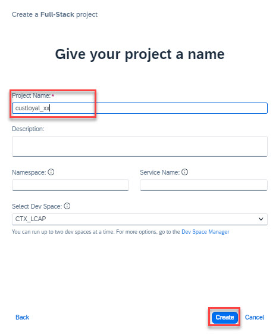

# Contents
Module 1 : <a href="https://github.com/SAP-samples/build-apps-enablement/blob/main/BuildShow/251_TA_BTP-Build_Code_Using-Joule/251-1_Build_Code.md"><b>Build Code</b> </a>
Module 2 : <a href="https://github.com/SAP-samples/build-apps-enablement/blob/main/BuildShow/251-A_TA_BTP-Build_Code_ProcessAutomation/251A_Build_Process_Automation_optional.md">Build Process Automation</a> 
Module 3 :<a href="https://github.com/SAP-samples/build-apps-enablement/blob/main/BuildShow/252_TA_BTP-Build_Code_Build-Apps/252-0_Build_Apps.md"> Build Apps</a> 

# Module 1 - Unit 1: SAP Build Code  

## Introduction into SAP Build Code

SAP Build Code is a turnkey development environment that combines runtime and design-time capabilities with built-in solutions for DevOps and Application Lifecycle Management.

**Benefits of SAP Build Code**

- Achieve a clean core by developing side-by-side extensions with SAP Build Code
- Optimize developer efficiency with generative AI, productivity tools, and application lifecycle management
- Enables developers to build and extend powerful end-to-end business applications with programming language of choice 
- Leverage interoperability between classic development and low-code development tools 

**Key capabilities of SAP Build Code**

- Differentiate cloud solution with stable and future-proof foundation, solution becomes future proof and works with different editions of S/4HANA, and quality assurance options included
- Enable developers to code faster and smarter, code generation based on generative AI, Ease of Application Lifecycle Management 
- Application and extension development, Integrate with SAP and non-SAP systems
- Easy access for all types of developers with centralized Lobby, for Fusion Development

## Creation of a new project

Here is a video tutorial you can follow for this step <a href="https://video.sap.com/media/t/1_owke7d4f">Build Code: Create a new project</a>

## Access Lobby

The starting point for this tutorial is the Lobby of SAP Build, the central entry point for all SAP Build products.

1. Open the lobby: https://sap-build-academy-devtest.eu10.build.cloud.sap/lobby
(formerly: https://lcapteched.eu10.build.cloud.sap/lobby) 
2. Ask the instructors for the username and password

## Create a new project

1. Click on **Create** button

2. Select **Build an Application**

3. Select **SAP Build Code**

4. Select **Full-Stack Application**

5. Type in your Project Name in the following format: `Customer_Loyal_{link|userId}`
**Comment by Marc, better name it custloyal_userID otherwise there could be a problem that the name is too long during the deployment**
6. Click the **Create** button.

> The creation of the project can take up to 1 minute.

**[Next Module 1 - Unit 2: Create Data Entities with Joule](./251-2_Create_Data_Entities_with_Joule.md) >**
