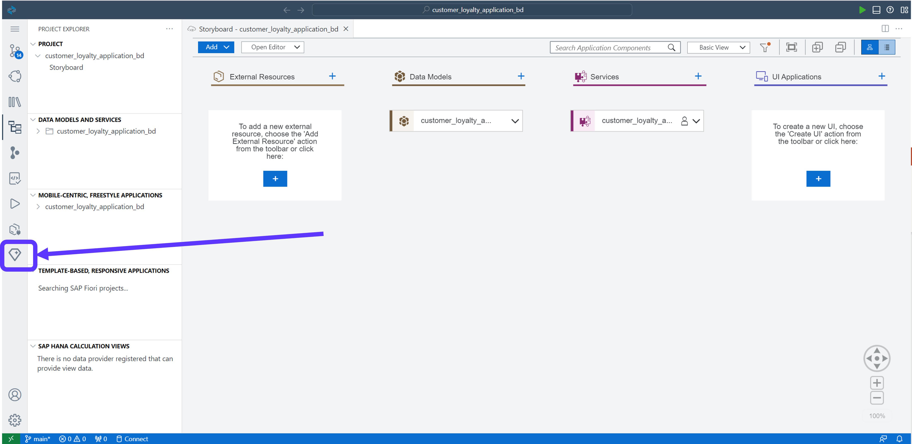
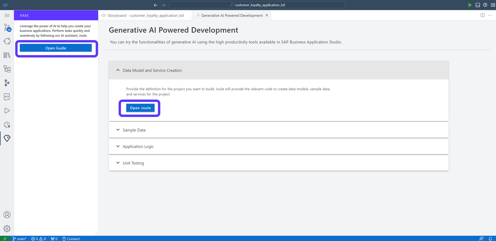
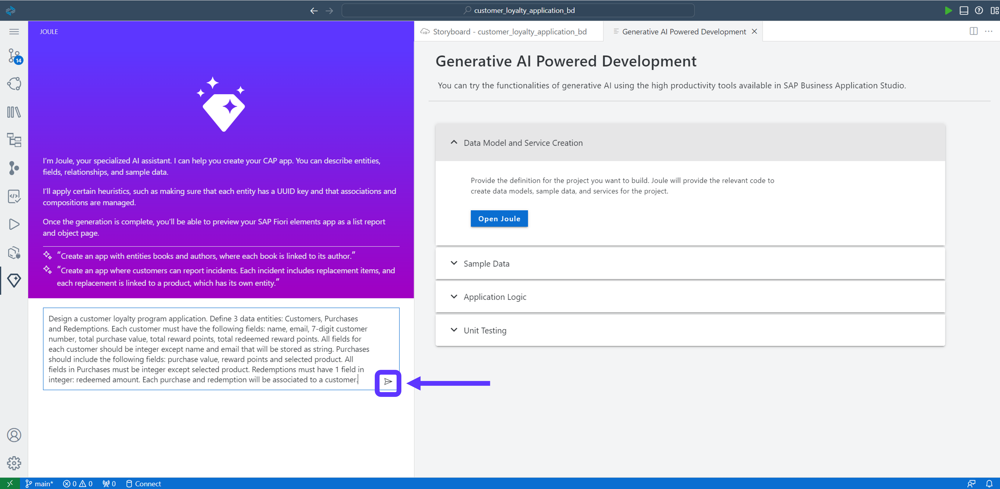
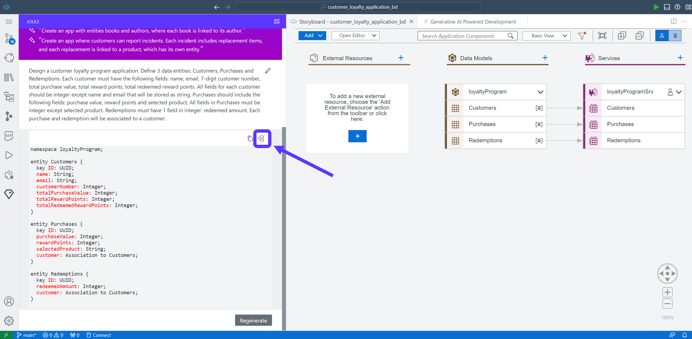

# Module 1 - Unit 2: Create Data Entities with Joule  


## Create Data Entities
Here is a video tutorail for this unit <a href="https://video.sap.com/media/t/1_sm76hg3f">Create data entities with Joule</a>


1. After the project is created click on the project name in the Lobby. SAP Business Application Studio will be opened. Now go directly to the digial assistant Joule. 



2. Click on **Open Guide**. We will start with the Data Model and Service Creation. Therefore, expand the panel and press on the **Open Joule** button.



3. Let's start with the creation of the Data Model and the Services. Therefore, we are using the generative AI capabilities to generate the code. Of course we could also create the Data Model visually from the Storyboard or by writing the code manually. In this tutorial we want to create a customer loyality program application. Customer can get bonus points for there purchases of products and can redeem these points. Please copy the Prompt below and send it to Joule to generate the data model and services.

> ## Prompt for Data Entity Creation
>
```code
Design a customer loyalty program application. Define 3 data entities: Customers, Purchases and Redemptions. Each customer must have the following fields: name, email, 7-digit customer number, total purchase value, total reward points, total redeemed reward points. All fields for each customer should be integer except name and email that will be stored as string. Purchases should include the following fields: purchase value, reward points and selected product. All fields in Purchases must be integer except selected product. Redemptions must have 1 field in integer: redeemed amount. Each purchase and redemption will be associated to a customer.
```



The code should be generated now below your prompt.

4. Accept the Code by clicking the Accept icon (see screenshot below).

Depending on the server, it can take up to 2 minutes for Joule to create the data models and services for you.<br>
Once you accept the code, you will see the update on the right side under Storyboard tab<br>



**[Next Module 1 - Unit 3: Enhance Sample Data with Joule](./251-3_Enhance_Sample_Data_with_Joule.md) >**
