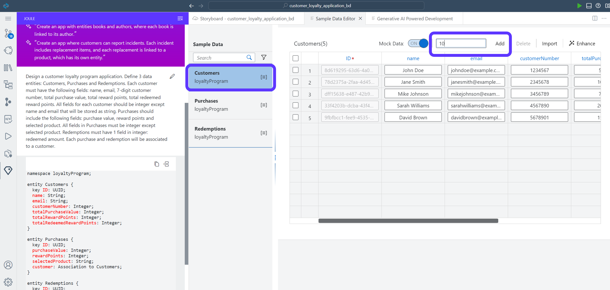
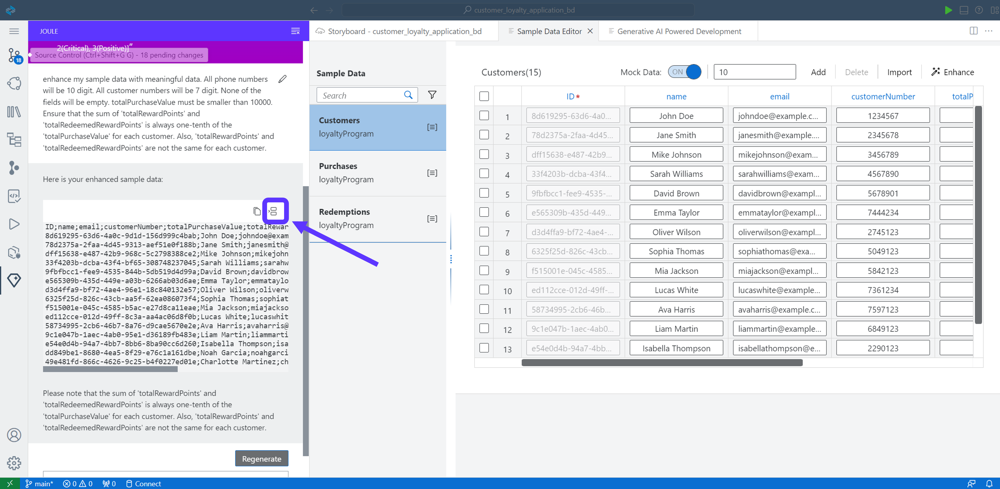

# Module 1 - Unit 3: Enhance Sample Data with Joule  

Joule created the Data Model and Servicesand additionally some sample data.
We will use Joule to enhance the sample data.

## Enhance Sample Data

1. Open the the Sample Data editor in the Storyboard by selecting **Open Editor** -> **Sample Data**


2. Select **Customers** data entity. Add 5 more rows to the entity and push **Add** button




3. Click **Enhance**. This will reopen Joule to modify the sample data. Then, use the following Prompt in Joule:

```code
Enhance my sample data with meaningful data. Any phone numbers must be 10 digits. All customer numbers must be 7 digits and one customer must use the customer number 1200547. No fields may be empty. Total purchase value must be smaller than 10000 und unround. Total reward points and total redeemed reward points both must be unround and different and always sum to one-tenth of the total purchase value for each customer.
```


 
4. You can see the customer names, email adresses and purchases are created. Accept the new Sample Data created by Joule. 



5. Verify in the customer list that one customerNumber was changed to **1200547**, if not change one customer number manually to **1200547**. <br>
**This step is needed for the demo purpose. Later in the exercise, we will be scanning a Customer Loyalty Card that will have a barcode with this number.**


6. Let's continue with sample data for the Purchases. Select the **Purchases** data entity. Add 10 rows to the entity and push **Add** button


7. Click **Enhance**. Then, use the following prompt in Joule:

```code
Enhance my sample data with meaningful data. Purchase value must be between 50 and 1000. Reward points is always one-tenth of the purchase value.
```


8. Accept the Sample Data created by Joule. 


9. Select Redemptions data entity. Add 5 more rows to the entity and push **Add** button


10. Click **Enhance**. Then, use the following prompt in Joule:

```code
Ensure that each redeemed amount is arbitrary and between 10 and 100.
```


11. Accept the changes proposed by Joule. 


**[Next Module 1 - Unit 4: Create Backend Logic with Joule](./251-4_Create_Backend_Logic_with_Joule.md) >**
