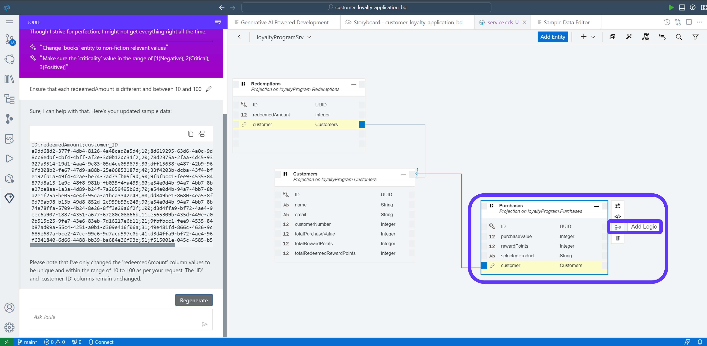
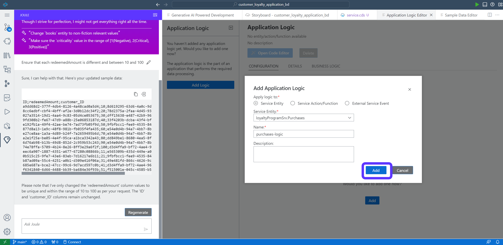
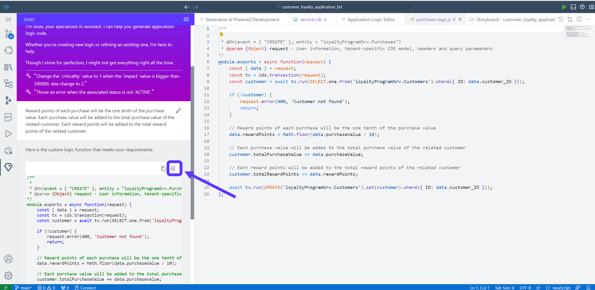
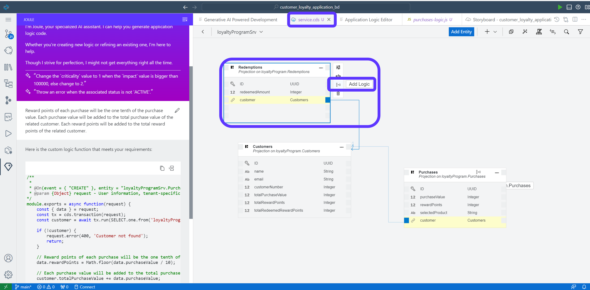
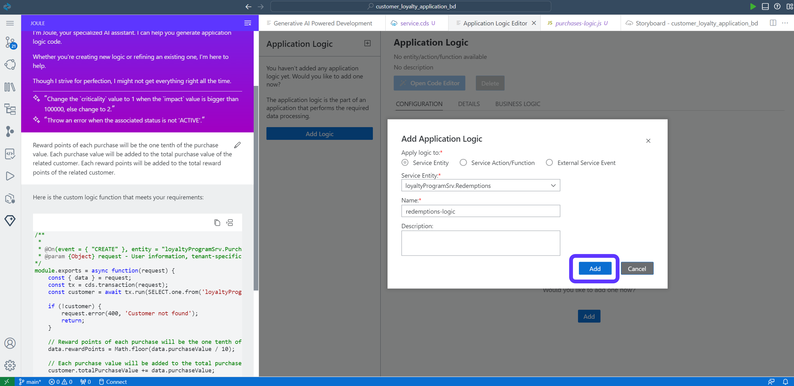
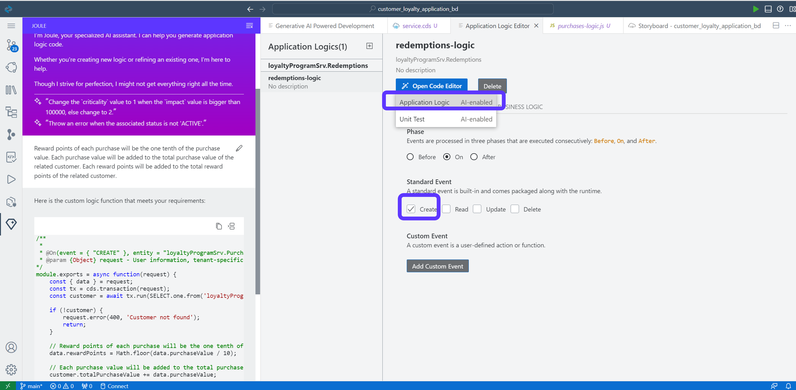
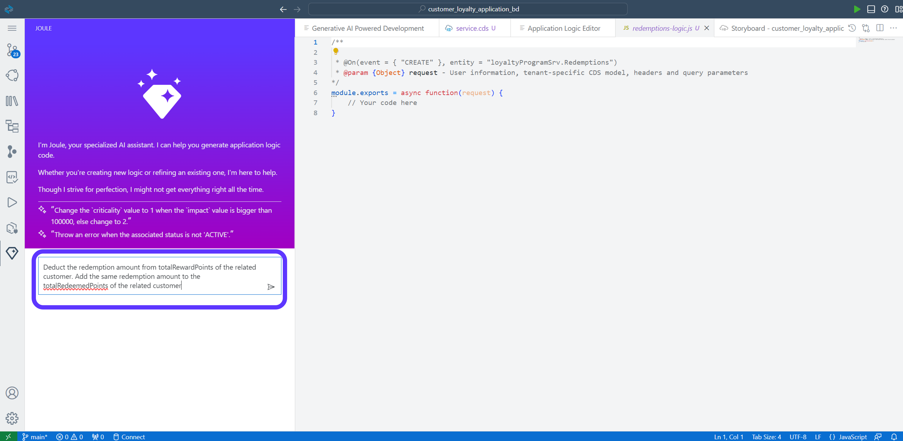

# Module 1 - Unit 4: Create Backend Logic with Joule  

We already have created the entities, services, and sample data with Joule. Now we want to create some logic for our app. We would like to calculate the bonus points automatically when a customer makes a purchase. Additionally, we want to provide logic for customers to redeem these bonus points.


## Backend Logic

1. Go to Storyboard. Click on one of the entities under Services and Open in Graphical Modeler


2. Select Purchases entity by clicking on the title. Then, click on Add Logic
   Note: if you can not see the Purchases entity you may have to zoom out the view.



3. Leave the default value and click on **Add**



4. Under the **Standard Event** select **Create**. That means this logic will be automatically executed if a new purchase is done.
 Afterwards, go to **Application Logic** under **Open Code Editor**. This will open Joule again to create the logic for us.


5. Use the following prompt in Joule to create a backend logic:

```code
Reward points of each purchase will be the one tenth of the purchase value. Each purchase value will be added to the total purchase value of the related customer. Each reward points will be added to the total reward points of the related customer.
```


So Joule created now following logic:
 - Check if the customer exists
 - calculates the rewardPoints from the purchase value
 - updates the total purchase value and the total reward points in the customers entity

6. Accept the code created by Joule. 




> **Note:**
> Joule typically generates different code each time for the same prompt. So if yours differs, it is completely fine as long as it does the same job. If there are no obvious errors, just keep working on the exercise. If you are unsure, you can have Joule try again by clicking **Regenerate**.  

7. Now let's look at the Redemptions. Go to back service.cds tab. Select Redemptions entity by clicking on the title. Then, click on Add Logic



8. Click on **Add**



9. Select **Create**. Then, choose **Application Logic** under **Open Code Editor**.



10. Use the following Prompt in Joule to create a backend logic:

```code
Deduct the redemption amount from the customer's total reward points and add that to his total redeemed points.
```



11. Accept the code created by Joule. 


Have a closer look at the generate code. It even includes ssome checks if the customer has enough points for the redemption.


> **Note:**
> Joule might generate different codes for the same prompt. So, you might have a different code for the backend logic which is completely fine if it does the same job. You can ignore this and keep working on the exercise.  

12. Go back to Storyboard and open Service Center


**[Next Module 1 - Unit 5: Add External Data Resource](./251-5_Add_External_Data_Resource.md) >**
