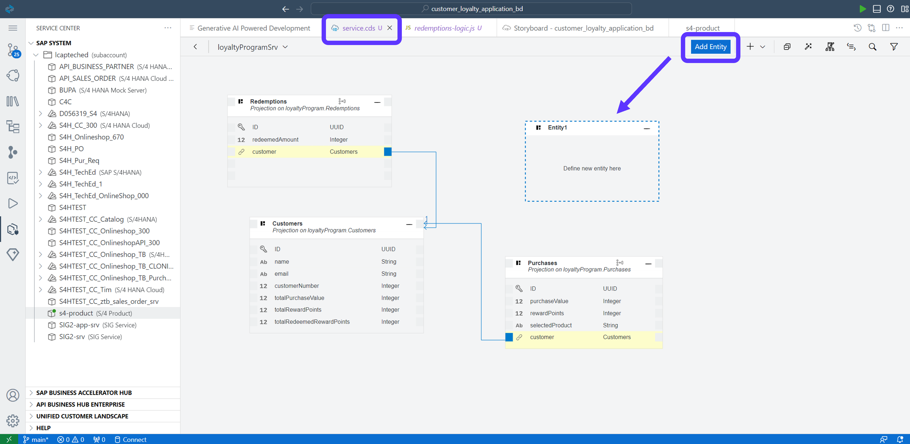
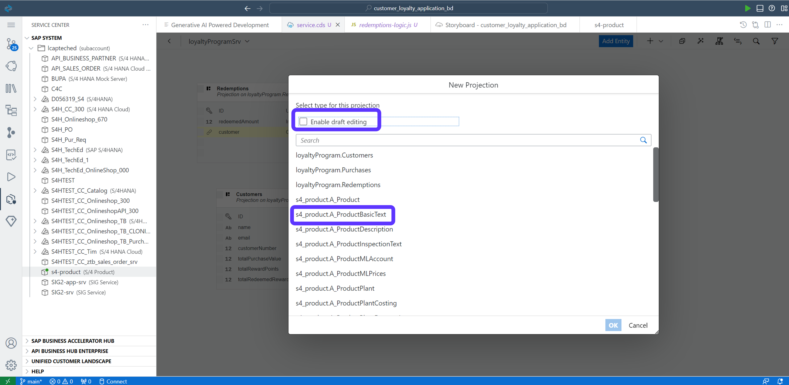

**[Previous Module 1 - Unit 4: Create Backend Logic with Joule](./251-4_Create_Backend_Logic_with_Joule.md) >**
# Module 1 - Unit 5: Add External Data Resource  

In this part of the tutorial we will connect to an S4/HANA to get all the related product data.

Here is a video tutorial for this unit <a href="https://video.sap.com/media/t/1_8uqgkn7q">Add External Data Source</a>

1. Therefore go to **SAP System** in the Service Center and find the BTP destination **S4HANA_Joule_Product** and click on **Add to CAP**

**Note:** This destination is already configured by your subaccount admin. The destination is connected to a sandbox API from SAP Business Accelerator Hub. For more information about the API go to the SAP Business Accelerator Hub: https://api.sap.com/api/API_PRODUCT_SRV/overview

2. Go to Storyboard and check if the External Resource got updated

3. Go to service.cds tab and Add Entity

You can drop the new entity anywhere 

4. Select the data entity: **s4_product.A_ProductBasicText**

**[Next Module 1 - Unit 6: Admin UI](./251-6_AdminUI.md) >**
