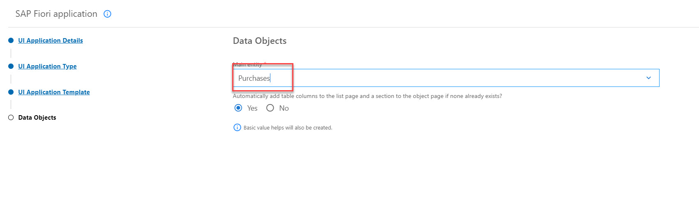
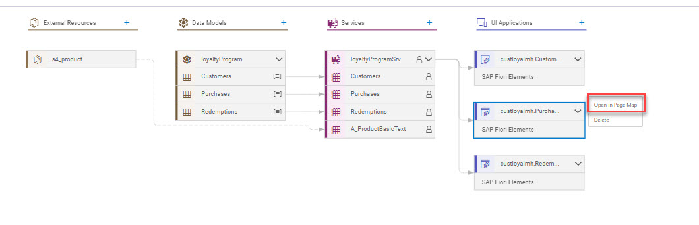
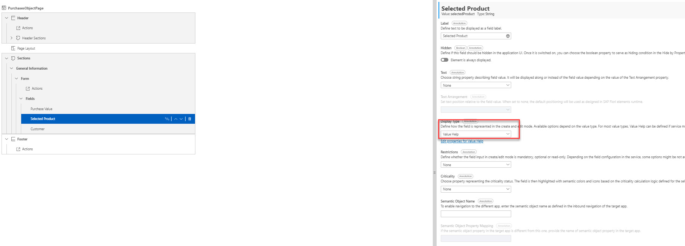

**[Previous Module 1 - Unit 5: Add External Data Resource](./251-5_Add_External_Data_Resource.md) >**
# Module 1 - Unit 6: Admin UI

To Display and test the content we have already created for the customer loyalty program, we also create some Fiori Elements UIs.

Here is a video tutorial for this unit <a href="https://video.sap.com/media/t/1_wtxp2s27">UI Application</a>

1. Go to back to the Storyboard and add a first UI application.

2. We will start with the user interface for the data entity Purchases.  Enter the following values:
Display name: Purchases 
Description: Manage Purchases 
Data Source: <"your project name">  

3. As we are using the browser, we will select **Template-Based Responsive Application** as UI Application type.

4. And as an UI Application Template select **List Report Page**

6. As a last step select the **Purchases** entity as Main entity and complete the setup. The page will be created now.

You can repeat the same with the customer and redemption entity.

Customer:
  - Display name: Customers
  - Description: Manage Customers
  - UI Application type: Template-Based Responsive Application
  - UI Application Template: List Report Page
  - Main Entity: Customers

Redemptions:
  - Display name: Redemptions
  - Description: Manage Redemptions
  - UI Application type: Template-Based Responsive Application
  - UI Application Template: List Report Page
  - Main Entity: Redemptions

7. Now we are going to modify the UI for the purchases a bit. We will include the products from S4 as value help in the purchases and hide some fields. Therefore go back to the Storyboard, select the Purchases Ui and open it in the Page Map.

8. We want to modify the Object page. Therefore click on the **edit** icon

9. In the Sections, expand **General Information** then expand **Form** and then expand **Fields**. Afterwards it will look like this:

10. The reward points are calculated automatically by the logic Joule has created for us. Therefore we delete the **Reward Points** field by pressing the trash bin icon next to it and confirm the deletion.

11. We want to select the Products from S4 for the purchases. Therfore select the field **Selected Product** and change the Display Type in the properties on the right side to **Value Help**. 
Set the following:
  - Label: Product
  - Value Source Entity: A_ProductBasicText
  - keep the rest as it is and press apply

You can now preview the UI. here is a video tutorial to preview the backend app you created <a href="https://video.sap.com/media/t/1_eht1hhe4">Preview</a>.

**[Next Module 1 - Unit 7: Preview](./251-7_Preview.md) >**
