# Module 1 - Unit 7: Deployment  

The last step in SAP Build Code is to deploy the application to CloudFoundry. This includes also that destinations are created automatically that the ODATA services can be consumed also by other tools like SAP Build Apps.

But before the deployment, we are preparing the services that the can be easily consumed in SAP Build Apps. Therefore we need to add the projections of the data entity without draft editing.

1. Go to the Storyboard tab and click the **+** icon next to **Services**

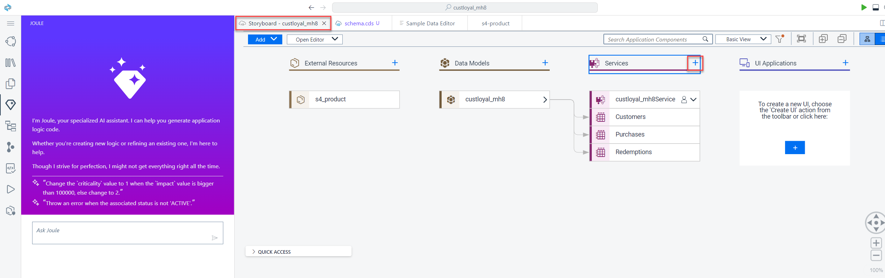

2. Select the **Customers** entity and disable draft editing.

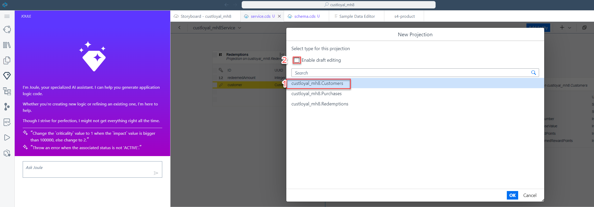

3. Rename the projection to **CustomerND** and click **Add Entity** to also add Purchases and Redemptions without draft editing. Rename Purchases to **PurchasesND** and Redemptions to **RedemptionsND**.

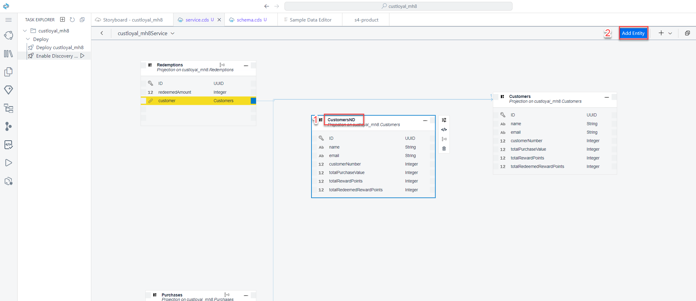

4. Afterwards it should look like this:

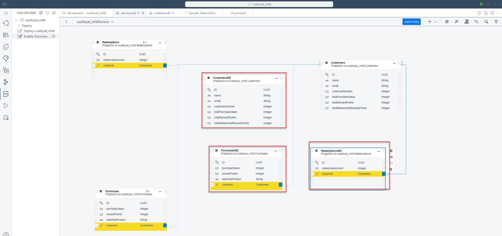

5. Now everything is prepared. For the deployment go to Task Explorer and click on the Play icon next to **Enable Discovery and Deploy** option

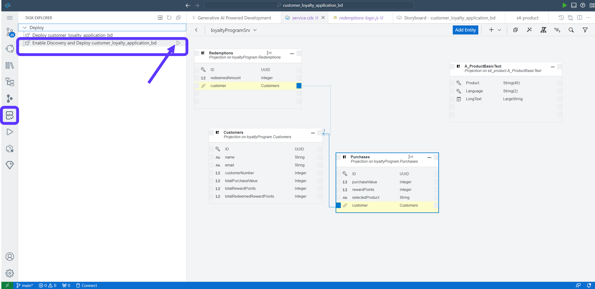

6. Check if the task has launched in the terminal

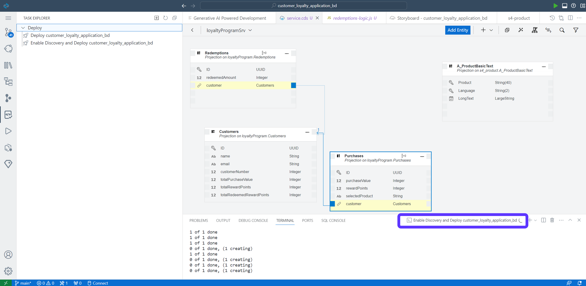

7. During the deployment a new page will be opened to to sign into CloudFoundry. Click on *Open a new browser page to generate your SSO passcode*

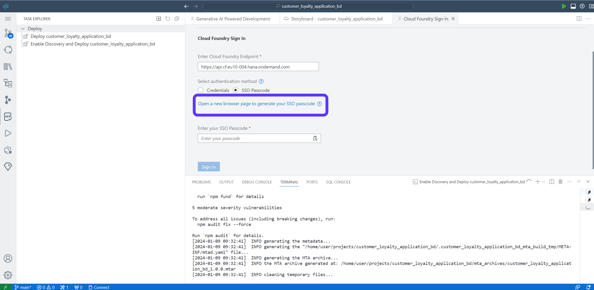

8. Copy the Temporary Authentication Code. 

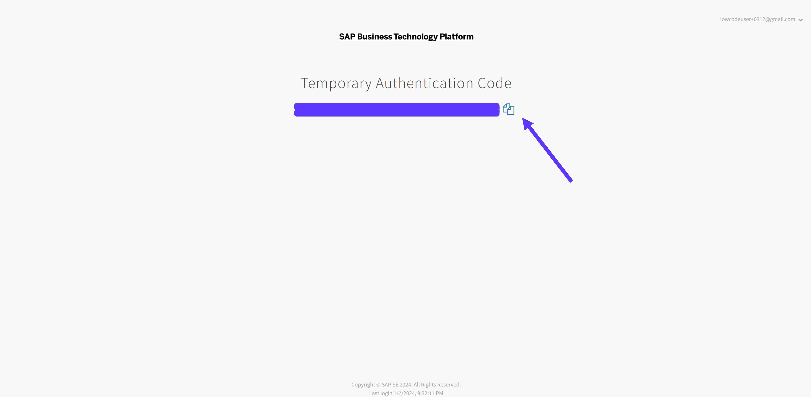

9. Paste the Code and Sign In.

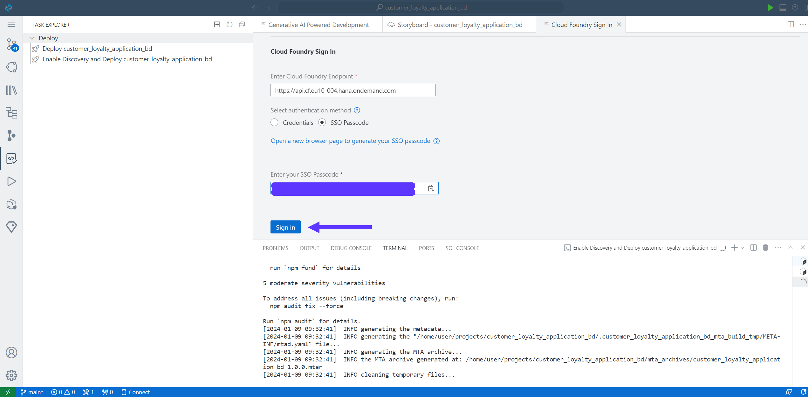

10. Select the Organization and Space. Then, press **Apply**

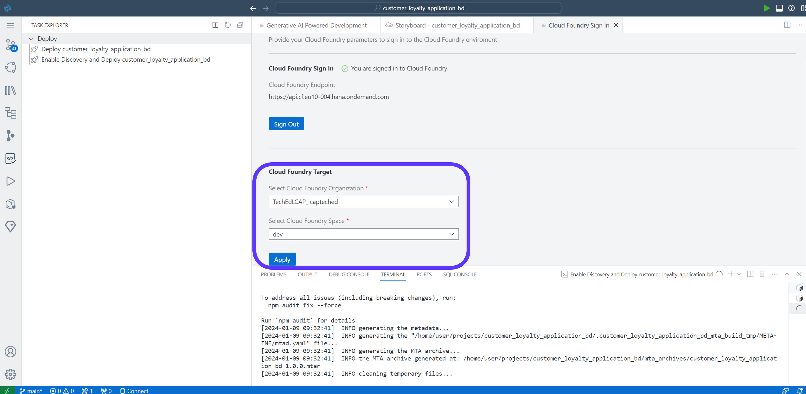

After the successful deployment you will find the link of the deployed application in the terminal. Use Ctrl+click to try it out!

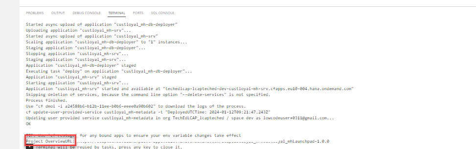

 Explore the UIs that you have created and create a new purchase in the Purchases UI.
 
 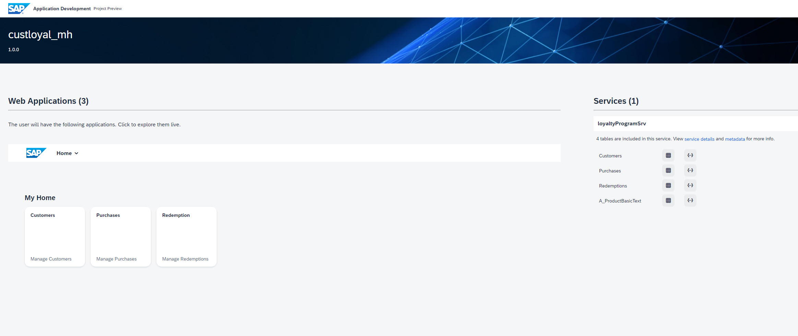
 

•	Open the Customers app

•	Choose a customer and click into the details for that customer

•	Note the values kept for this customer coming from the sample data

•	Go back to the Project Preview 

•	Open the Purchases app

•	Now we will simulate making a purchase using the Built-in Fiori Elements app

•	Click Create

•	Enter 1000 for the Purchase Value and choose your customer and product before

•	When we create this purchase, our logic should execute and calculate the reward points, so we leave this blank. Go ahead and create the Purchase.

•	Verify that the Reward Points were properly calculated

•	Switch back to the Customers app where you see the details for your customer

•	Note the values here. They are not updated until we refresh, so note the total values before refreshing and see if they are both updated as expected. Just use the browser refresh to update the details.

•	Did the logic work?

•	Now let’s redeem all the customer’s reward points. Copy that value.

•	Go back to the Overview page, and open the built in app for Redemptions

•	Create a Redemption for your customer and the total reward points for that customer (You might try to redeem more points first – if our logic is working, it should not allow this!)

•	Go back to thew Customer’s details and note the total amount and predict what he new amounts should be after the redemption.

•	Refresh the tab and see if your prediction matches the result!

•	If so – Congratulations! You have successfully implemented a fairly complex backend service!

**That was it for the SAP Build Code part. Congratulations**

**<a href="https://github.com/SAP-samples/build-apps-enablement/blob/main/BuildShow/251-A_TA_BTP-Build_Code_ProcessAutomation/251A%3A%20Build%20Process%20Automation%20optional.md">[Next Module 2: SAP Build Process Auomtaion] </a>**
