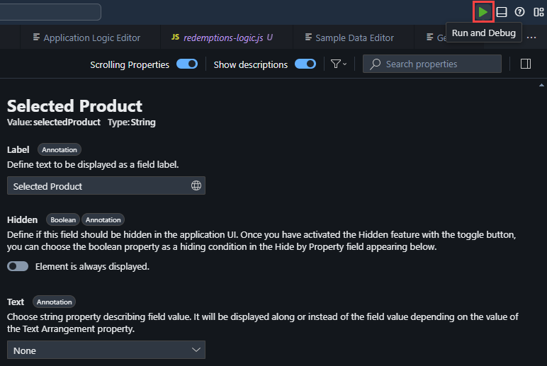
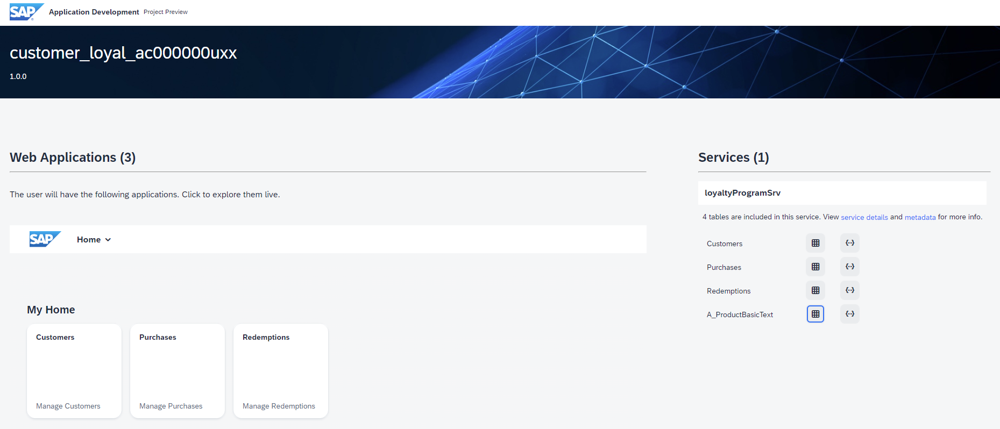
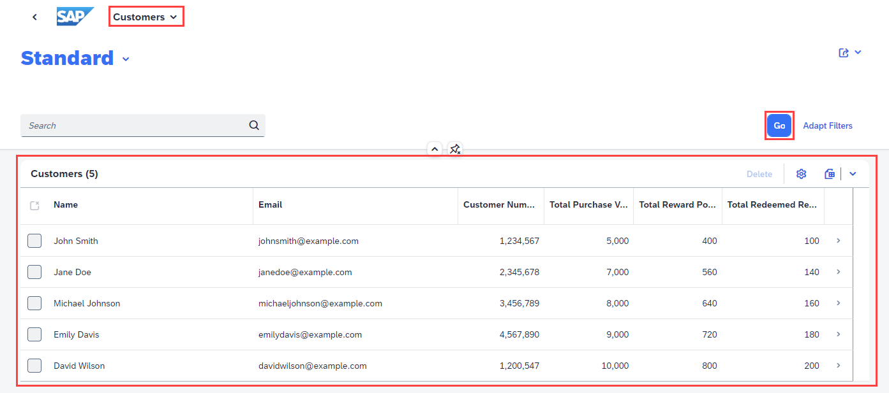

**[Previous Module 1 - Unit 6: Admin UI](./251-6_AdminUI.md) >**

# Module 1 - Unit 7: Preview

You can now preview the UI. here is a video tutorial to preview the backend app you created <a href="https://video.sap.com/media/t/1_eht1hhe4">Preview</a>.

1. To preview your application, go to the upper-right corner, and click **Run** and **Debug**.  

2. Select **Run customer_loyal_acxxxxxxxx**  

3. The application’s preview is displayed.  

4. Click on **Go** in each of the tiles (**Customers, Purchases. Redemptions**) in the Customer Loyal UI to see the generated data. Please note that in the application Preview not all functions may be available.  

 You have successfully built and previewed a CAP application using SAP Build Code powered by Joule copilot!

 Now lets deploy it!

 **[Next Module 1 - Unit 8: Deployement](./251-8_Deployment.md) >**