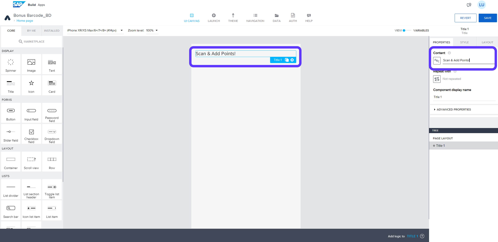
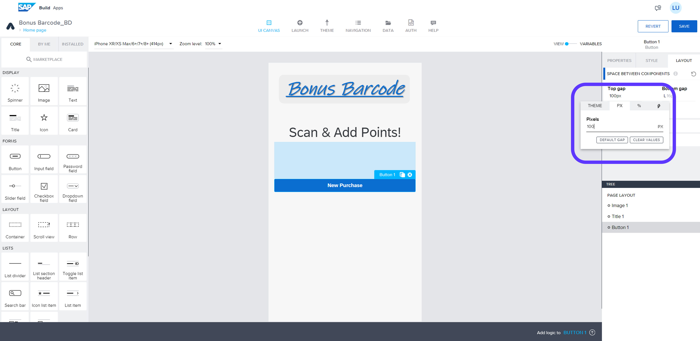
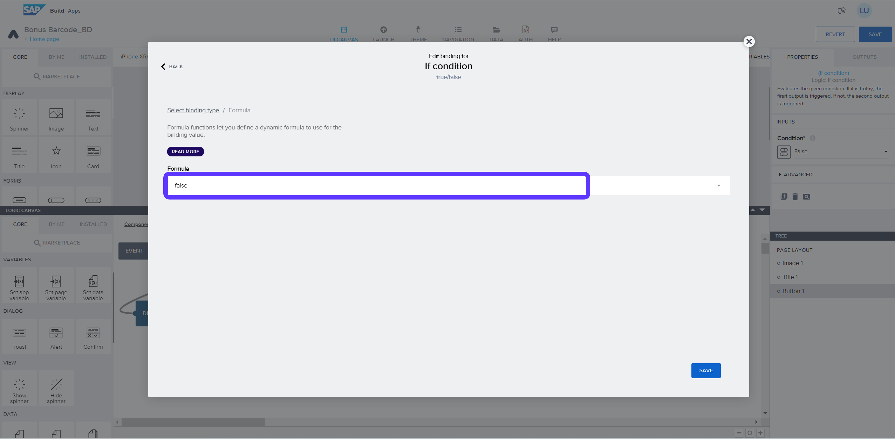

# Module 2 - Unit 1: Create UI  

1. Create a project

2. Follow: Build an Application > SAP Build Apps > Web & Mobile Application and name your project

**Note**: you can use your initials to name your project. So that it will not be confusing for you if you are using the same lobby with outhers in a common workshop

3. Remove *Text 1* 

4. Rename *Title 1*: Scan & Add Points!

5. Align the text centerally 

6. Select *Page Master Heading* under Style tab

7. Drag & Drop *Image* component above the *Title 1*. Then, click on the image icon under *Source*

8. Save the  *Bonus_Barcode_Logo* below and Drag & Drop it to the box 

9. Click on *Use Image*

10. Drag & Drop the *Button* component and rename the label: *New Purchase*

11. Increase the *Top gap* to 100px 

12. Open the Logic Canvas from the bottom of the page and Drag & Drop the following logic components component

**Note 1**: Please make sure that the New Purchase *Button* is selected

**Note 2**: You should go to Marketplace and install the *Action sheet* and  *Prompt number* logic components

13. Select *Action sheet* and Click on *Custom list*

14. Add 2 values and fill the input box as follows and save

label: Barcode Scanner 
value: Barcode

label: Manual Input
value: Manual

15. Update the *Action sheet title text*: **How to enter customer ID**

16. Select *If condition* and select the little icon

17. Go to *Formula* and click on the false

18. Type the following formula and save 

 

> outputs["Action sheet"].pickedAction.value=="Barcode"

19. Select *Prompt number* component and add the following text under *Dialog title*

 

> Enter 7 digit customer ID

20. Click on the Home Page from top left corner and add a new page called as: **New Purchase**

21. Switch to Variables > Go to Page Parameters > Add Parameter > Rename the parameter: **SelectedCustomerNumber** > Save your Project

22. Click on New Purchase from top left corner and go to Home Page

23. Select *Open Page* component and update the Page with *New Purchase*

24. Click on the X under SelectedCustomerNumber > go to Output value of another node

25. Select *ScanQR/barcode* and select QR barcode content and save

26. Select the second *Open Page* component and update the Page with *New Purchase*

27. Click on the X under SelectedCustomerNumber > go to Formula > Create formula

28. Type the following formula and save
 

>STRING(outputs["Prompt number"].userInput)

29. Click on the Button component > Go to Layout > Set Width to 200px under Exact Size  

30. Align the button horizontally to the middle

31. Click on the Home Page from top left corner and add a new page called as: **Redeem Points**

32. Switch to Variables > Go to Page Parameters > Add Parameter > Rename the parameter: **SelectedCustomerNumber** > Save your Project

33. Click on Redeem Points from top left corner and go to Home Page

34. Select *New Purchase* button and click on the little duplicate icon

35. Select the duplicated button (the one below) and rename the label: **Redeem Points**

36. Select the Open Page component and replace the page with **Redeem Points** page

37. Select the second Open Page component and replace the page with **Redeem Points** page. Save your project

38. Select Home Page from top left and go to *New Purchase*

39. Remove *Text 1*

40. Select *Title 1*, Rename: **New Purchase** and Align the text centerally

41. Go to Style tab and select **Page Master Heading**

42. Drag & Drop a Container. Rename the display name: **Main Container**

43. Drag & Drop *Title 1* into the Main Container.

**Note**: You can check the Component Tree to see if the Title is now under the Main Container

44. Drag & Drop a Card component inside of the Main Container 

45. Drag & Drop another container under Card 1 but inside of the Main Container. 

**Note**: You can check the Component Tree to see if the Container 1 is now under the Main Container or not

46. Select Container 1 and change the layout of the component to Horizontal

47. Drag & Drop a Card component inside Container 1

**Note**: You can check the Component Tree to see if the Card 2 is now under the Container 1 or not

48. Duplicate the Card 2 component twice until you have 3 horizontal card components

49. Compare the Component Tree in your page with the screenshot below. Please make sure that you have the same layout

50. Select Card 1. Rename the title: *Customer Number* Rename the content: *Customer Name*

51. Select Card 2. Rename the content: *Available Reward Points*

52. Select Card 3. Rename the content: *Total Redeemed Points*

53. Select Card 4. Rename the content: *Total Purchase Value*

54. Select the Main Container. Then, use keyboard shortcut to copy the container: **CRTL+C**.

**Note**: Make sure that you have the pop up that shows you successfully copied the component to the clipboard

55. Go to the Page: Redeem Points

56. Click into the middle of the page. Then, use keyboard shortcut to paste the container: **CRTL+V**.

57. Remove *Title 1*. Remove *Text 1*. Save your project

58. Select *Title 1* inside of the Main Container. Rename the content: *Redeem Points**

**[Next Module 2 - Unit 3: Authentication and Data Integration](./252-3_Authentication_and_Data_Integration.md) >**

