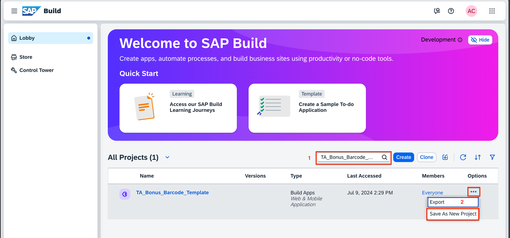
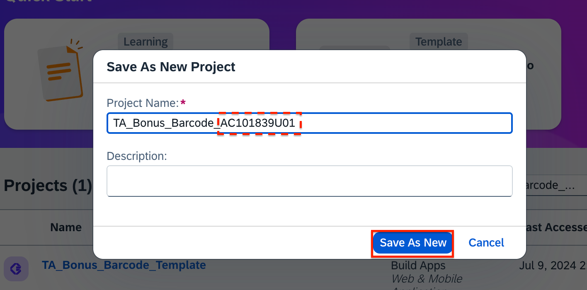

# Module 2 - Unit 2: Upload UI  

1. Open your SAP Build Lobby. 
Search for <b>TA_Bonus_Barcode_Template.</b> 
You will find the Build Apps project. Go to options and select <i>Save as New Project.</i>  

2. Rename the project with the user id provided to you. 

Your Build Apps project will open. Lets get to Build now.

**[Next Module 2 - Unit 3: Authentication and Data Integration](./252-3_Authentication_and_Data_Integration.md) >**
