> [Previous Module Import the template](./252-2_Upload_UI.md) 
# Module 2 - Unit 3: Authentication and Data Integration  

1. Click on the page name written in blue at the top left corner of your page. Go to the page: *New Purchase*  
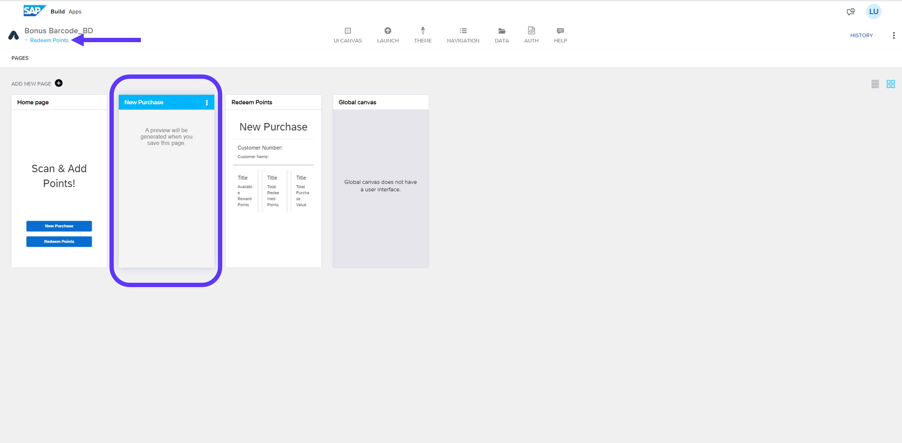

2. Go to AUTH tab > Enable Authentication > SAP BTP authentication > OK  
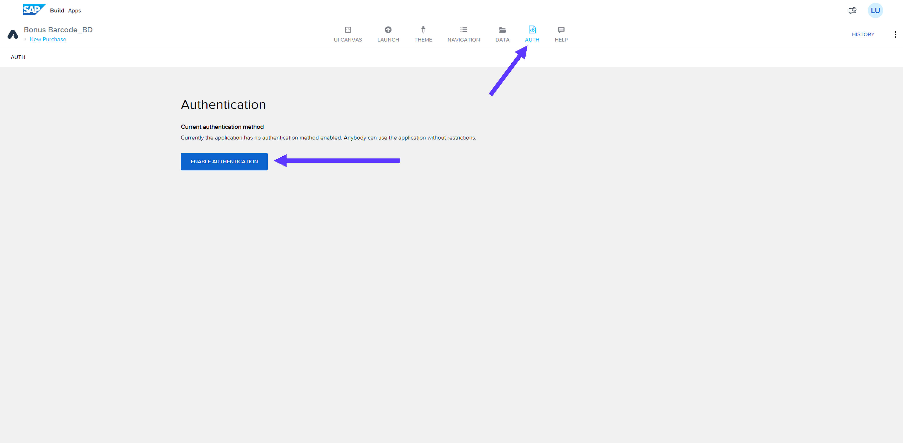

3. Go to DATA tab  
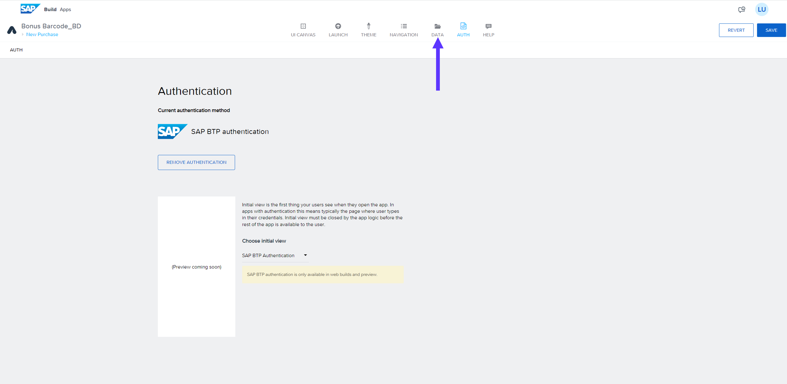

4. Add Integration > BTP Destinations  
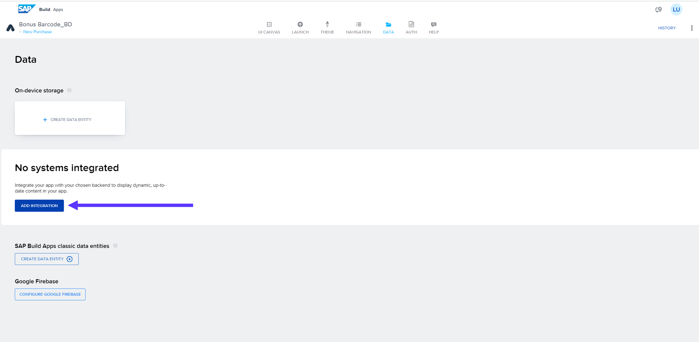

5. Search for your project name in Build Code part of the exercise. Select your project once it is listed.  
<b><i><u>PS</b></u>: If the Build Code deployement fails, search for <b>customer_loyal_ac00000uxx-loyaltyProgramSrv</b>  </i>
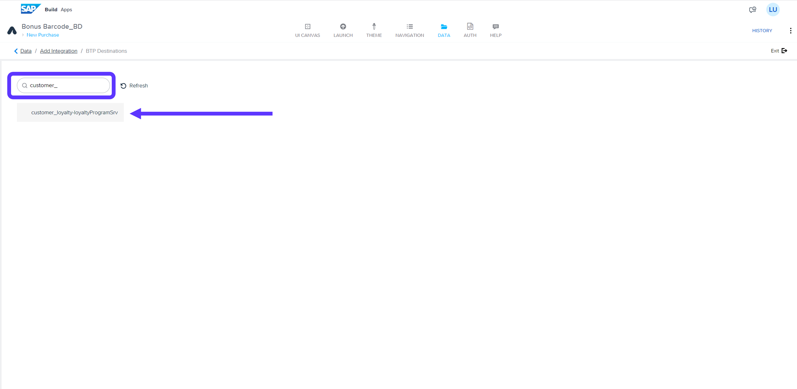

6. Install Integration  
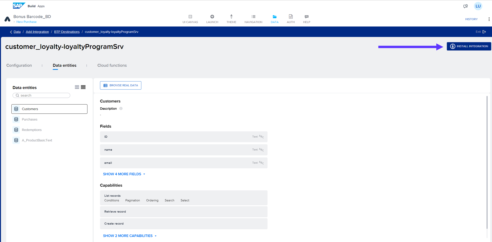

7. Click on Enable Data Entity for all 4 Data entities listed on the left and Save it  
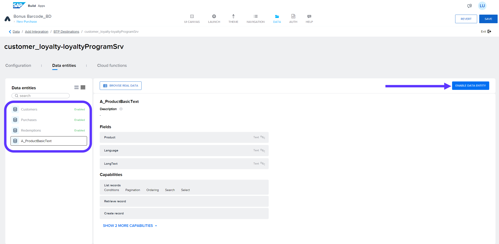

8. SAVE and Exit.  
   Go to DATA TAB again and select ADD Integration  
   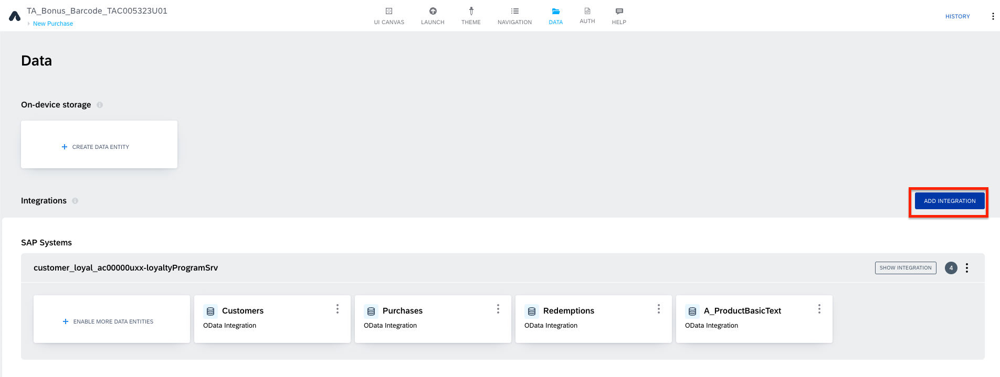
9. Select SAP Library.  
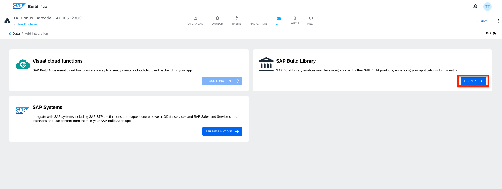

10. Search for your deployed process and select it.   
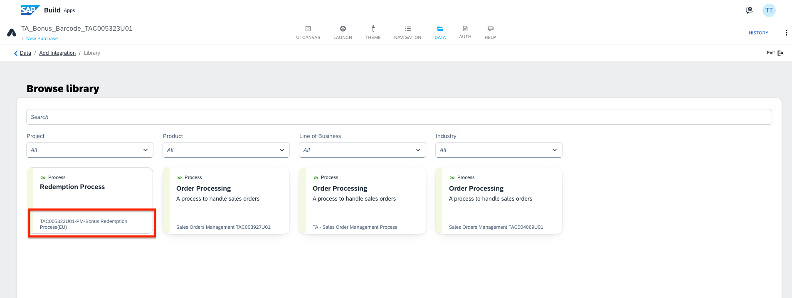

11. Select Enable Process.  
SAVE it and Go back to Canvas View
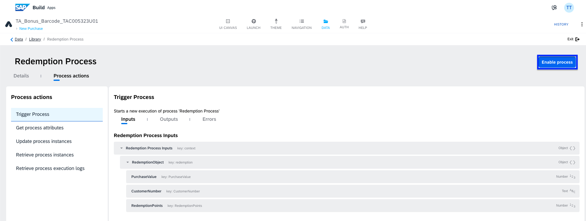

**[Next Module 2 - Unit 4: Logic for Data variables](./252-4_Logic_for_Data_Variables.md) >**

