# 

1.  Go to the next page: *Redeem Points*

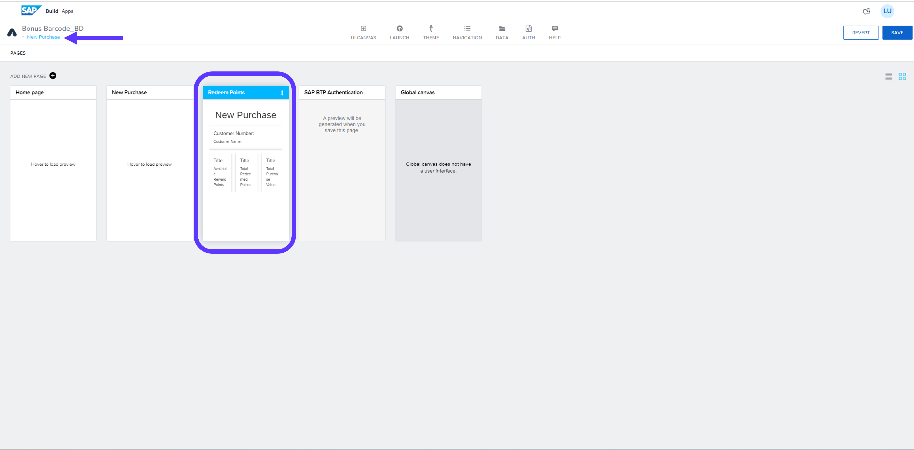

2. Drag & Drop the UI Components with the following order: List divider > Input field > Button

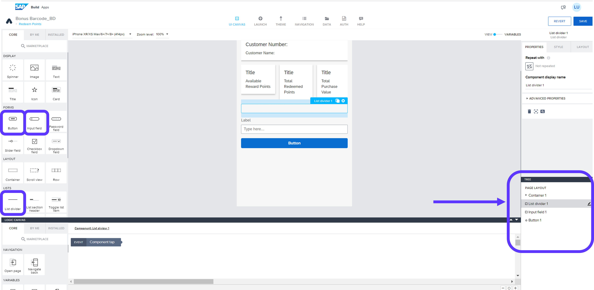

3. Switch to Variables > Go to Page Variables > Create a Page Variable > Save

 

>Variable: *RedemptionAmount* Value type: number

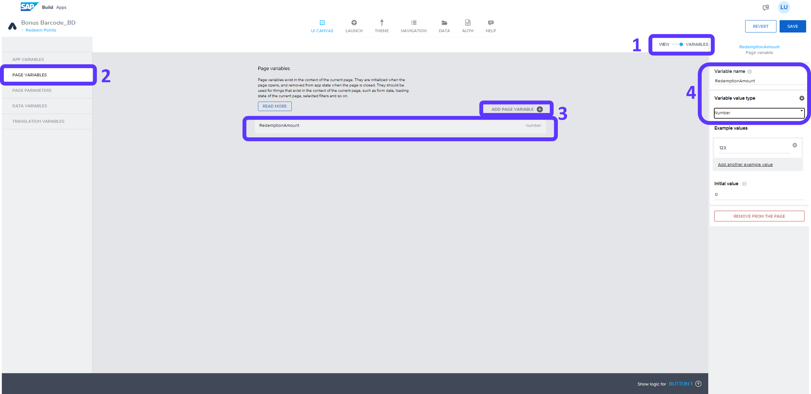

4. Go to Data Variables > Create Data Variable > Go to Filter Condition of the created variable

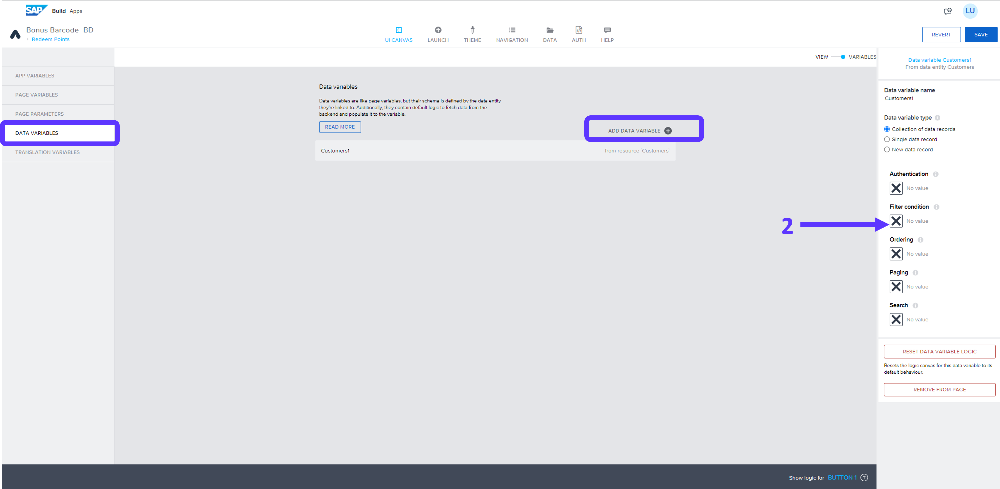

5. Object with Properties > Add Condition > Property: *customerNumber* > Condition type: *equal* > Click on the little icon under Compared value

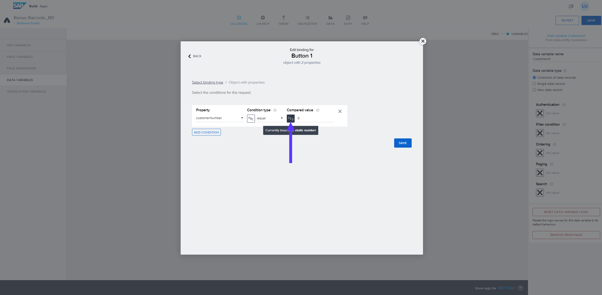

6. Formula > Click on the Formula Bar > Type the following formula: *INTEGER(params.SelectedCustomerNumber)* > Save > Save

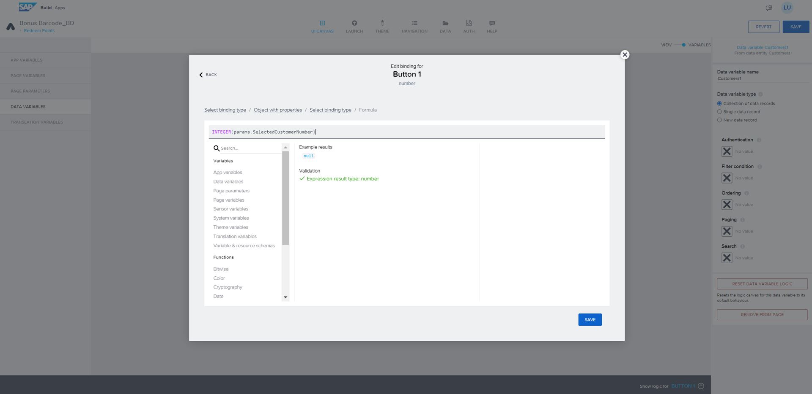

7. Select Input field > Rename label: *Redemption Amount* > Click on the little icon under *Value*

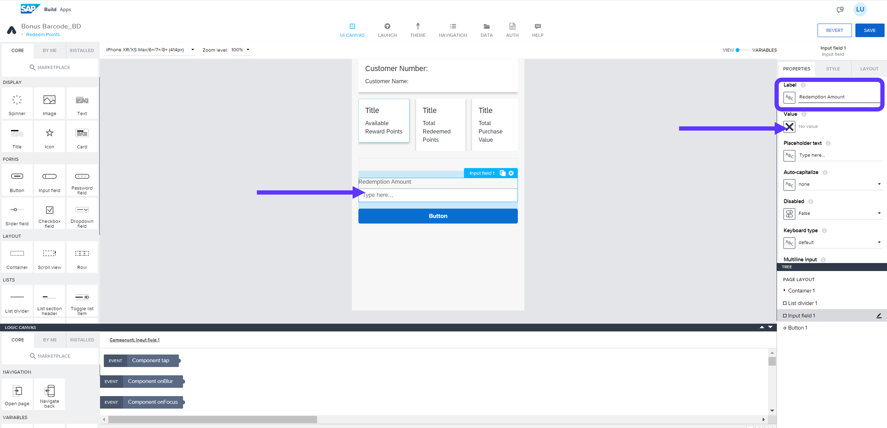

8. Data and Variables > Page Variable > Redemption Amount > Save

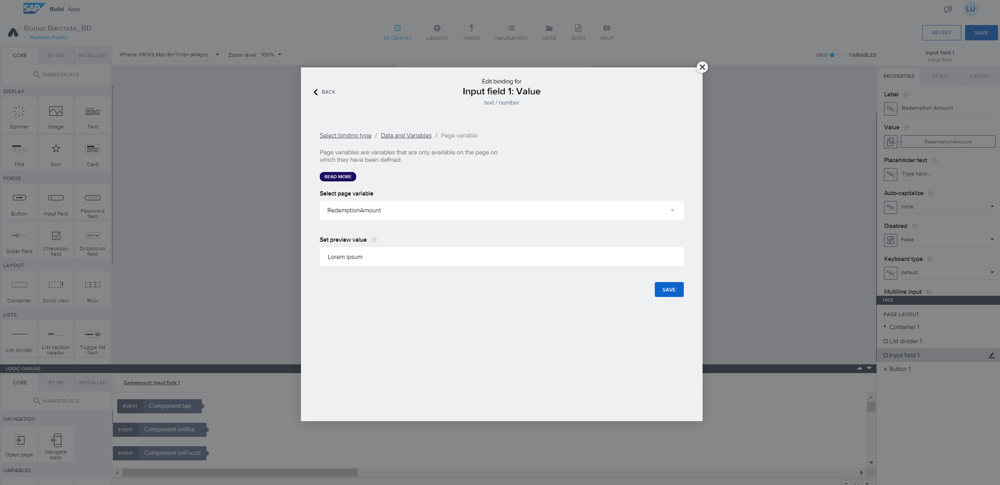

9. Select Button > Raname label: *Redeem Points!*

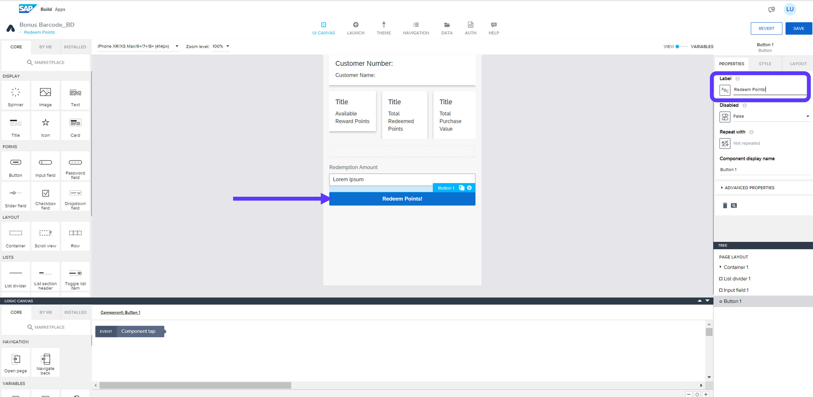

10. Drag & Drop the logic components below to create the logic flow shown below. Save

11. Select the trigger process node.  
    On right hand side make sure you select the right process and opne the binding menu for Redemption object.

12. Use the following formulas for Purchase Value and Customer number.  
<b>Purchase value</b><pre>data.Customers1[0].totalPurchaseValue</pre>
<b>Customer number</b><pre>data.Customers1[0].customerNumber</pre>
For Redemption value select the Page variable <i>Redemption Value</i>

13. Select Create record function > Select the data entity: *Redemptions* > Click on the Custom Object

14. Click on the ABC icon under ID > Formula > Click on the Formula bar

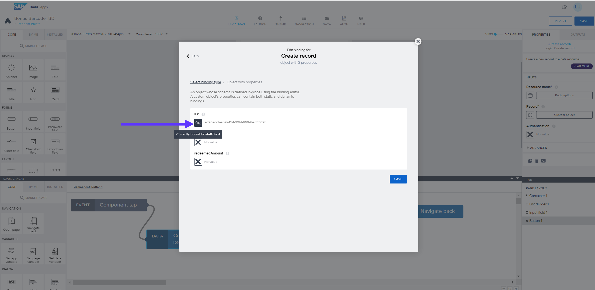

15. Type the following formula and Save: *GENERATE_UUID()*

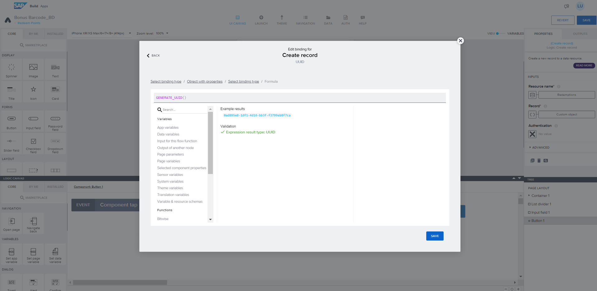

16. Click on the X icon under customer_ID > Formula > Create formula

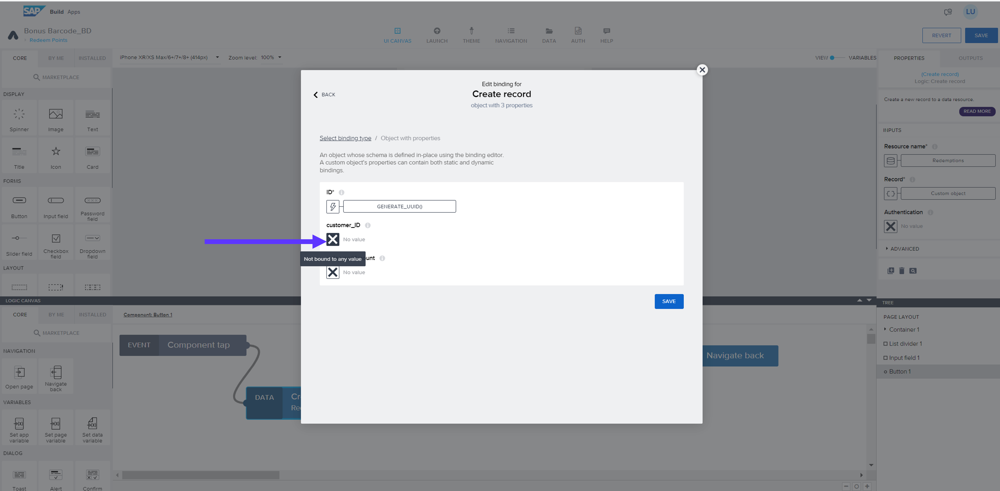

17. Type the following formula and Save: *data.Customers1[0].ID* 

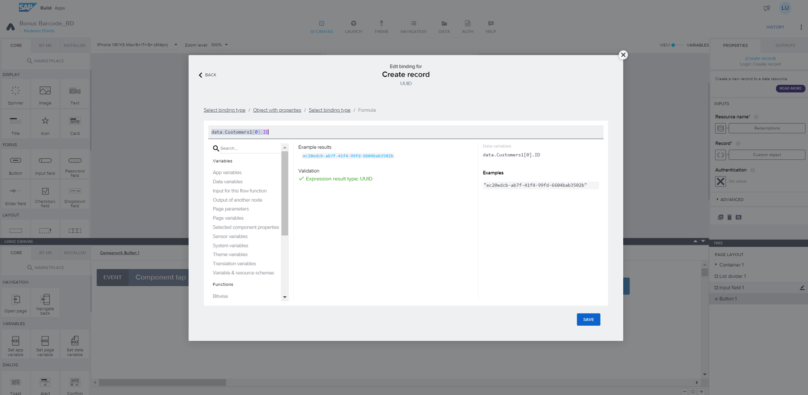

18. Click on the X icon under redeemedAmount > Formula > Create formula

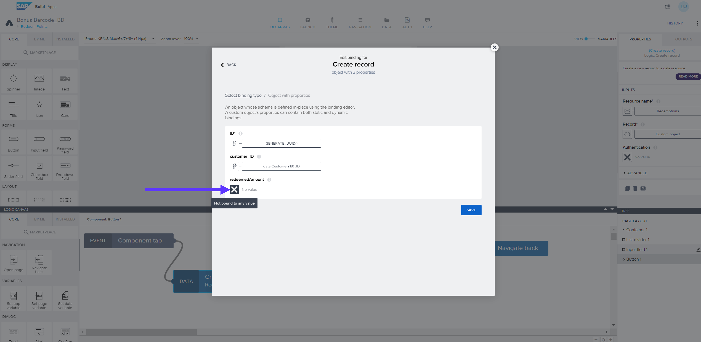

19. Type the following formula and Save: *INTEGER(pageVars.RedemptionAmount)* 

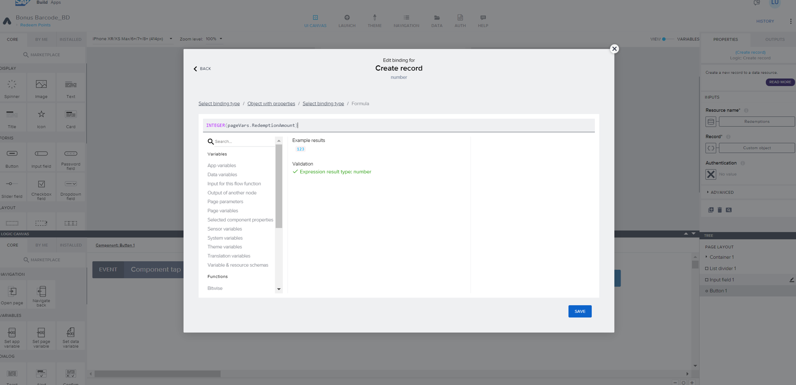

20. Save the window

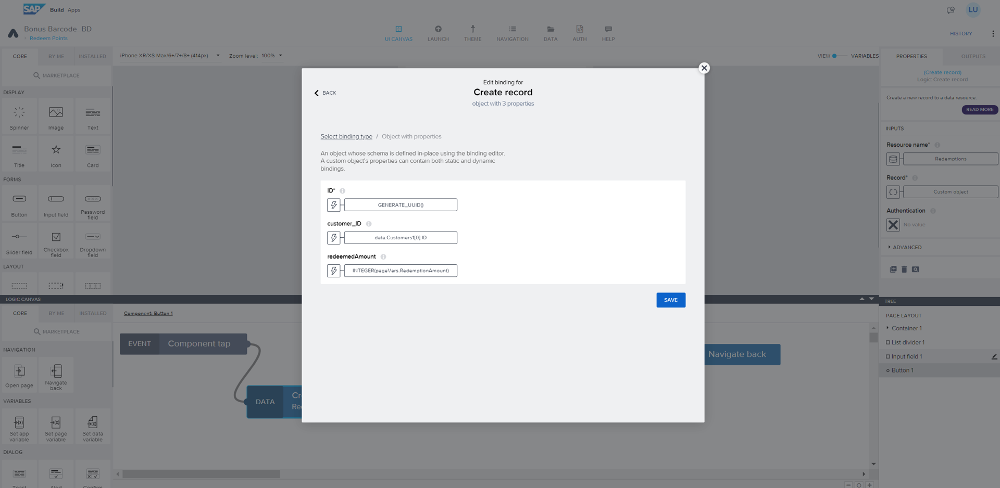

21. Select Alert component > enter the following text <i>Please check your inbox</i>

**[Next Module 2 - Unit 5: Logic for UI Components](./252-5_Logic_for_UI_Components.md) >**
