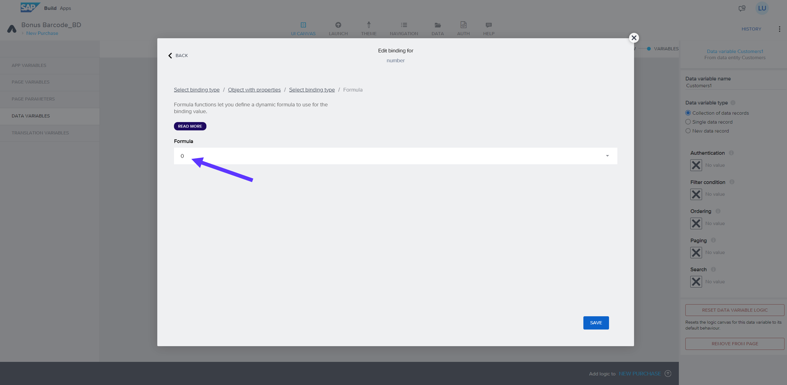

**[Previous Module 2 - Unit 3: Authentication and Data Integration](./252-3_Authentication_and_Data_Integration.md) >**

# Module 2 - Unit 4: Logic for Data Variables  

Here is a video tutorial for this unit <a href="https://video.sap.com/media/t/1_3c5lewrl">Logics for Data variables</a>

1. Go to UI Canvas > Switch to Variables > Go to Data Variables > Add 2 data variables: *A_ProductBasicText* and *Customers* 

**Note**: Please make sure that you have same data variable names in your screen: **A_ProductBasicText1** and **Customers1**

2. Select *Customers1* data entity. Click on the *X* icon under Filter condition. Go to Object with Properties

3. Add a condition. Property: *customerNumber*. Condition type: *equal*. Click on the little icon under Compared value

4. Go to Formula > Click into the Formula field

5. Type the formula below > Save the Formula > Save the condition
 

>INTEGER(params.SelectedCustomerNumber)

6. Drag & Drop the UI Components with the following order: List divider > Dropdown field > Input field > Button

7. Switch to Variables > Go to Page Variables > Create 2 Page Variables > Save

 

>Variable 1: *PurchaseValue* Value type: number
>Variable 2: *SelectedProduct* Value type: text

8. Switch back to View > Select Dropdown field. Rename the Label text: *Select Product*. Then, Click on the little icon under *Option list*

9. Go to formula > Type the formula below > Save the Formula 

 

>MAP(data.A_ProductBasicText1, {label:item.Product, value:item.Product})

10. Go to Selected value > Data and Variables > Page Variable > SelectedProduct > Save

11. Select Input field > Rename label: *Purchase Value* > Click on the little icon under *Value*

12. Data and Variables > Page Variable > PurchaseValue > Save

13. Select Button > Raname label: *Add Points!* > Open Logic Canvas

14. Drag & Drop the logic components below to create the logic flow shown below

15. Select Create record function > Select the data entity: *Purchases* > Click on the Custom Object

16. Click on the ABC icon under ID > Formula > Click on the Formula bar

17. Type the following formula and Save: *GENERATE_UUID()*

18. Click on the X icon under customer_ID > Formula > Create formula

19. Type the following formula and Save: *data.Customers1[0].ID* 

20. Click on the X icon under purchaseValue > Formula > Create formula

21. Type the following formula and Save: *INTEGER(pageVars.PurchaseValue)* 

22. Click on the X icon under selectedProduct > Data and Variables > Page Variable > SelectedProduct

23. Save the window

24. Select *Alert* component > CLick on the ABC icon under Dialog title > Formula 

25. Type the formula below > Save

 

>data.Customers1[0].name + " has successfully earned " + outputs["Create record"].response.rewardPoints + " points!"

**[Next Module 2 - Unit 4: Logic for Data Variables 2](./252-42_Logic_for_Data_Variables2.md) >**

