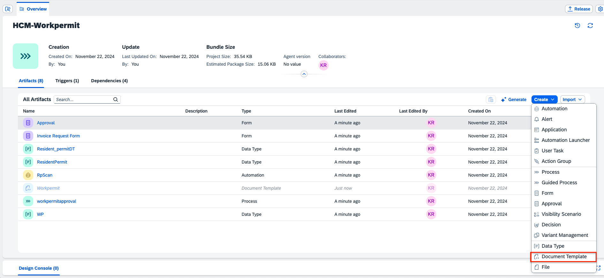
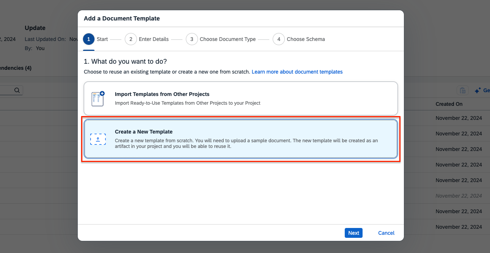
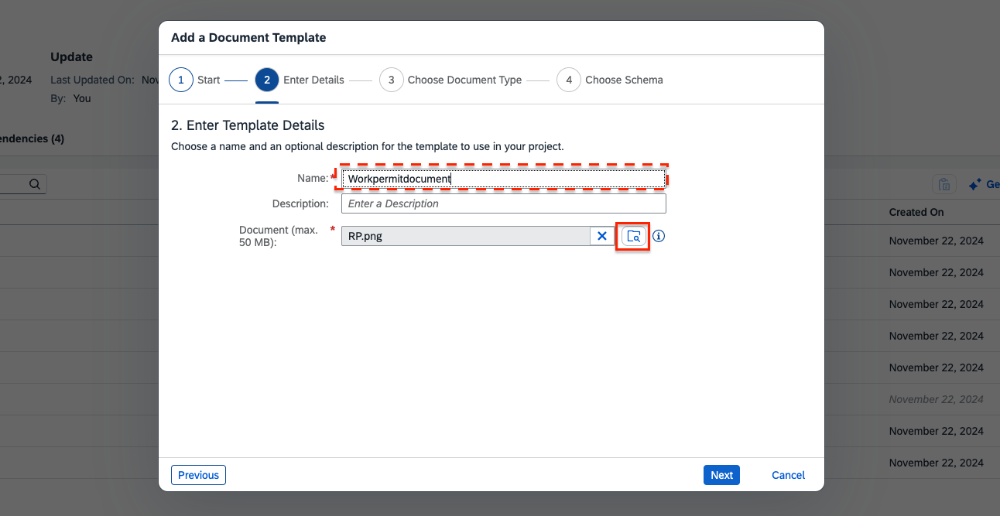
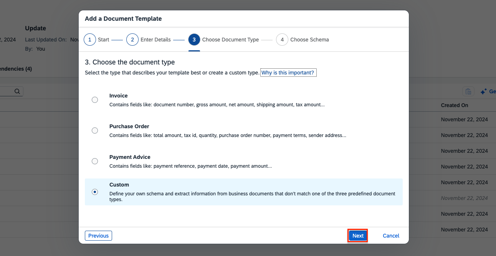
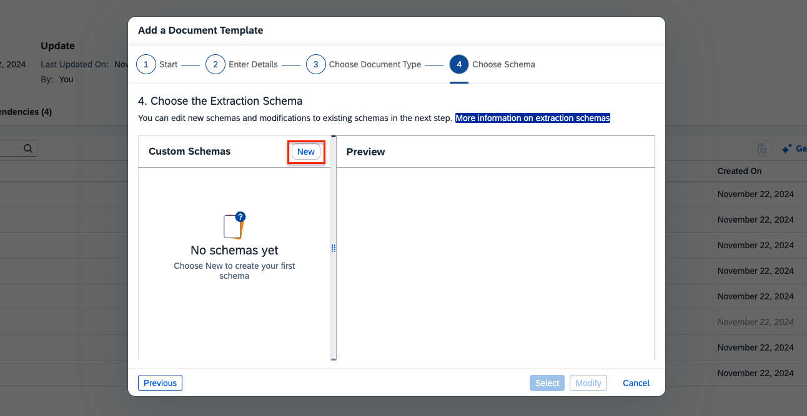
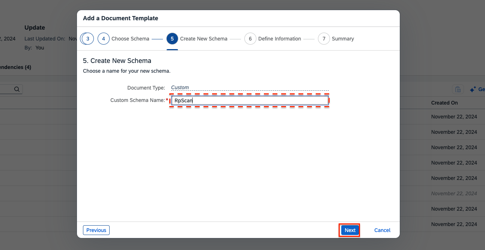
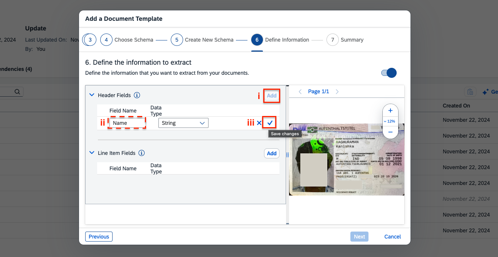
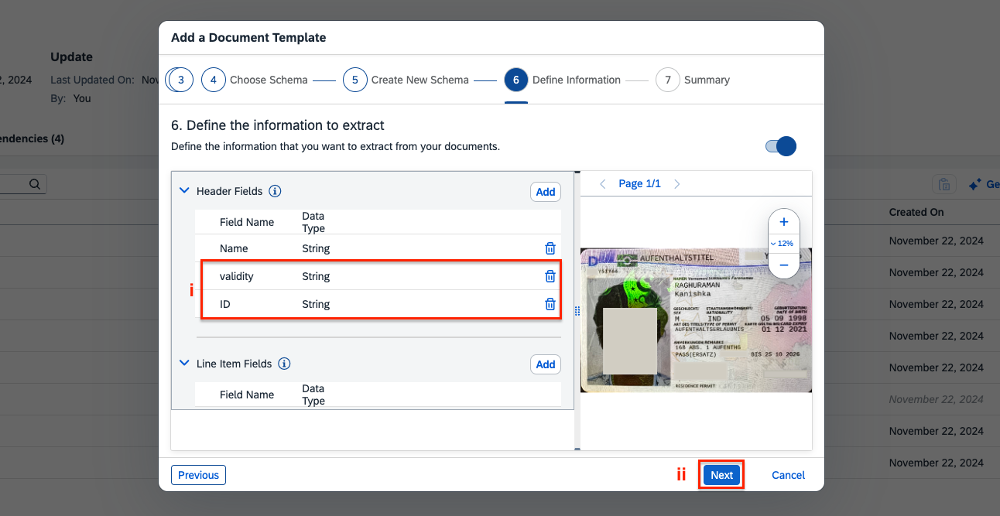
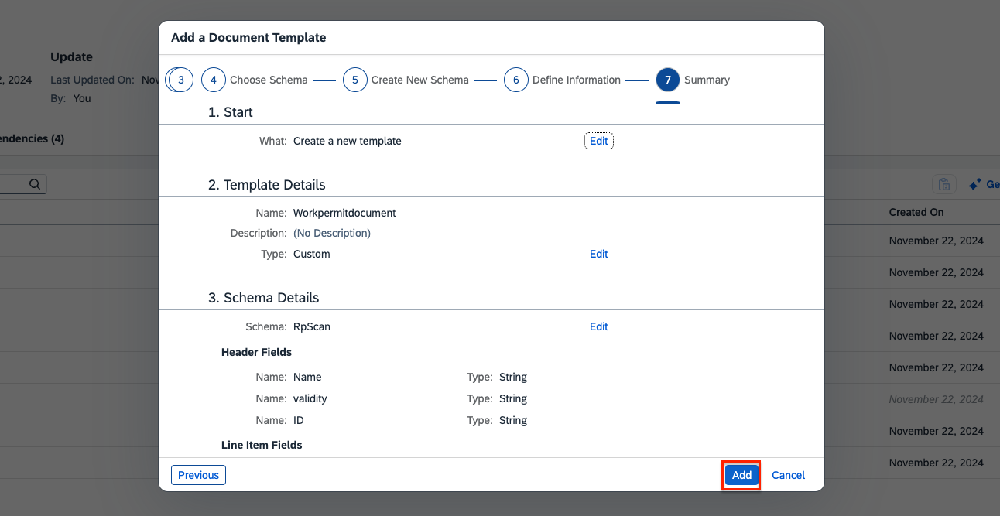

< [Previous Lesson](/BuildandAutomateTour2024/1_Build_Process_Automation/11_Import_template/readme.md)

# Create Document Template

1. Download the document here 
<a href="https://github.com/SAP-samples/build-apps-enablement/blob/main/BuildandAutomateTour2024/1_Build_Process_Automation/Template/RP.png">Work Permit Document</a> 
> Also free to use your own Work Permit document.

2. In your new created Build Process Automation project, click on **Create** and select **Document Template**.  

3. Select ** Create a New Template** and click on **Next**.  

4. Give a name to the template *Workpermitdocument* and select the document locally form your computer.  

5. For the document type, select **Custom** and click **Next**.  

6. To create a new extraction schema, click on **New** in the Custom Schemas menu.  

7. Give a name to the schema **RpScan**.  

8. In the schema, create the fields to be extracted from the document. 
**Add** a new header field and call it **Name** with the data type string and **Save** it.  

9. Similarily, add **validity** and **ID** fields.  

10. Review the template and *Add** it.

[Next Lesson](./2_Annotatetemplate.md) >