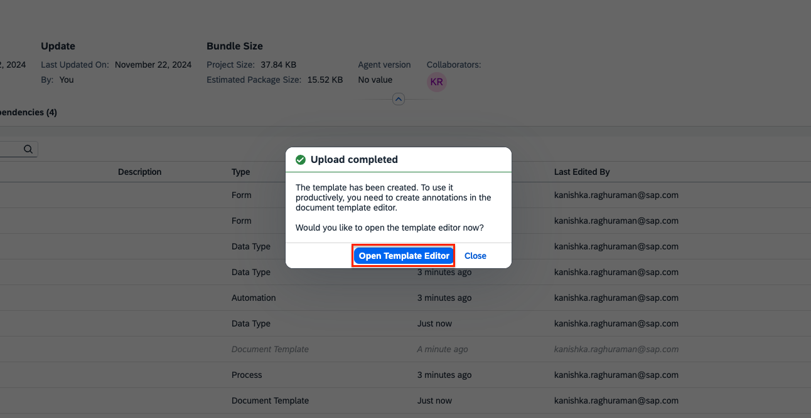
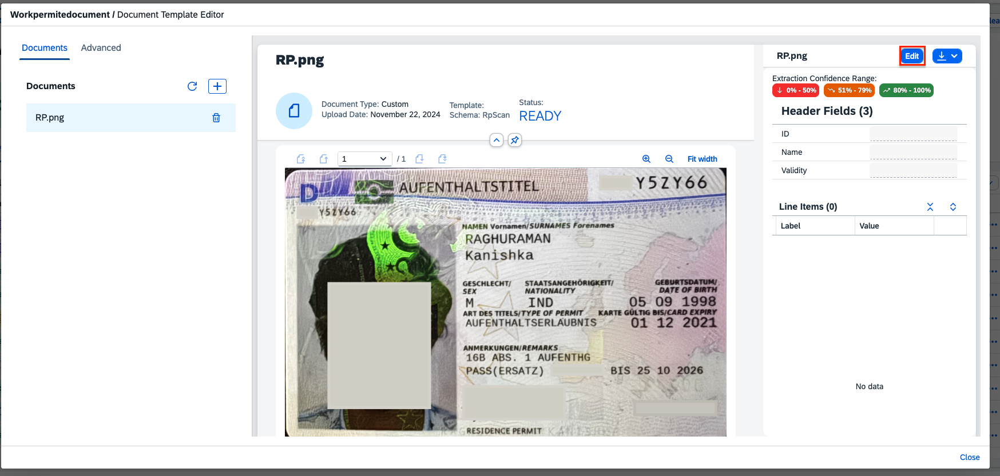
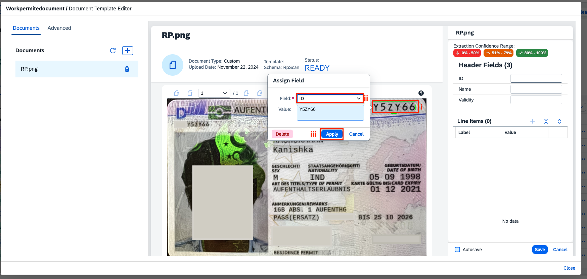
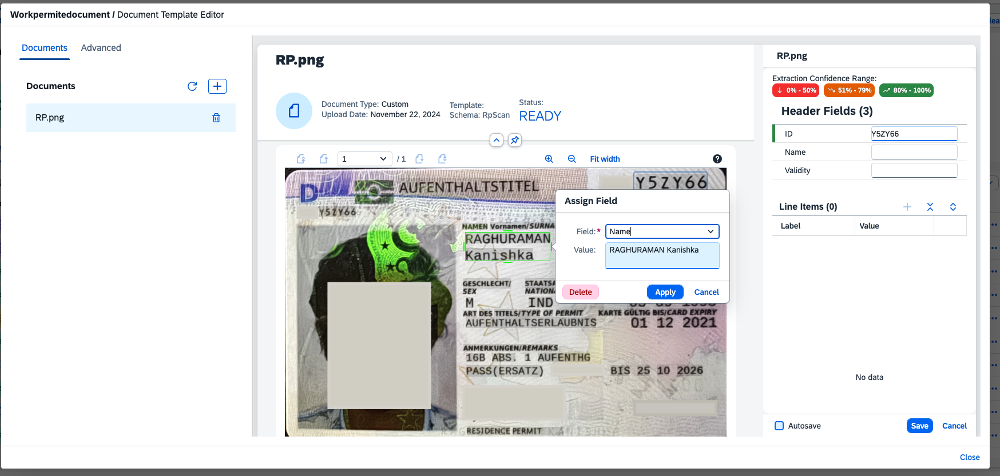
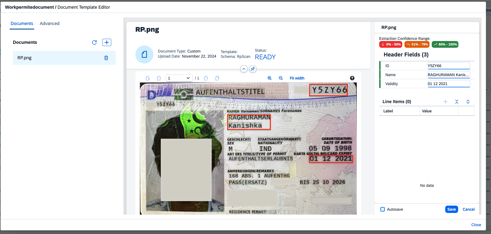

< [Previous Lesson](./1_CreateTemplate.md) 

# Annotate the Template

1. Open the **Template Editor** to annotate your newly created document template.  

2. Refresh to load your teamplate document. Click on **Edit** on top right to annotate your document.  

3. Select the document ID on your document and annotate it with **ID** field.  

4. Select both first and last name on your document and annotate it with **Name** Field.  

5. finally annotate the **Validity** field with expiry date on the document and Save  

[Next Lesson](./3_Automation.md) >