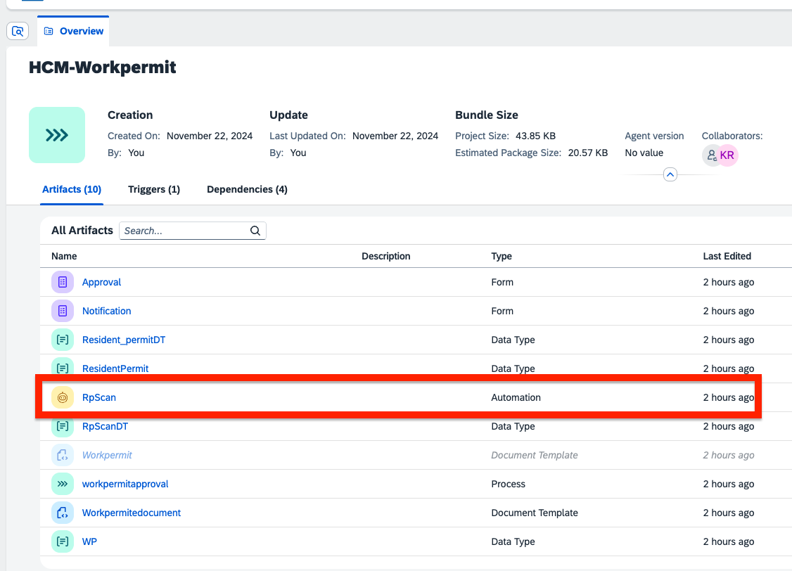
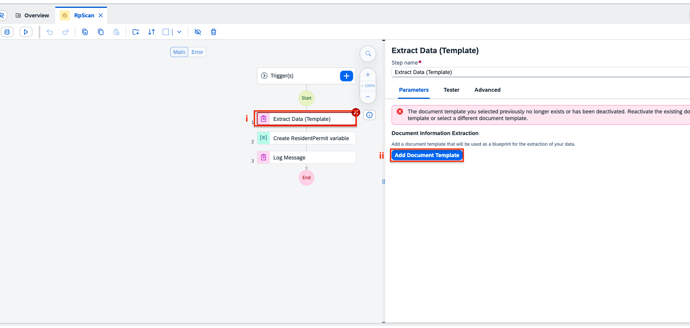

< [Previous Lesson](./2_Annotatetemplate.md) 

# Use the document template in the automation

1. Open the automation **RpScan**.  

2. Select the **Extract Data (Template)** step in your automation and **Add Document Template**.  

3. 