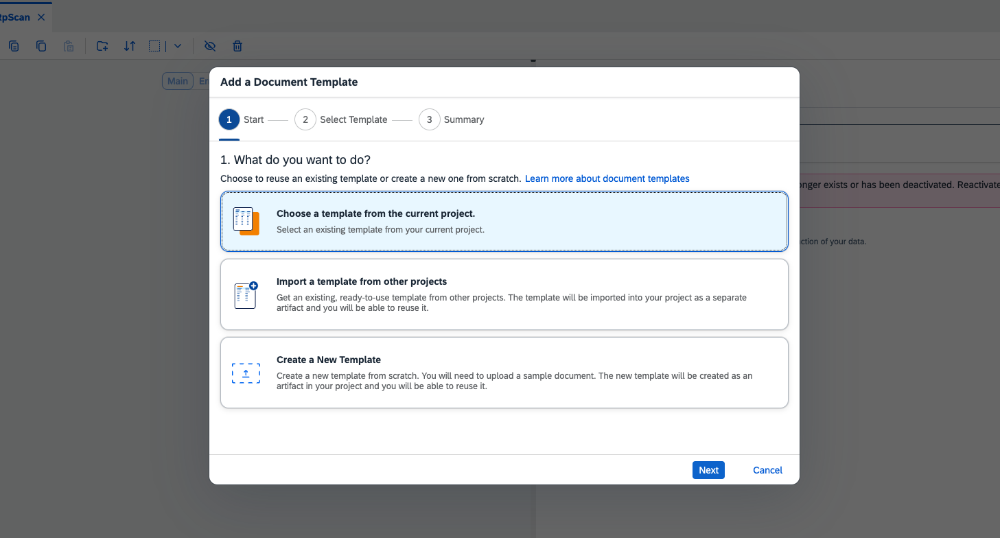
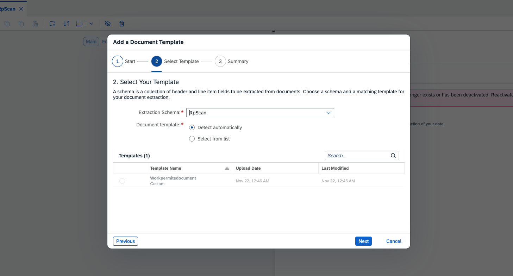
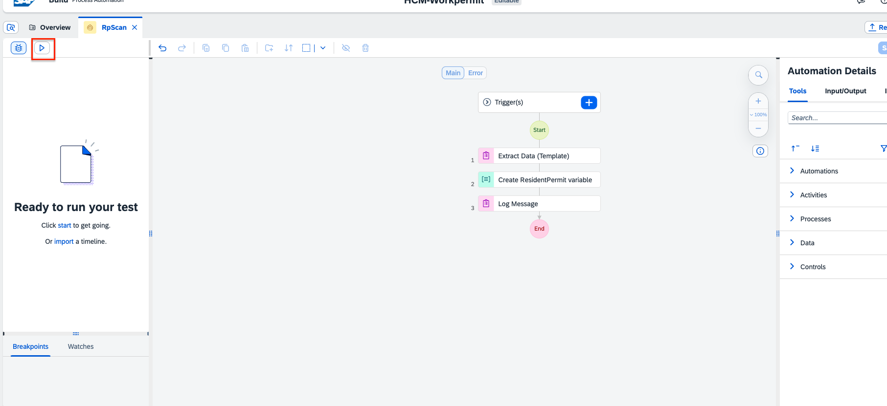
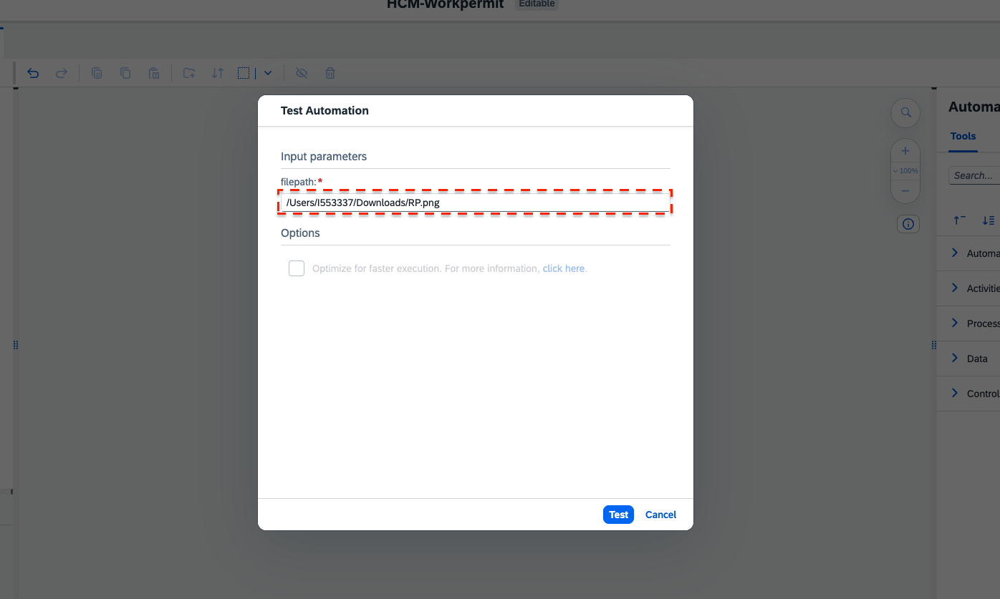
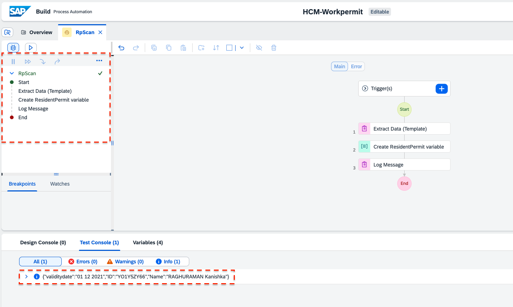

< [Previous Lesson](./2_Annotatetemplate.md) 

# Use the document template in the automation

1. Open the automation **RpScan**.  

2. Select the **Extract Data (Template)** step in your automation and **Add Document Template**.  

3. Select **Choose a template from the current project** and click on Next.  

4. Select **RpScan** in the extraction Schema and click on Next. 
Select **Add** in the summary tab.  

5. Now to test your automation, click on **Run** on the top left.

6. Enter the file path of the document in your computer and test it.  

7. You can see the steps in your automation being executed on the left hand side, and the extracted data in the test console below.  

[Next Lesson](./4_Deployprocess.md) >