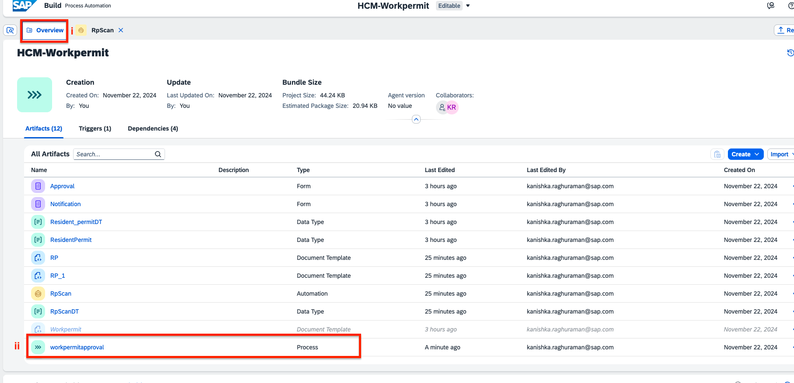
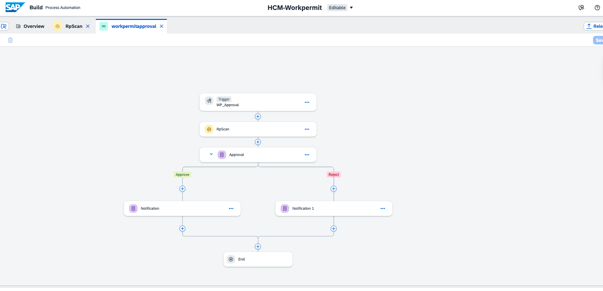
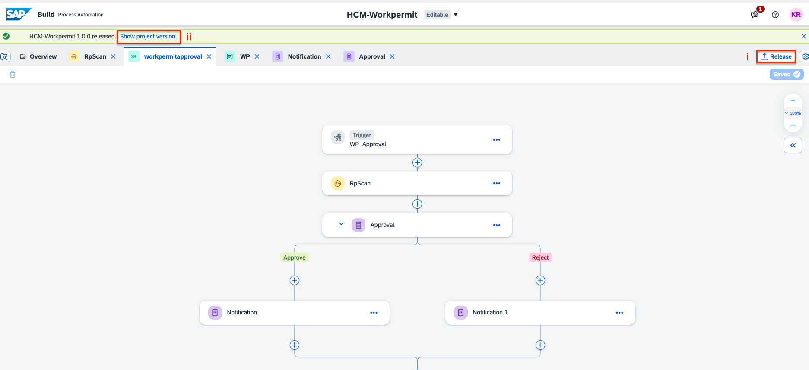
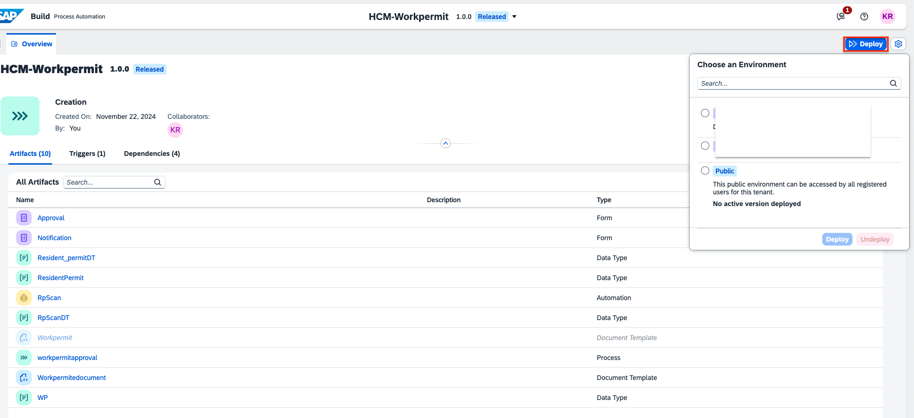
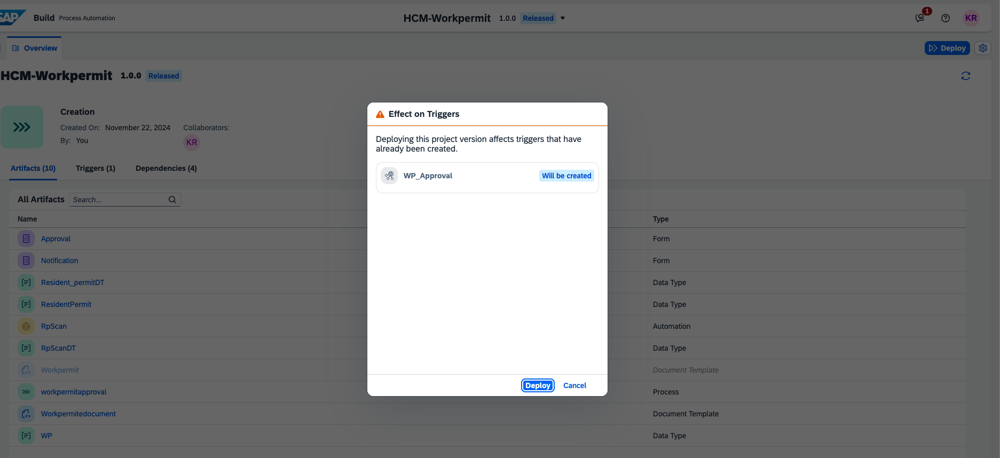
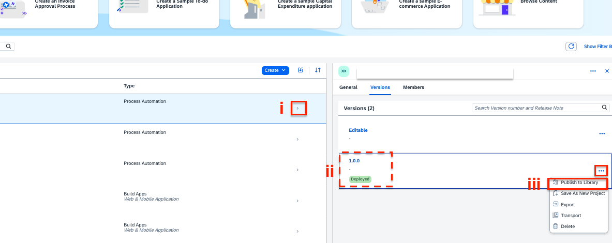
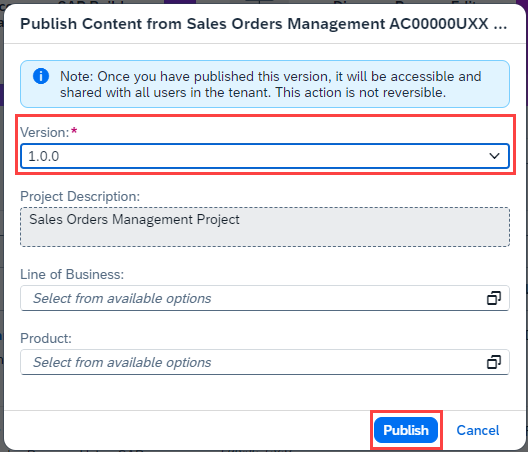

< [Previous Lesson](./3_Automation.md)

# Deploy process

1. Go to the **Overview** tabm and open **workpermitapproval** process.  

2. Review the process, it starts with an API trigger, that will start the automation and starts an approval process.  

3. Release your project on the top right corner and click on **Show published version**.  

4. Deploy the released version and select an environment you want to deploy your project.  

5. Select **Deploy**.  

1. After you released and deployed the process, go to SAP Build Lobby and find your project.

2. For your recently deployed version of the project, click on the 3 dots under options and **Publish to Library**.

   

3. Select the version (you can select the most recent version) and click on **Publish**. Now, your process will be visible from SAP Build Apps in SAP Build Library section.

   
   
You have successfully released, deployed and published your process. It is time to integrate with your app!

[Next Unit](/BuildandAutomateTour2024/2_Build_Apps/Readme.md) >
