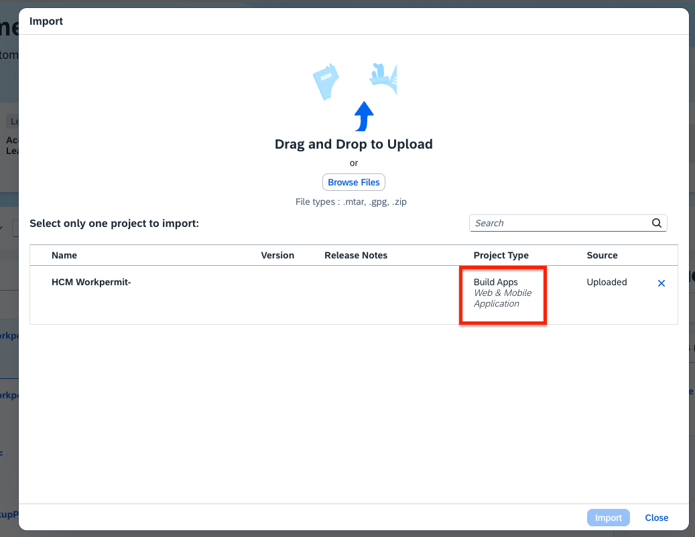
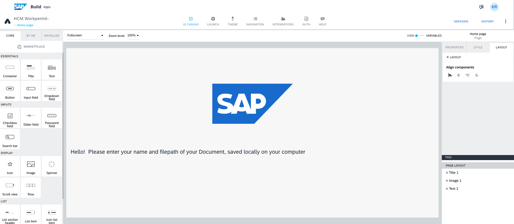

< [Previous lesson](./Readme.md)

# Import SAP Build Apps template 

1. Download the SAP Build Apps template from here <a href="https://github.com/SAP-samples/build-apps-enablement/blob/main/BuildandAutomateTour2024/1_Build_Process_Automation/Template/HCM%20Workpermit%20App.mtar">HCM App template.</a>  

2. Open your SAP Build Lobby. 
Click on **Import** icon.  

3. Now, make sure the project type is **Build Apps**, and click in **Import** button.  The HCM App will be created in your SAP Build lobby now.  

4. Open the Build Apps project now. <b>

[Next Lesson](./2_AppCustomisation.md) >