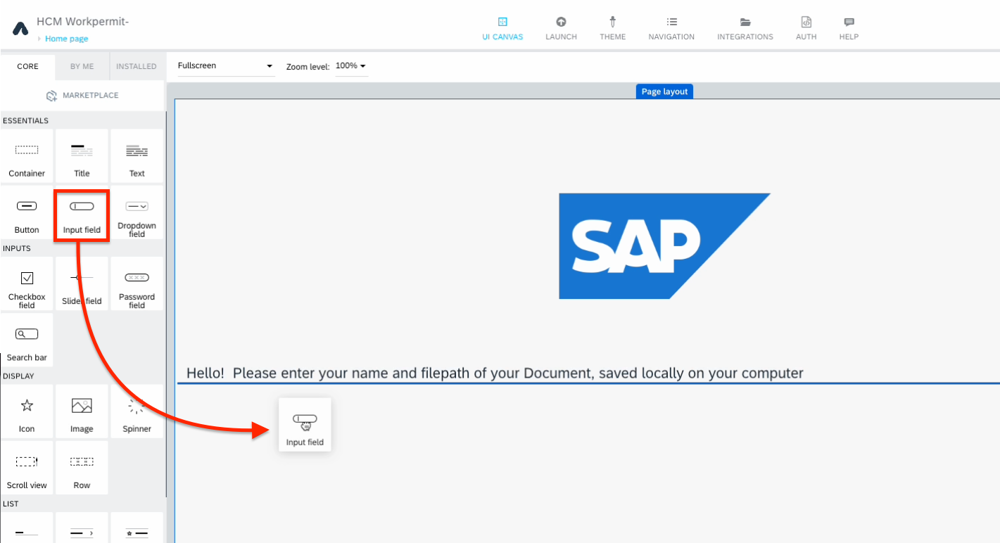
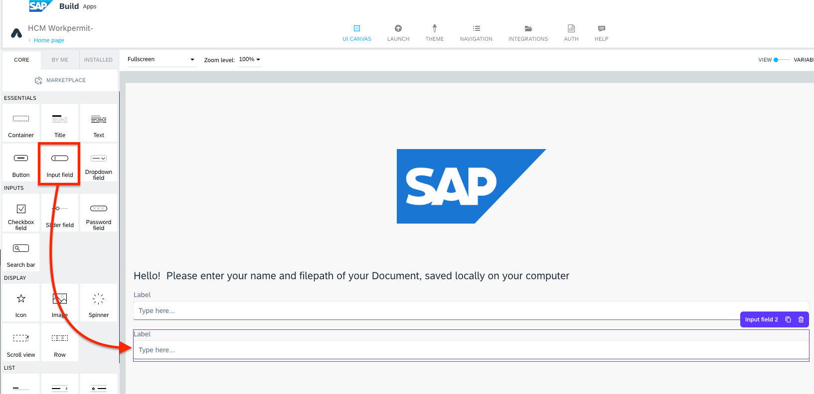
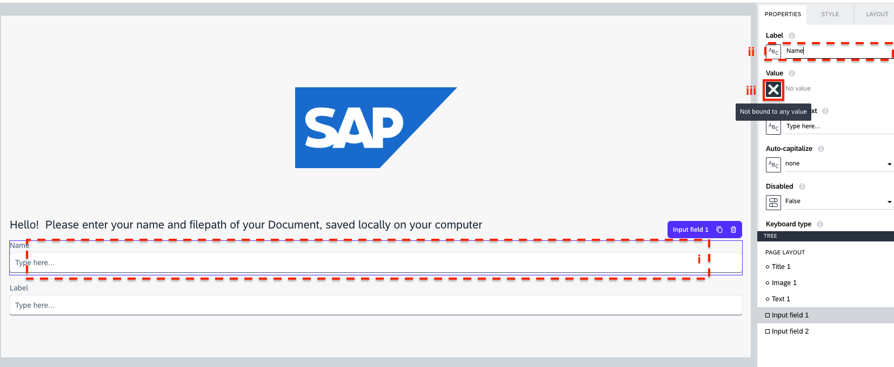
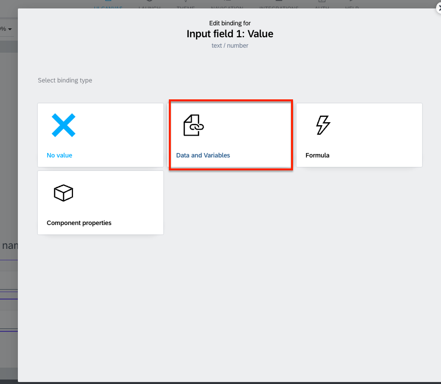
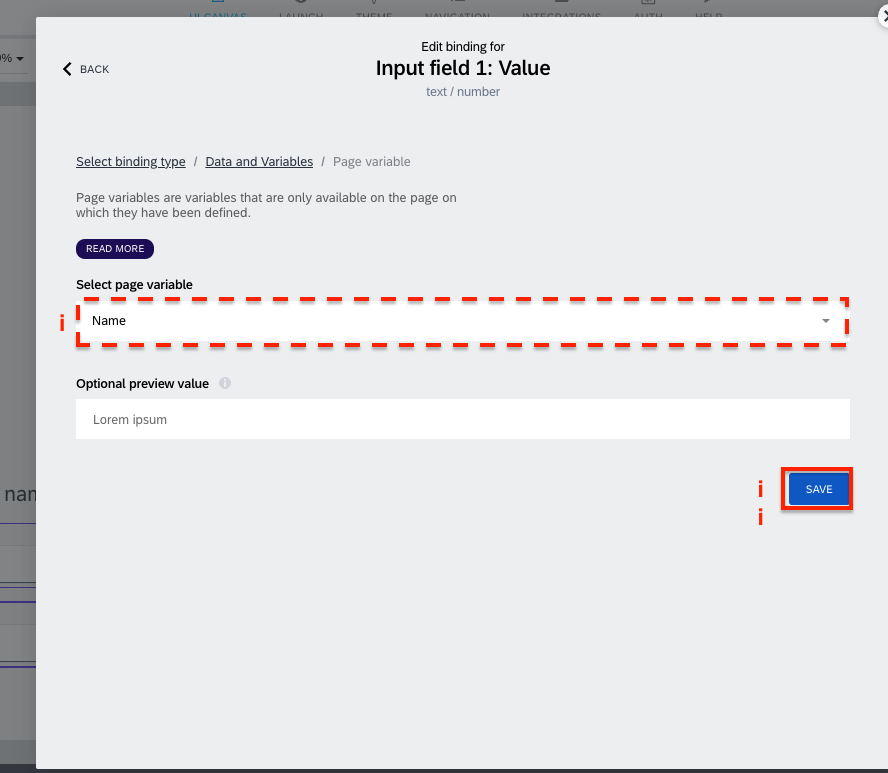
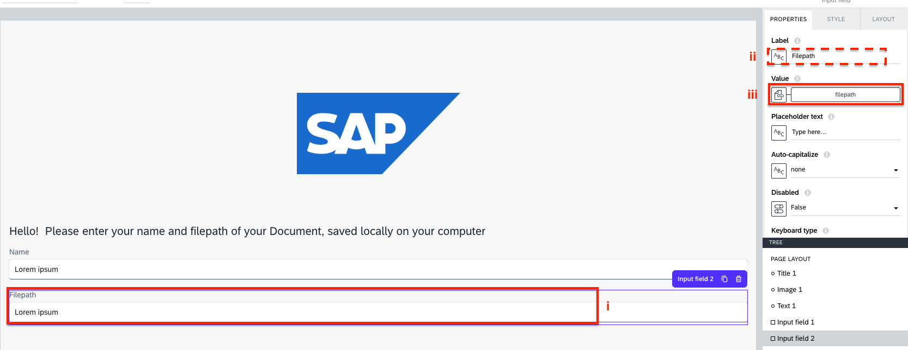
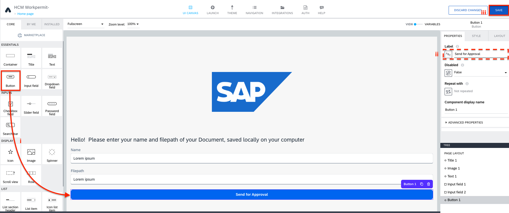

< [Previous lesson](./1_Import_template.md)

# Customise your App

1. From the component library, drag and drop a **Input field** into the editor.  

2. Drag and drop another **Input field** into the editor.  

3. Select the first input field, the properties tab will open on right hand side. 
Change the Label to **Name** and open the binding menu by clicking on **X** under Value.  

4. Select **Data and Variables** and select **Page variable**.  

5. Select **Name** and **SAVE**.

6. Similarily, select the change the label of the second input field to **filepath** and bind the value with **Filepath** page variable.  

7. Drag and drop a **Button** component into the editor and change the label to **Send for Approval**.  .

[Next Lesson](./3_Addprocess.md) >