< [Previous lesson](./2_AppCustomisation.md)

# Add process trigger to the application


1. Select **Integrations** tab on the top and click on **ADD INTEGRATION**.<br><br>
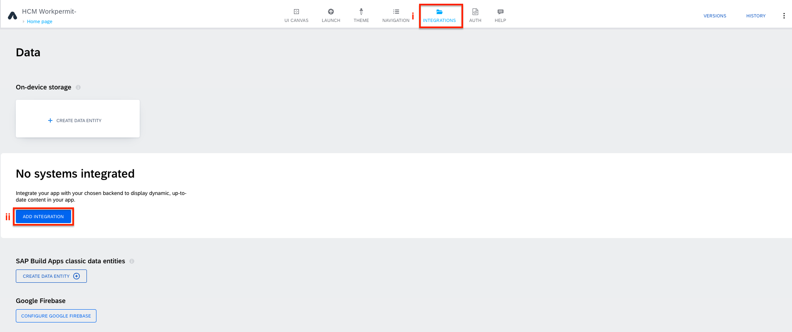

2. Select **LIBRARY** under SAP Build Library.<br><br>
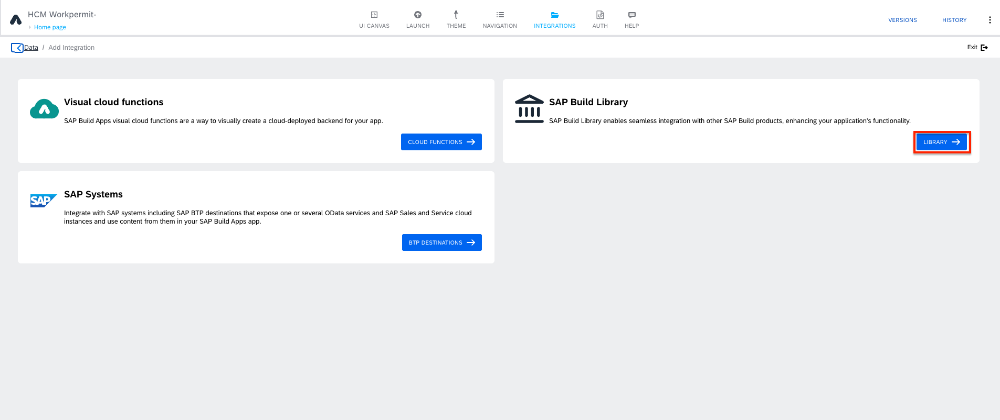

3. Select your recently published process in the library.<br><br>
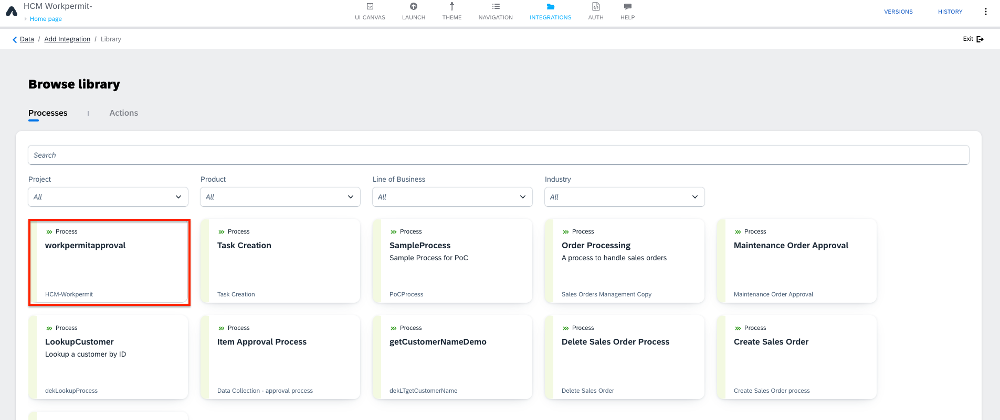

4. Click on **Enable process**.
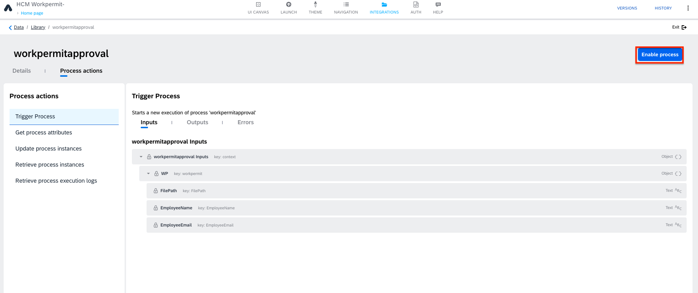

5. Switch back to **UI Canvas**.<br> Select the button and click on **Add logic to BUTTON 1** in the bottom to open the logic editor.
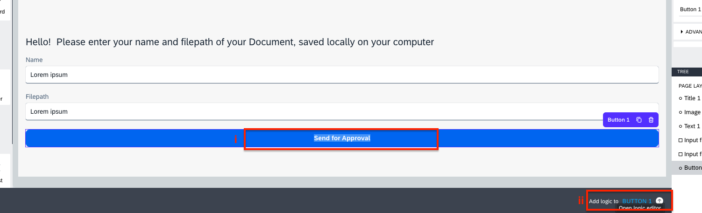

6. Drag and drop **Trigger process** logic component into the logic editor.
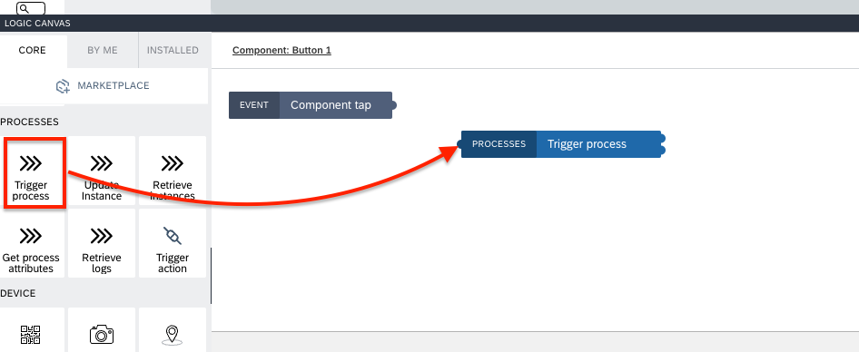

7. Connect the nodes.<br> select workpermitprocess and click on **{ }** to open the binding menu of the input parameters.<br><br>
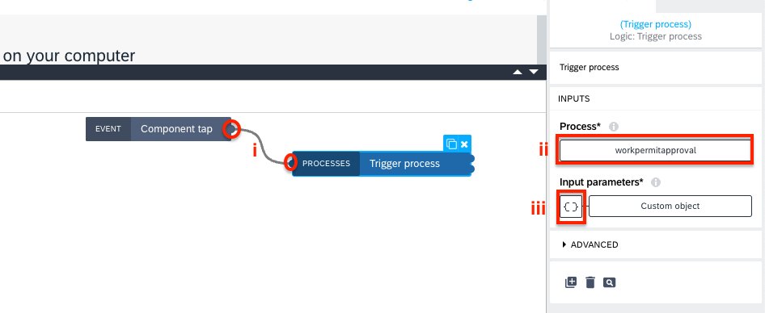

8. Select **Object with properites**.<br><br>
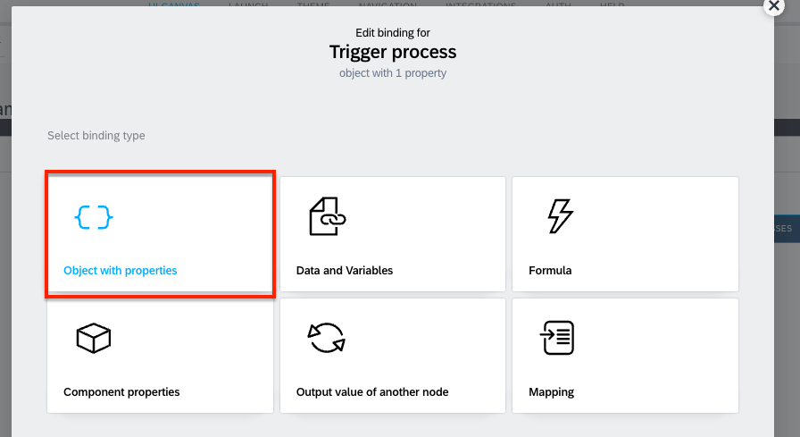

9. Open the binding menu of **FilePath** by clicking on **ABC** and select the filepath page variable.<br>
similarily, bind the **Name** page variable to **EmployeeName** parameter.<br><br>
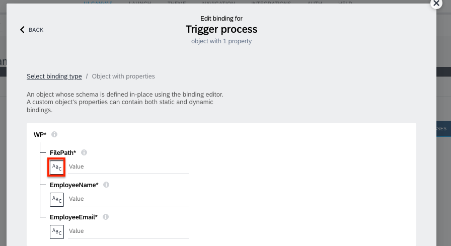

10. Open the binding menu for the **EmployeeEmail**
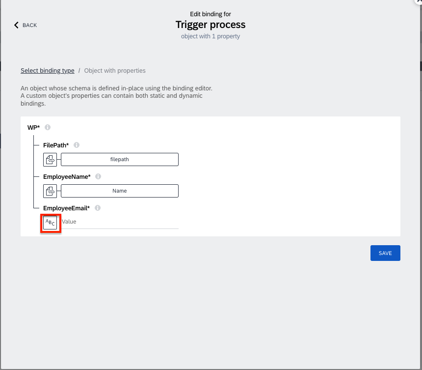

11. Select **System variable**.<br><br>
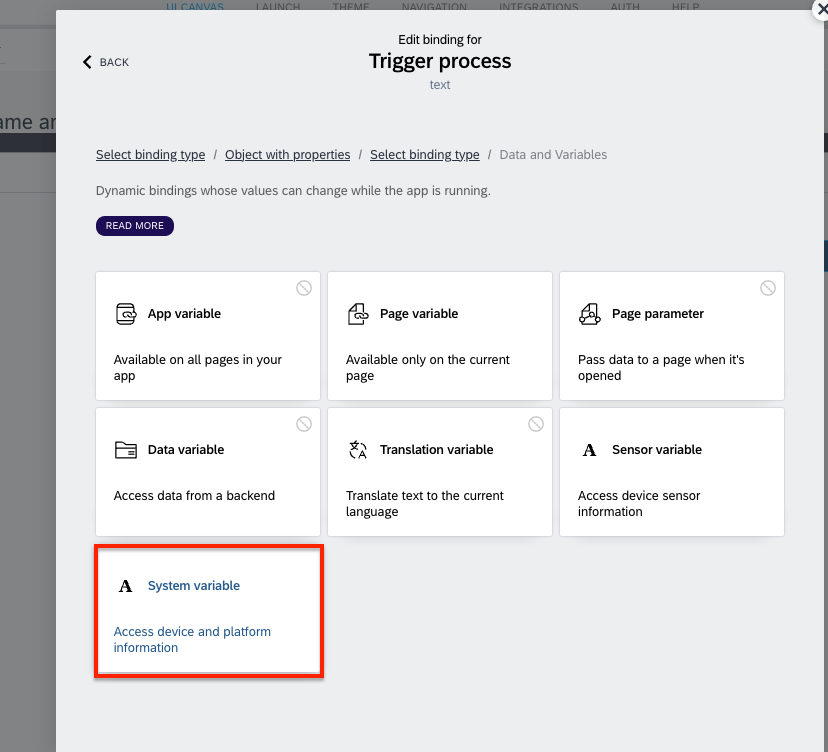

12. Select **Currently loggen in user** for system varaible and **Currently logged in user.email** for system variable field and **SAVE** it. <br><br>
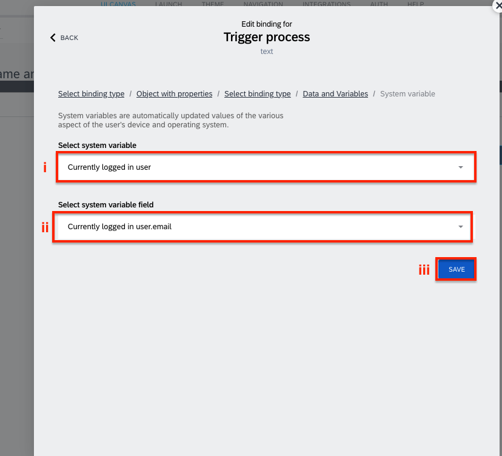

13. **SAVE** again.
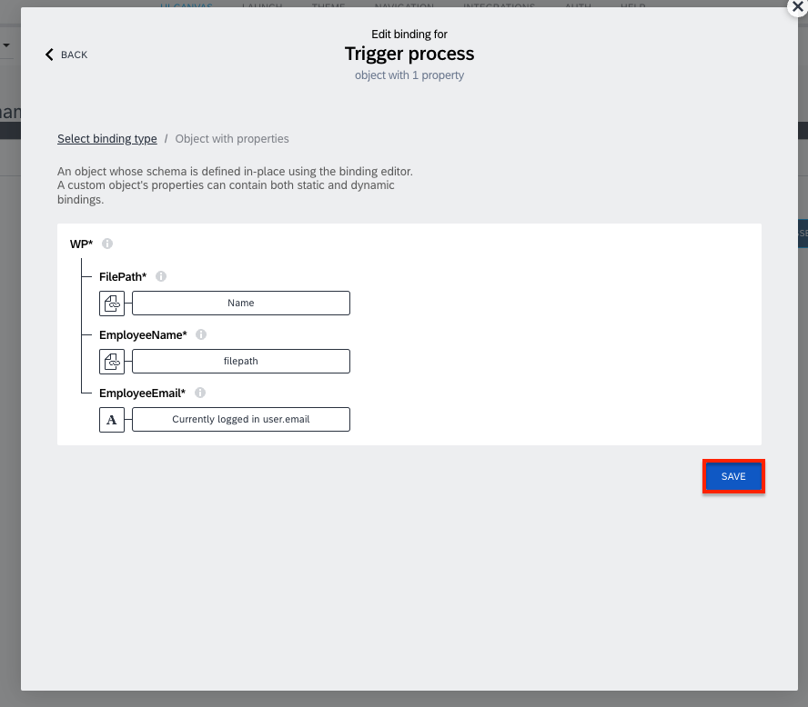

7. Drag a **Toast** flow function onto the canvas.

    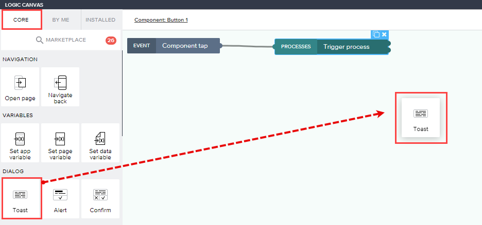

Connect the **top** output of the **Trigger process** flow function to it.
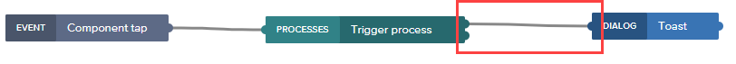

8. Click on the **Toast** flow function and configure it in the **Properties** pane on the right.
For **Toast message**, click on the **ABC**.

    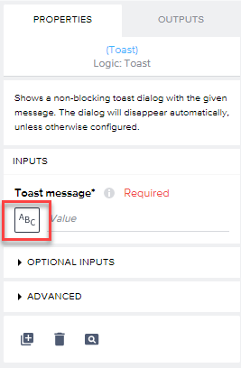

Select **Formula** > **Formula**.

```
"Triggered process with ID: " + outputs["Trigger process"].newProcessInstance.id
```

9. Save the formula using the **Save** button.

    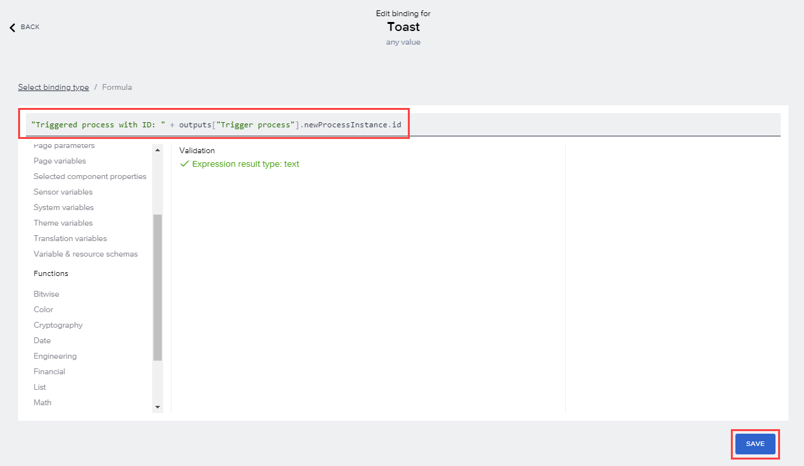

10. Select **SAVE** on the top right corner of the screen to save your recent changes.

    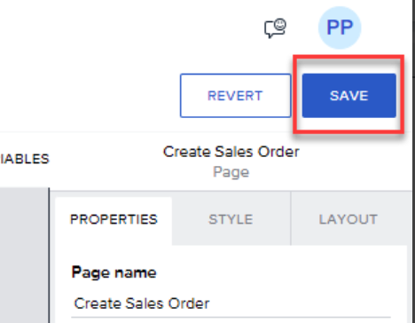

Congratulations, its time to Test your HCM Workpermit App and Process.

[Next Lesson](./4_Testing.md) >