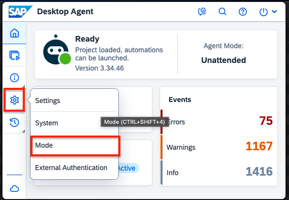
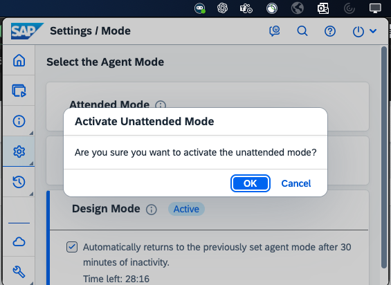
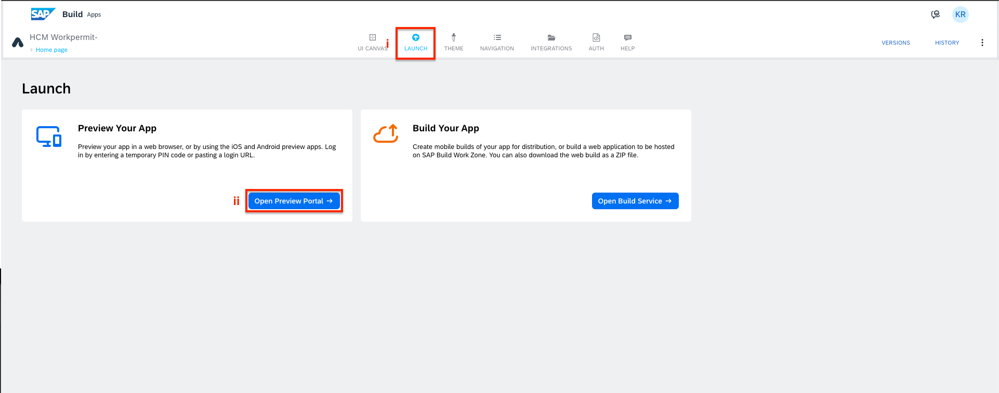
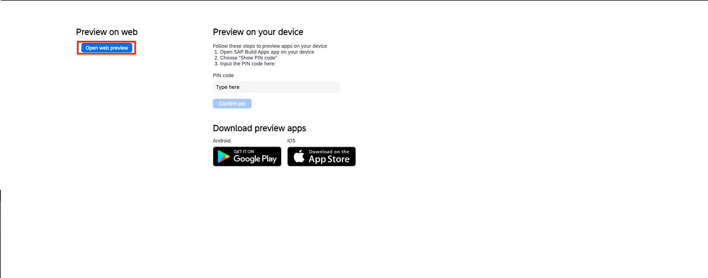
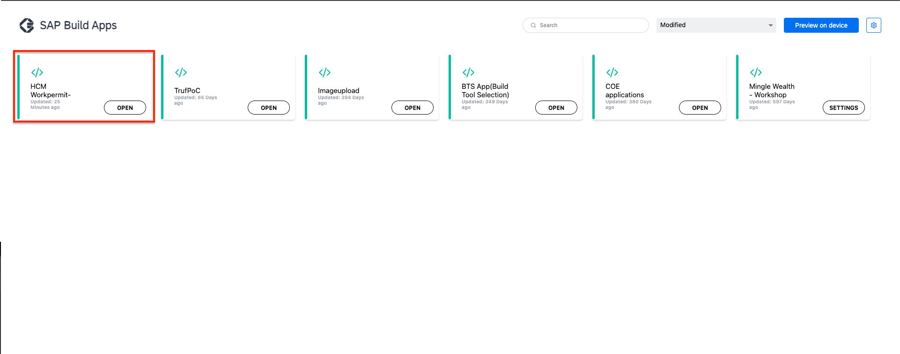
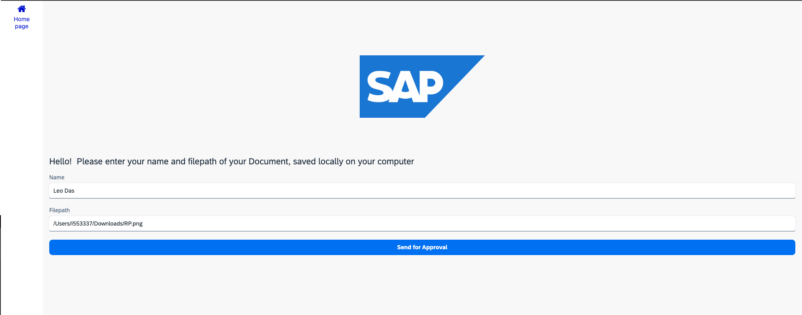
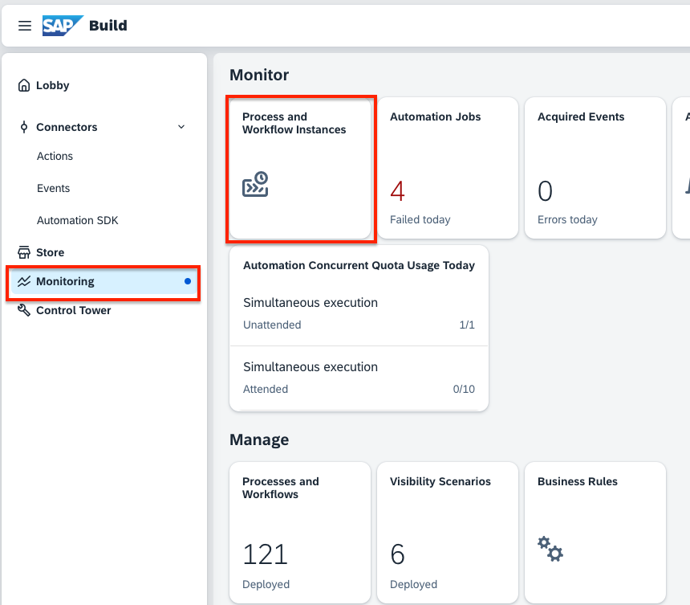
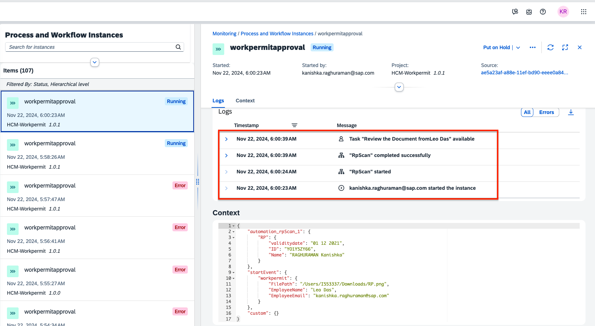
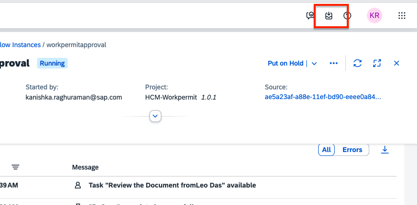
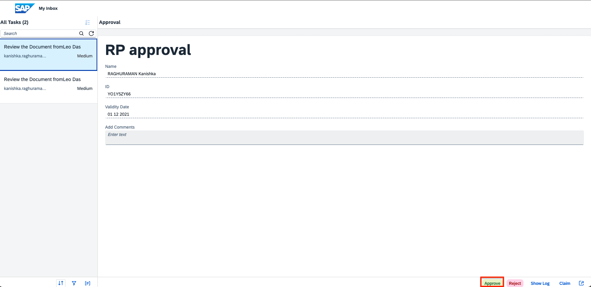

< [Previous lesson](./3_Addprocess.md)

### Testing

# Change Agent Mode
1. Open the desktop agent on your pc, Open the settings and select **Mode**.  

2. Activate **Unattended Mode**.  
 

# Preview the App

1. Go back to your Build Apps project, Click on **Launch** tab and select **Open Preview Portal**.  

2. Select **Open web preview**.  

3. Select your recent Build Apps project.  

4. Enter the Name and Filepath and click on the **Send for Approval** button.

# Monitor the process

1. Open the SAP Build Lobby. Click on **Monitoring** tab and select **Process and Workflow Instances**.  

2. In the Logs, you can see the current status of the process, looks like it is sent for approval.  

3. Open the inbox on the top right.  

4. Check the details and approve it.

Congratulations!! you have sucessfully completed the exercise. 

You can now deploy this application in SAP BuildWorkZone and central access distrubition to all employees in the company!

Happy Building!