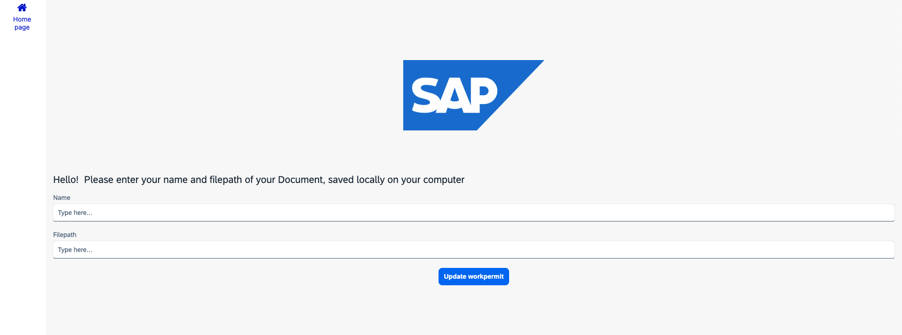

< [Previous Unit](../1_Build_Process_Automation/12_CreateyourProcess/4_Deployprocess.md)

# Create a App to upload your work permit using SAP Build Apps

You will create an app for work permit document information and name of the employee. This app will trigger an existing work permit approval process in SAP Build Process Automation.

## Script Overview

This tutorial shows how to use SAP Build Apps to create, stylize a simple, one-page app to SAP BTP.

Specifically, the app lets the user enter sales order details and then send these to an SAP Build Process Automation process for approval. (In a real-world scenario, the sales order would then be created in S/4HANA Cloud, but that is not part of our flow.)

> **Note:** Make sure to exactly follow the exercise documentation and use the provided naming conventions. Otherwise, you will encounter issues.

## Goal

In this unit, you will learn how to:
- Customisng an app using SAP Build Apps.
- Trigger from your app a workflow in SAP Build Process Automation

At the end of this workshop, your app will look something like this:

## Further information

- [Product Page](https://www.sap.com/products/technology-platform/no-code-app-builder.html)
- [SAP Discovery Center - Services for SAP Build Apps](https://discovery-center.cloud.sap/serviceCatalog/sap-build-apps?region=all)
- [Tutorials for SAP Build Apps](https://developers.sap.com/tutorial-navigator.html?tag=tutorial%3Atype%2Ftutorial&tag=software-product%3Atechnology-platform%2Fsap-build%2Fsap-build-apps-enterprise-edition)
- [Developer Community for SAP Build Apps](https://community.sap.com/topics/build-apps)

<!-- 
[Next Unit](../421_BTP-CleanCore_BuildApps-Workflow/README.md) >
-->
