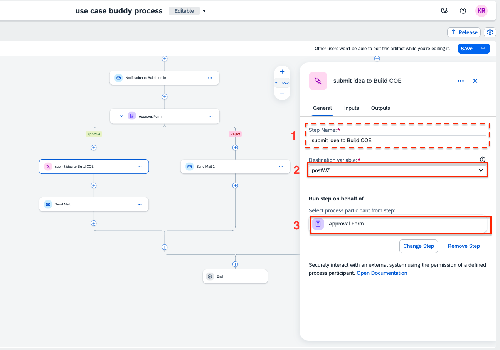
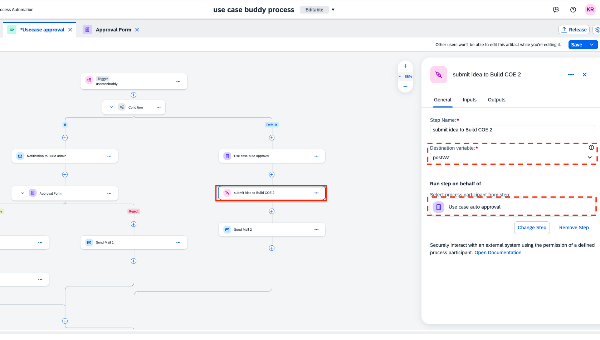
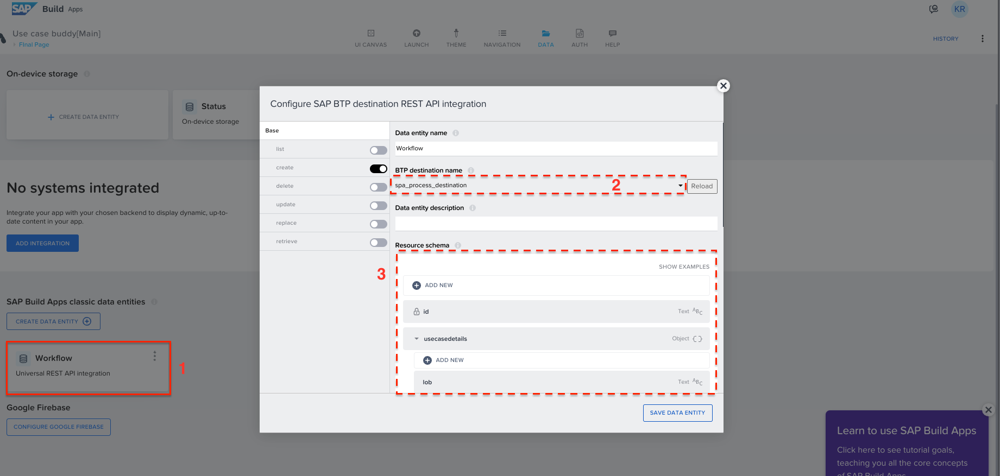
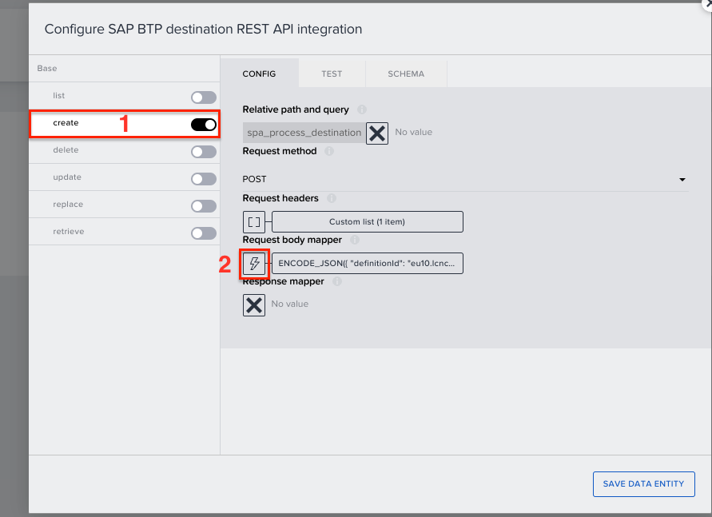

# Implement the Use Case Buddy's approval process configuration and setup
<!-- description --> After you've imported the templates and initially got your project started now is the time to connect everything and get your Use Case Buddy up to speed.

## You will learn  
  - How to connect SAP Build Apps and SAP Build Process Automation destinations
  - How to customize templates and get your Use Case Buddy to a first version

## Prerequisites  
 -  You went through the first Use Case Buddy Tutorial ["Build up your Use Case Buddy"](www.sap.com) and got your project started. 

## Intro
Within this tutorial you will implement the buddy's approval process and configure necessary elements to set it up. 
>Objective of this tutorial: Connect all content packages from SAP Build Apps, Build Process Automation and SAP Build Work Zone as well as change up necessary personalized settings for a first working version of the Use Case Buddy.

### Process Customization

You'll need to set up the correct email configurations so that the right people are reviewers. The first email step in this process would be sent to the IT Team/SAP Build Admins who will review the Use Case information. An email notification can be sent to them that a new Use Case idea has been submitted.

1. Change up the correct address of your reviewer. This person gets all the notifications about new submitted use cases. The email address can be entered in the email header. 
      <!-- size:500px -->
    

1. The mail body can also be edited. Please make sure to change the link of the inbox.
    
    <!-- size:500px -->
    

1. Similarily, edit the email body of the other email steps. 

1. In the approval step recipients, enter the email address of Build Admin/IT admin.
   Similarily, change the recipient for use case auto approval form.

    <!-- size:500px -->
    

### Forward and show ideas in the SAP Build Work Zone template

<!-- @Kanishka: Could we also put this step later? So that people who dont want to use the Work Zone part can always skip it at the end? -->

In the previous step <place holder for previous chapter>, we created an action project that will post the ideas in a workspace of SAP Build Work Zone. Now we will insert that action project in this approval process so that approved ideas get displayed on the Work Zone site.

1. Click on **+** icon under the sucess branch of approval form to add a step. 
   select **Actions** now.
   <!-- size:500px -->
   

2. Now search for the action project you created and add it. 
      <!-- size:500px -->
    
   
3. You can rename the step to *Submit idea to Build COE*.
    
    Make sure a destination variable is selected, if not, please create one.
    Under **Run step on behalf of**, select **Approval form**. Leave the input parameters as it is.

    <!-- size:500px -->
    
Go to Inputs tab, map <i>postmessage</i> to <i>Content</i> and <i>title</i> to <i>Name</i>
       <!-- size:500px -->
    
1. Similarily add another action project under the **Auto approval form** in the default branch of the Condition, 
     <!-- size:500px -->
    

1. After all the configuration, make sure to save it and release it.

    <!-- size:500px -->
    

2. After releasing, deploy your project. Select the target you created to connect to the SAP Build Work Zone to define the target variable.

    <!-- size:500px -->
    

### Integrate your use case approval process with the Use Case Buddy App
1. First make sure your [process automation destination setup](https://developers.sap.com/tutorials/spa-create-service-instance-destination.html) is completed. 

1. In the SAP Build Process Automation project, in the data type use case buddy, you can see that there are a lot of parameters.

    <!-- size:500px -->
    

  *In other words, these values are needed to trigger the approval process. These values are sent from SAP Build Apps through destination API.*

1. In SAP Build Apps project, check the data connection **Workflow**. 
   
   - Make sure the correct destination is selected to access SAP Build process automation.
   - The resource schema from SAP Build Apps should match the data types in SAP Build Process Automation.   

    <!-- size:500px -->
    

1. Select the **Create** tab and open the formula for *Request body mapper*.

    <!-- size:500px -->
    

1. Using formula editor replace the destination id of your deployed process. 

    Through the destinations, the SAP Build Apps, can access SAP Build Process Automation service, and using the defition ID of the process, the app will be able to identify the right process. 
    
    Now, this data connection will identify the process and deliver the values according to schema of the data type created in process automation project.

    <!-- size:500px -->
    

1. To get the definition ID, make sure your SAP Build Process Automation project is **deployed**.
    
    Once deployed, go to the monitoring tab of your Build lobby and select **Process and Workflows**.

    <!-- size:500px -->
    

2. Search for your process, and select it.

    Now copy this definition ID and use it in SAP Build Apps.
  
    <!-- size:500px -->
    
