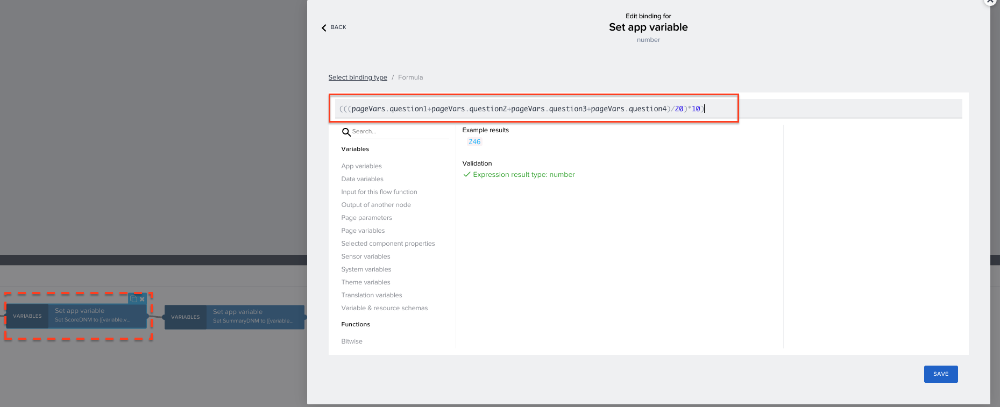
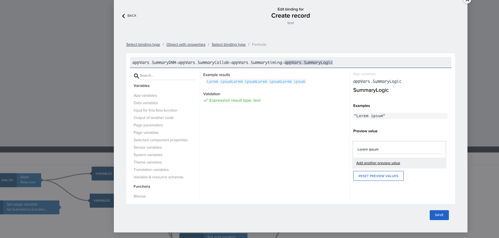

# Customize the Use Case Buddy to your needs
<!-- description --> The Use Case Buddy templates contain lots of great questions and proposals for how you can use and build your own Buddy. This section is all about you changing up the content in it.

## You will learn  
  - How to ideate, collect and differentiate ideas from your users
  - How to build your own Use Case Buddy for your organization
  - How to connect SAP Build Apps, SAP Build Process Automation and SAP Build Work Zone Advanced Edition
  - How to change and customize contents, logics and workflows in the SAP Build portfolio

## Prerequisites  
 -  You have setup and build the Use Case Buddy from Tutorial [Build up your Use Case Buddy](www.sap.com)
 -  You have implemented the Use Case Buddy's approval process configuration and setup the necessary steps from Tutorial [Implement and ...](www.sap.com)

## Intro
The Use Case Buddy templates contains lots of great questions and proposals for how you can use your own Buddy. This section is all about you changing up the content in it.

>The following descriptions work as a inspiration and documentation for things you might want to change, add or delete! Of course you can customize way more, but use this a first start to understand the templates are built and how they work in interconnection.

**What's in it for you?**
With customizing the **Use Case Buddy** in your organization you can:

  - Swap out questions, contents and elements
  - Change logics, weightings and reviewers
  - Adapt to your branding, visuals and guidelines

### Details page (sub category) 
In the Details Page, basic information of the use case is collected, like Name, description, LoB and more. App variable has been used to collect this information.   
  <!-- size:500px -->
  

### Adding more options to the "Line of Business" list

- To add the more options in the list for ***Line of Business***, open and binding menu for the **Option list** and add the options.
  <!-- size:500px -->
  

- In binding menu select list of values to edit or even add more options in the dropdownn lists.
<!-- size:500px -->

### Progress bar

- A progress bar has been used in the app, to let the users track the progress of the questionnare using an app variable *completion* value.
  <!-- size:500px -->
  

- Using *Set app variable* to assign value to progress bar, in every page to hardcode the progress based on the number of pages used.
  <!-- size:500px -->
  

### Creating question containers

1. Each question container will have a Title component and an Answer component.  
The questions are static, and can be changed in the properties of the component   
  <!-- size:500px -->
  

2. The Answer component will have a text component and a slider component, and have page variables answer and question binded to text and slider components respectively.  

  <!-- size:500px -->
  

3. The slider have 5 values and text component will display dynamic values based on the slider value with logic created on the page level.
Below is the logic for that.
- An event logic is used to check the slider values. In the properties of event logic select the question variable which is binded with the slider.

  <!-- size:500px -->
  

- The answer page variable is binded with a formula to check the slider value and show the respective option accordingly. 
for example
      IF(pageVars.question1==1, "1 Data source", IF(pageVars.question1==2, "2 Data sources", IF(pageVars.question1==3, "3 Data sources", IF(pageVars.question1==4, "4 Data sources", IF(pageVars.question1==5, "not sure about the number of data resources",""))))) <!-- this will format it as code on the sap.developers markdown flavor-->

Feel free to change the options and values accordingly. 

### Complexity score calculation

The complexity score is a straightforward aggregation of slider values. Each slider, ranging from 1 to 5, represents a level of difficulty (1 being easy, 5 being difficult). In our template, there are five values in each slider.

Consider a page with four questions, each with a slider having five values. The maximum complexity score for this page would be 5 values * 4 questions = 20. To make this more digestible, we calculate the average score on a 10-point scale for each page using the formula:

    Averagescore= (sum of selected values/maximum value) * 10

  <!-- size:500px -->
  

Finally we aggregate the score of all pages to calculate the overall complexity of the idea.

  <!-- size:500px -->
  

### Summary Generation

Similar to the score calculation, the summaries are concatinated using the page variables and some the static text in each page.

  <!-- size:500px -->
  

And finally summaries from all the pages are concatinated when sending data to SAP Build Process Automation.
  <!-- size:500px -->
  

### Final page

**Deciding complexity**

- When the final page is mounted, the app variable complexity is binded using the formula. 
        IF(appVars.Score<=3, "Low", IF(appVars.Score<=5,"Moderate",IF(appVars.Score<=7.5, "High", IF(appVars.Score>=7.5,"Very High",""))))<!-- this will format it as code on the sap.developers markdown flavor-->

- For the complexity score less 3 the complexity is **low**, for complexity less than 5 it will be **moderate**,for the complexity score less 7.5 the complexity will **High**, and will remain **Very High** if the complexity score is greater than 7.5.

Similar formula is used in the image component.

- Using <i>create record</i> logic in the Submit use case button, the data is sent from the app to trigger the approval process via destinations. here, an additional field called <b>post message</b> is sent. 
This is field is used to add formatting the to the post when adding it in Build COE. 
  <!-- size:500px -->
  

HTML tags can be used to format this text.

  <!-- size:500px -->
  

Formatted text on the workspace. 
<!-- size:500px -->
  

After all the customisation, open the app in preview mode to test the framework.

- In testing, you can enter the use case idea in the application and submit it.
- The idea will be submitted to the process where you will see the email notificaiton to review the use case. in the SAP Build inbox you can review the use case and approve it. 

- Now the appoved idea should be visible in the Forums of your workspace.  

Best practises to deploy the application.

< Add here > 