# Get your Use Case Buddy started
<!-- description --> With the great advantages of low-code your key users, application developers and employees will be brimming with a vast number of ideas to build! Many will want to dive in fast and start developing their own solutions, because it is easy to start playing around with drag-and-drop tools. So, how can IT avoid becoming inundated with requests for approval to build use cases that exist already, don’t make sense, or risk creating shadow IT? How can IT best determines use case complexity and requirements for to-be solutions that extend and augment SAP systems? They require a structured way to collect, classify and review idea ... a Use Case Buddy!

## You will learn  
  - How to ideate, collect and differentiate ideas from your users
  - How to build your own Use Case Buddy for your organization
  - How to connect SAP Build Apps, SAP Build Process Automation and SAP Build Work Zone Advanced Edition
  - How to change and customize contents, logics and workflows in the SAP Build portfolio 

## Prerequisites  
 -  Account in SAP BTP ([Check out Free Tier Service Plans](https://developers.sap.com/tutorials/btp-free-tier-account.html) in case you want to start fresh)
 -  IAS tenant with the openID protocol; Important: SAML cannot be used as protocol. The IAS tenant and the BTP account with SAP Build Apps must run in the same landscape (Either both on the canary or both in the productive landscape) 
 -  Boosters for [SAP Build Apps](https://help.sap.com/docs/build-apps/service-guide/activate-your-sap-build-apps-package) and [SAP Build Process Automation](https://developers.sap.com/tutorials/spa-subscribe-booster.html) are activated
 -  SMTP Destination [configured](https://help.sap.com/docs/build-process-automation/sap-build-process-automation/configuring-smtp-mail-destination) to send mail notifications
 -  *(optional, in case you want to connect the Use Case Buddy to SAP Build Work Zone)* [SAP Build Work Zone Advanced Edition](https://blogs.sap.com/2023/01/02/sap-btp-onboarding-series-step-by-step-guide-to-activate-your-sap-build-work-zone-advanced-edition/) activated and setup in your BTP Subaccount
 - *(optional, in case you want to connect the Use Case Buddy to SAP Build Work Zone)* [Destination created](https://developers.sap.com/tutorials/spa-create-service-instance-destination.html) to trigger Process from any service
 - *(optional, in case you want to connect the Use Case Buddy to SAP Build Work Zone)* “JAM” as destination in BTP Cockpit can be found

## Intro
It’s essential for IT to educate and guide everyone involved in fusion development so their time and effort is being used wisely, steering them to the right projects from the start. Characterizing the complexity of a use case before development begins is critical, so that IT can prevent avoidable costs, quality issues, and security problems. And, as the volume of use cases for consideration quickly grows from a dozen to hundreds and more, the IT teams responsible for governance need to manage this at scale. This is where the Use Case Buddy comes into play!

<!-- size:500px -->
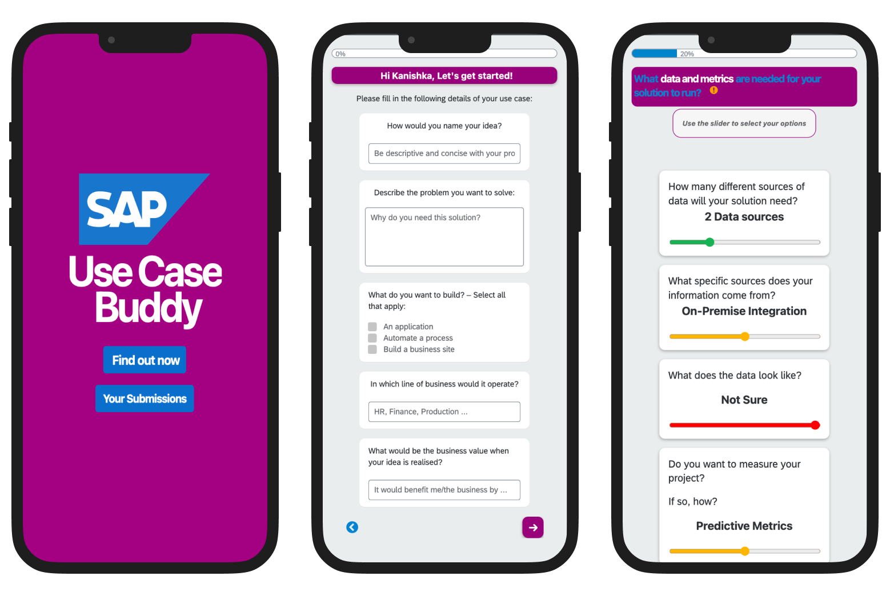

The buddy uses straightforward and practical questions to assess the project complexity during the ideation phase for. As a result, you’ll understand what each new idea will demand from your team and its resources, and determine whether it should be developed. When you build it yourself you’ll be able to gathers ideas from your Citizen Developers, translate them into requirements and technical descriptions for IT, let IT review them and establish a foundation of transparent low-code development and collaboration among all participants!

>Objective of this tutorial: *Take over the content packages,  give it your own branding, customize it according to your needs and ideas & you're already good to go!*

**What's in it for you?**
With building the **Use Case Buddy** in your organization you will:

  - Easily gather general specifications with SAP Build Apps
  - Classify complexity of low-code project for fusion collaboration
  - Enable IT Admins to review and approve use cases for development with SAP Build Process Automation
  - Store the information in a use case repository with SAP Build Work Zone Advanced Edition

### Get an understanding of how the Use Case Buddy works

Building the Use Case Buddy and making it work for your organization will bring a huge benefit to you! But in order to do that it will be helpful to understand the planned setup. 

1. So please take a look at this 📷 [demo video](https://video.sap.com/media/t/1_r2s0z7jd) to see how it could look like at your organization.

1. The Use Case Buddy consists of three big parts. Every part is connected with each other:
    1. **SAP Build Apps** App in the beginning to Collect the intial requirements and gather input from the users
    2. **SAP Build Process Automation** Process to forward and review the submitted use case through reviewers, for instance IT
    3. **SAP Build Work Zone Advanced Edition** site to centrally present and visualize submitted use cases for everyone interested for instance key users or stakeholders

    You could only use the ideation and reviewing two parts and leave out the third part which pushes them to a portfolio management site in SAP Build Work Zone - but then you don't have a central place to overview everything for your low-code community. This way they won't get inspired or maybe don't even start because they can't connect with each other on ideas.

1. This is the solution diagram for the Use Case Buddy setup including the respective roles.

     <!-- size:400px -->
    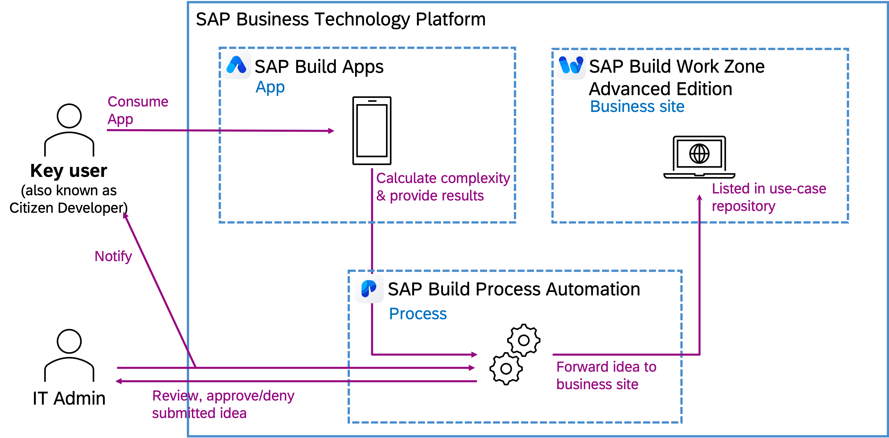

    The key user with a potential use case would be using the Use Case Buddy App built using SAP Build Apps, to the their use case and answer few set of questions which will then automatically calculate the complexity of the use case. Now this idea and description will be forwarded to IT admins/teams to check the feasibility of creating the use case using SAP Build Process Automation. The IT admins will review the use case and its complexity, and will make choice for the level of collaboration that might be needed to create the use case. For instance if they only need to check the final result for a low complexity use-case or whether they need to actively help because the needed systems are very big for a higher complexity use case.
    And ultimately the Use Case would be forwarded to a business site on SAP Build Work Zone Advanced Edition which then lists all of the Use Cases in a central repository.

1. Ready to move on? You've got all you need now!
    

### Get the templates!

1. If you're not already signed up for the SAP Build Governance Resource Center - [Sign up](https://url.sap/f96fc8) to get access to our SAP Build Governance resource center. Within it you will find the needed template!
    
    <!-- size:300px -->
    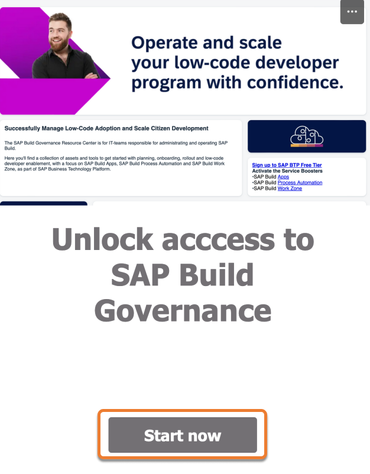

1. Then click on "accept" in the email invitation that will be sent to you. Access requests may take several minutes to verify and trigger the email, so kindly be patient.
    
    <!-- size:400px -->
    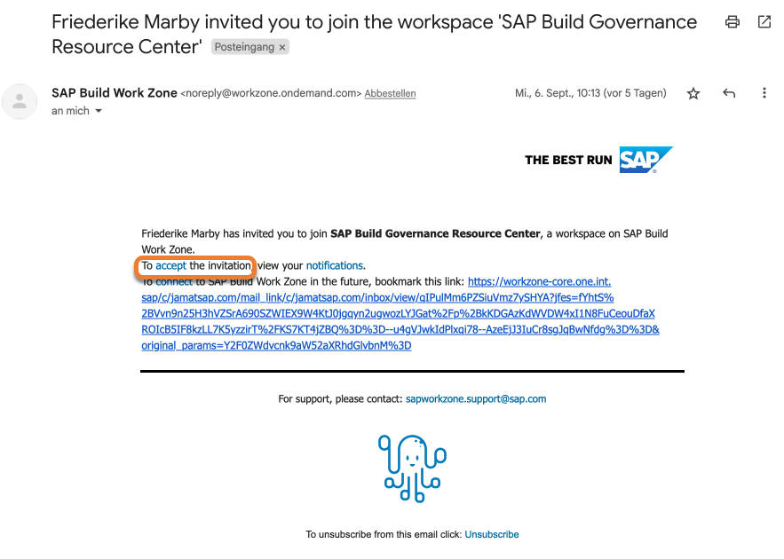

    In case you don't receive an invitation mail after 24 hours, use this [link](https://workzone.one.int.sap/) to access SAP Build Work Zone. 

2. Log-in with your SAP universal ID or quickly create a new one.    
    
    <!-- size:300px -->
    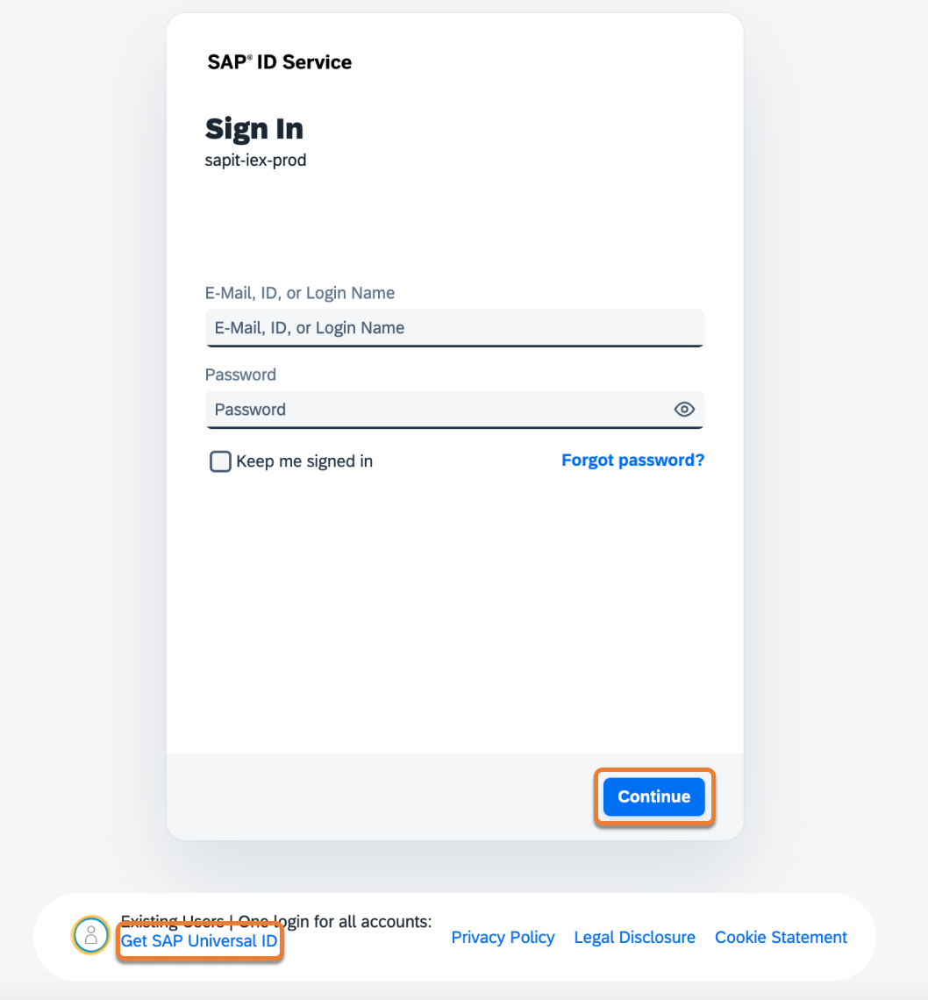
    
3. Look for the invitation in the notifications (bell button) and confirm from there. This will only work when you signed up with your email before.

4. Access the SAP Build Governance Resource Center by clicking on *Join*.
    
    <!-- size:500px -->
    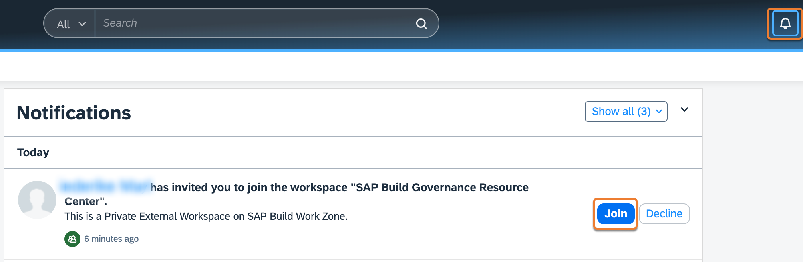

5. Scroll down in the SAP Build Governance Resource center until you reach the area of the Use Case Buddy. There click on *Click here to get the templates.*
    
    <!-- size:500px-->
    

6. Now just click on the file-names to download the templates to your personal device!
    
    <!-- size:500px -->
    

### Import the templates for SAP Build Apps & Process Automation

1. Open your SAP Build Lobby and if necessary log-in with your credentials or SSO.

    <!-- size:400px -->
    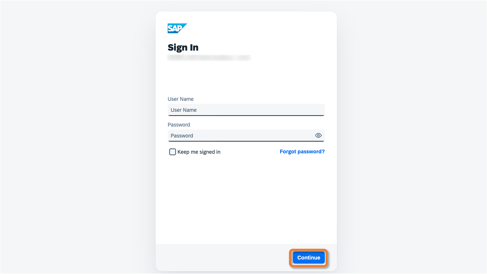

1. Click on the *Import* symbol.

    <!-- size:400px -->
    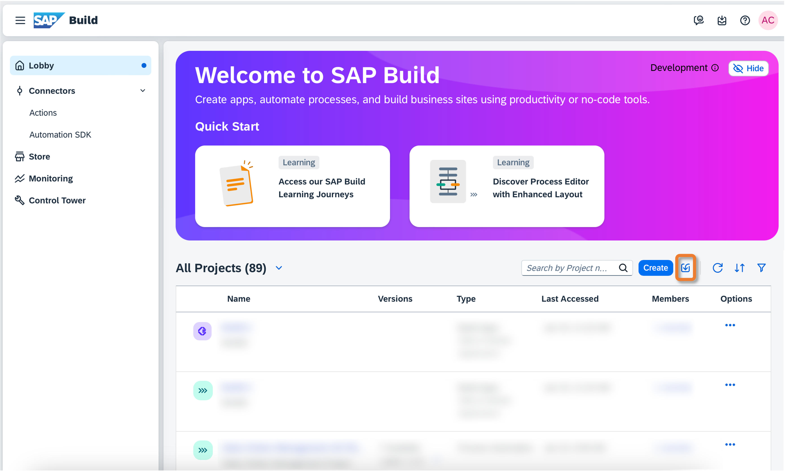

1. Click on *Browse Files*. Choose the first template you downloaded previously.

    <!-- size:400px -->
    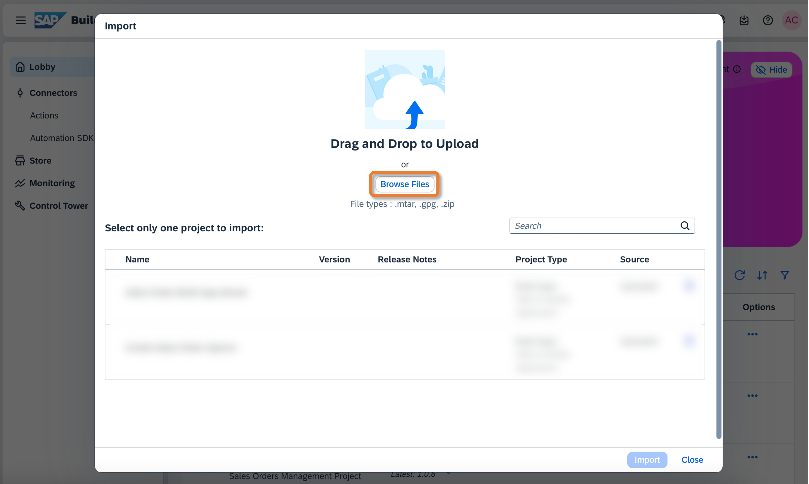

2. Select the template you just uploaded and click on the *Import* button.

    <!-- size:400px -->
    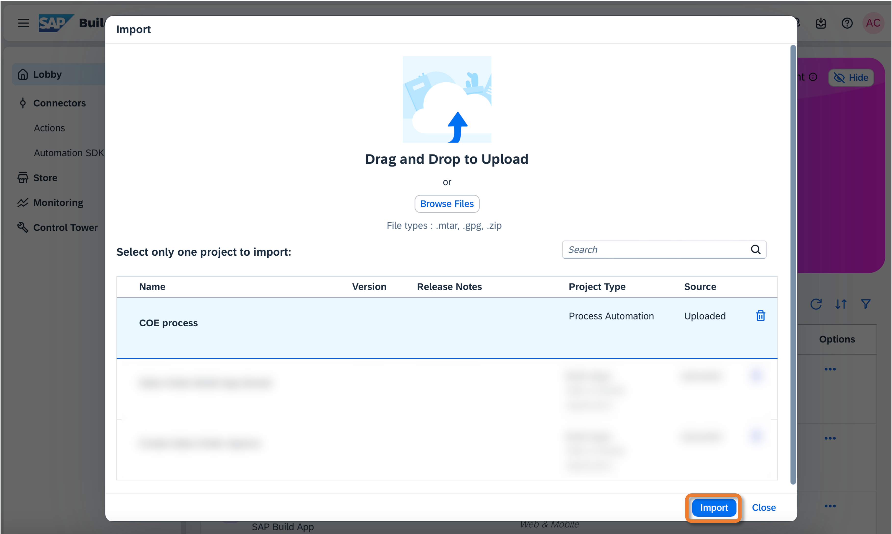

3. Repeat the steps with the other templates you downloaded.

4. All done! Now you can see your imported projects.

    <!-- size:400px -->
    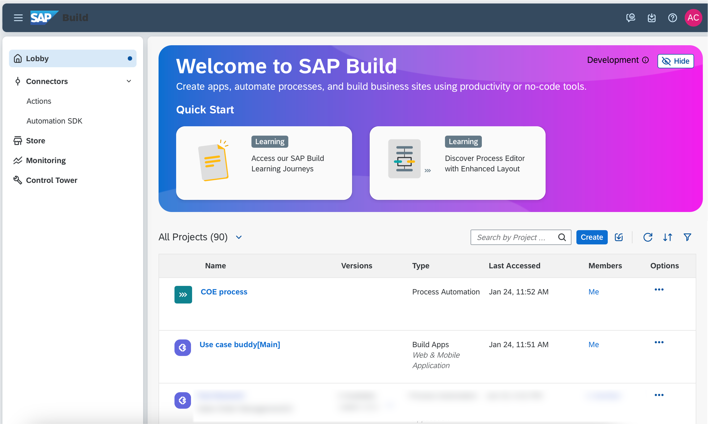

### Import the templates for SAP Build Work Zone Advanced Edition

In the third part of the Use Case Buddy the submitted ideas will get forwarded and displayed on a SAP Build Work Zone Advanced Edition site. The following step is all about importing a template site for this project. You can also do it with any other SAP Build Work Zone Advanced Edition site. 

1. Follow along this [tutorial](https://developers.sap.com/tutorials/build-digital-coe.html) to import and build your "Digital CoE". **Please note:** You only need to do step 1 and 2 for the Use Case Buddy. Of course you can still follow the other steps afterwards ...

### Setup SAP Build Work Zone Advanced Edition to SAP Build Process Automation 

In this step you'll connect SAP Build WorkZone Advanced Edition with the Forum APIs from your SAP Build Process Automation automation and the Action Project. We will also see how to post a new Idea to an already established Forum in SAP Build Work Zone Advanced Edition from an Action Project.

Let's get started!

1. Let's do Destination Setup first. Open **SAP BTP Cockpit** and navigate to **Destinations** section.

    <!-- size:500px -->
    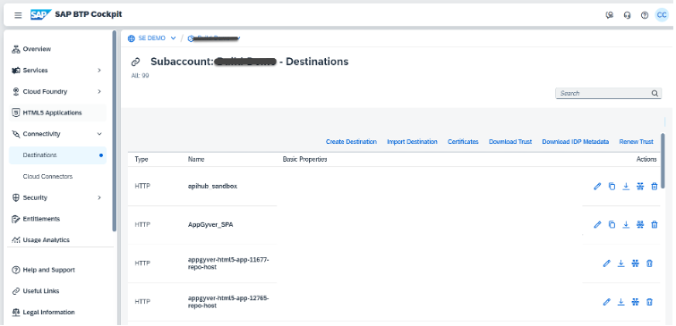

2. Search for **JAM** destination and click on **Clone** Icon to create a duplicate of the JAM Destination.

    <!-- size:500px -->
    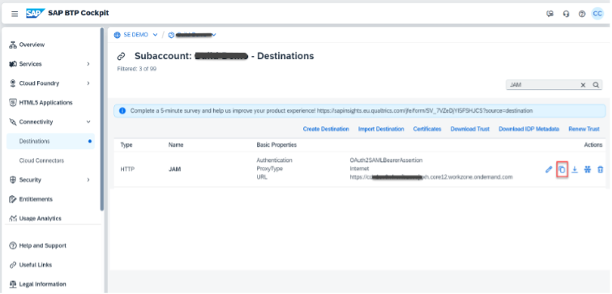

3. Change the followings in the JAM_CLONING destination and Save.

    - Give a different destination Name: **JAMForActions** *Please note: We will refer to this new destination “JAMForActions” later in Action Project.*
    - Add few **Additional Properties** as below:
      - sap.applicationdevelopment.actions.enabled : true
      - sap.processautomation.enabled : true
      - sap.build.usage: odata_gen

    <!-- size:500px -->
    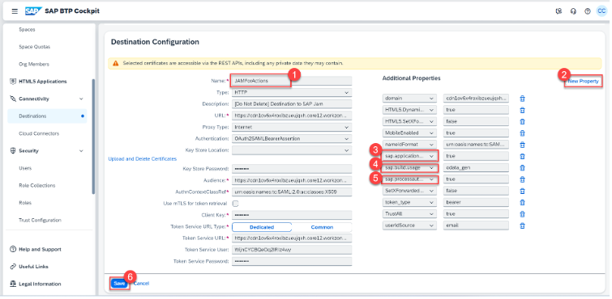
    
    Please take a note of the **JAM URL**. It’s the Workzone domain URL of your BTP account.

4. Click on **Check Connection** on newly created destination and verify the connection. You should get “**200: OK**”.

    <!-- size:500px -->
    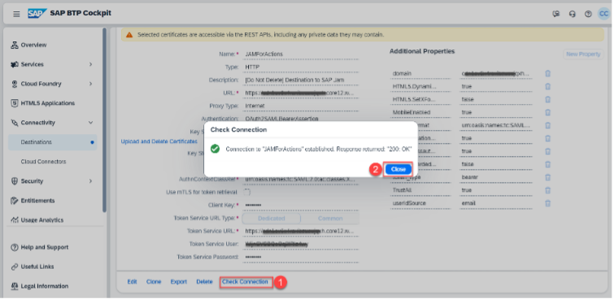

1. Next we'll create a new Forum in Workzone and spot the ID. Log into **SAP Build Work Zone** site (Advanced Edition) and navigate to your workspace, where you want to setup the Forum.

    <!-- size:500px -->
    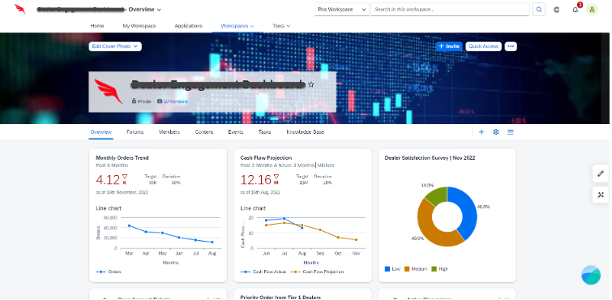

1. Click on **Forums** and click on **New Forum Topic**.

    <!-- size:500px -->
    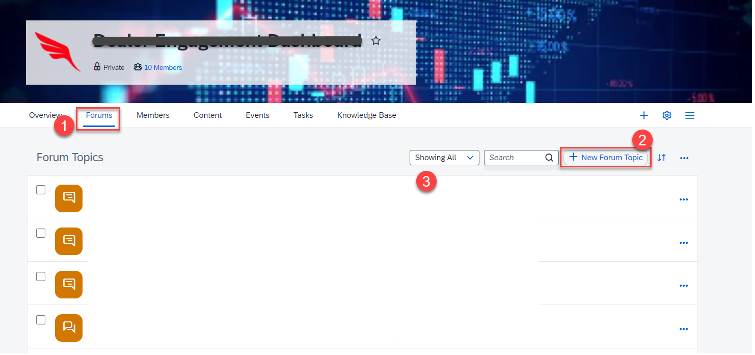

1. Enter the **Topic** Name (For example “Use Case Buddy”) and click on **Save**.

    <!-- size:500px -->
    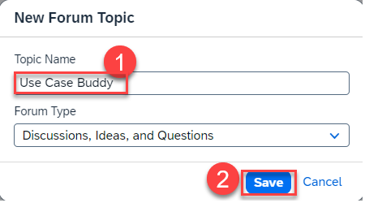

1. You will see that new Forum got added to the existing forum topics.
    
    <!-- size:500px -->
    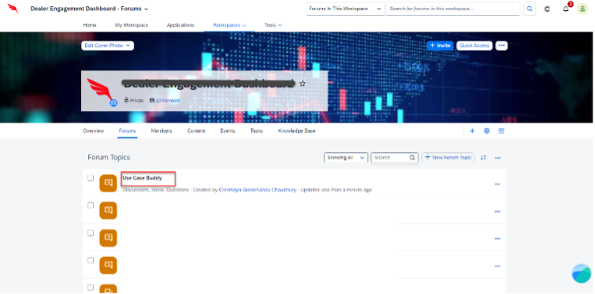

    Click on the Forum topic, to navigate to see the ideas available. Obviously, you will find zero ideas for the newly created forum.

    **Please note** the folder_id for the “Use Case Buddy” forum topic, we just created. Here, you can see the forum id as marked in the URL. It will be used while creating the Action project.

    <!-- size:500px -->
    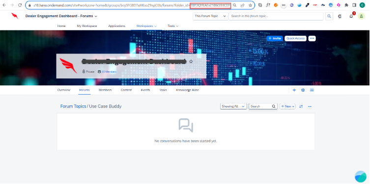

1. Now we will create the API specification (API Spec)

1. Download the API Spec from the below mentioned git repository:

    [APISpec](https://github.com/SAP-samples/build-apps-enablement/blob/main/UseCaseBuddy/IdeaPostAPISpec.json)

    **Please note** that this is the custom API specification created for this particular use case. The complete Work Zone Forum API specification can be found is SAP Business [Accelerator Hub](https://api.sap.com/api/Forum/overview).
    
2. Change the **Servers>url** to include JAM host URL (refer to JAM destination section)

    <!-- size:500px -->
    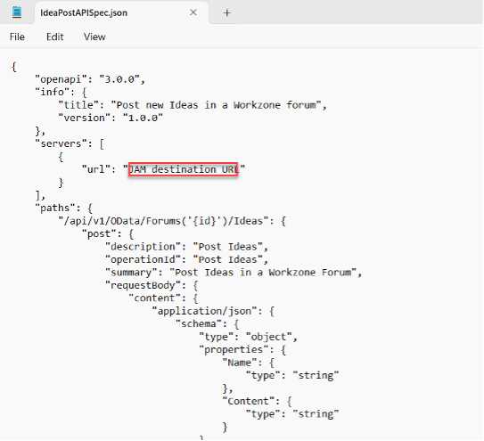

    **Please note** the *requestBody* and response of the API Spec. These are the properties we need to execute the Action Project.
    
    Refer the **Post Path URL**. The **“id”** is an input path parameter, we will configure while creating Action Project. 
        
    - Name: This is input Body parameter for Idea Title
    - Content: This is input Body parameter for Idea Content

### Create an Action Project

[Why are we doing this]

1. Open **SAP Build Lobby** and navigate to **Actions** section. Click on **Create**.

    <!-- size:500px -->
    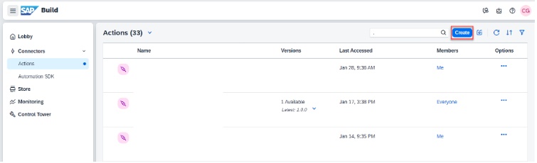

1. Click on **“Upload API Specification”**
   
    <!-- size:500px -->
    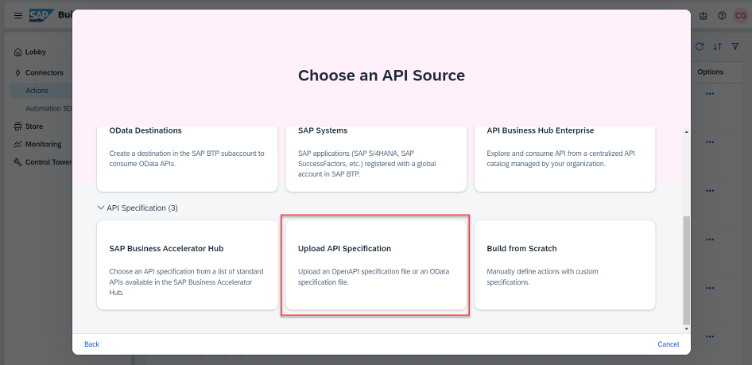

1. **Browse** the API Spec which you have downloaded in previous section and click on **Next**.

    <!-- size:500px -->
    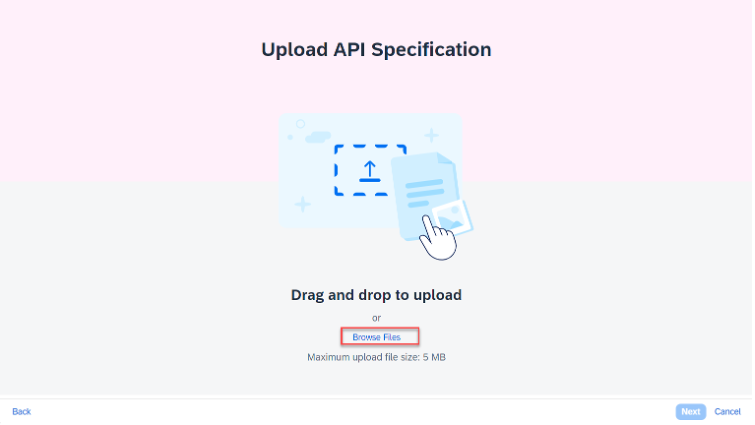
    <!-- size:500px -->
    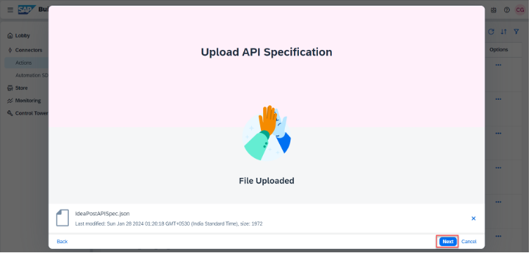

1. Enter the **Project Name** (For example Workzone_Adv_Forum_Create_Idea) and **Description**. 
     
    Click on Create. It will open the **Action Editor**, with the option of selecting the Actions, which we have preconfigured in our APISpec file.
 
    <!-- size:500px -->
    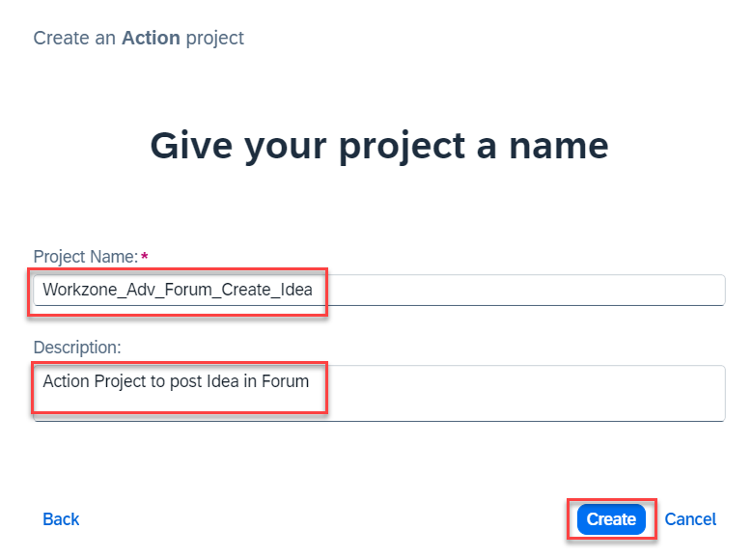

1. Choose the **Post Action** (/api/v1/OData/Forums('{id}**')/Ideas). Click on Add**

    <!-- size:500px -->
    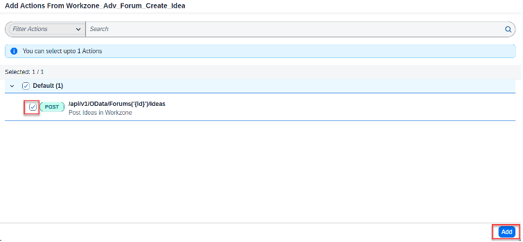

1. Now, you can see the Action Project in Action Editor with prefilled **Input and Output** section.

    <!-- size:500px -->
    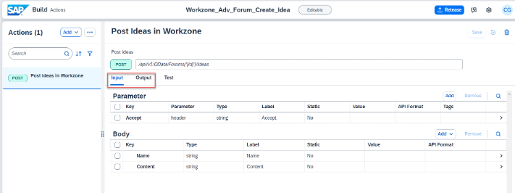

1. You can see that **“id”** as **path** parameter is missing as Input parameter. Let’s create it.

1.  In **Input** Tab, click on **Add**.

    <!-- size:500px -->
    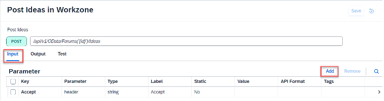

1.  Select **New Field** and enter all the required fields.

    <!-- size:500px -->
    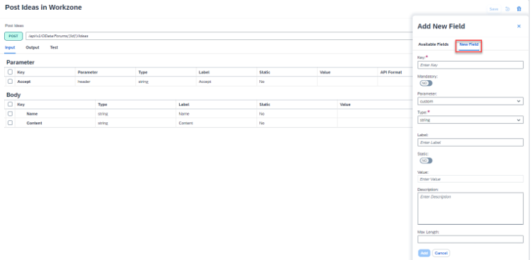

1. Enter the values of New Field as follows:
    - **Key**: *id*
    - **Mandatory**: *Yes*
    - **Parameter**: *Path*
    - **Label**: *id*
    - **Static**: *Yes*
    - **Value**: *Forum folder id* (your id which you have created in the previous section)

    Click on **Add**.

    <!-- size:400px -->
    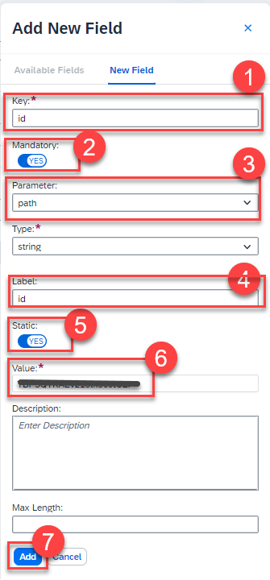

1. You can see that the** mandatory path parameter (id)** is now appearing in Input parameter section. Click on **Save**.

    <!-- size:500px -->
    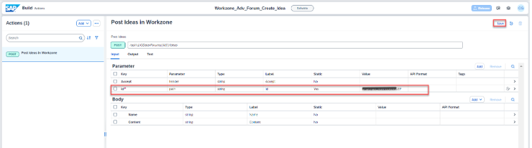

1. Navigate to **Test** tab. And select the **JAM destination** (Say, JAMForActions) from Destinations dropdown, which we have created in previous section.

    <!-- size:500px -->
    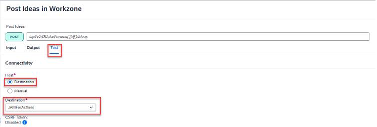

1. Enter the following **Input values** and click on **Test**.
    - **Accept**: *application/json*
    - **Name**: New Idea Title (For example: "New Mobile App for Finance Dept")
    - **Content**: New Idea Content (For example: "Considering the need for universal access, I propose developing a new mobile application for the team.")

    <!-- size:500px -->
    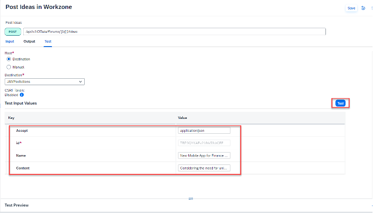

1. You can see that now the execution is successful with *201 status* code. Click on **Save** to save the Action Project.

    <!-- size:500px -->
    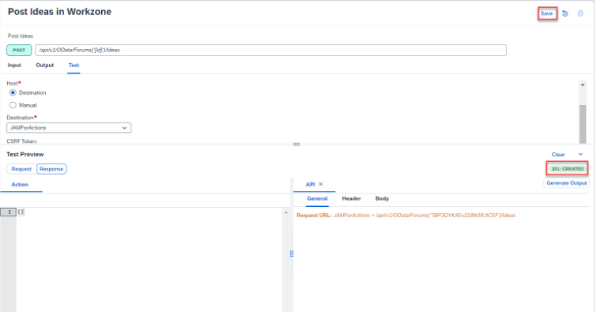

1. Lets verify the created Idea in Workzone! Navigate to Workzone Forum, which we have created in previous section. You can see the **idea posted** from Action Project is now appeared under the Forum.

    <!-- size:500px -->
    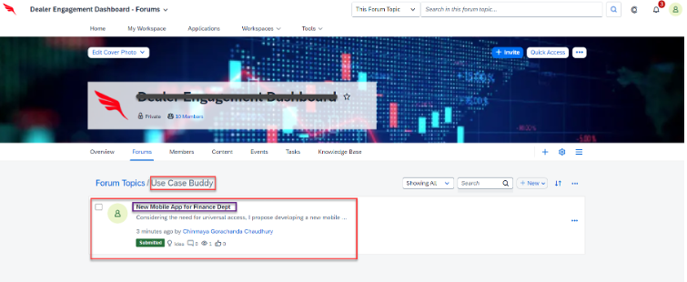

1. You can click on the **Idea Title** to navigate to the Idea detail. Where you can find various options for *Vote Up/Down* and *Comments*.

    <!-- size:500px -->
    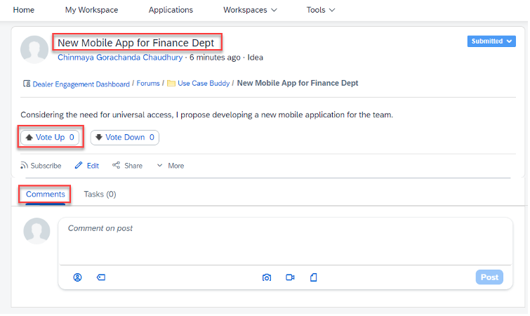

1. **Go Back to Action Editor** to Release and Publish the Action Project.

1. Click on **Release**.

    <!-- size:500px -->
    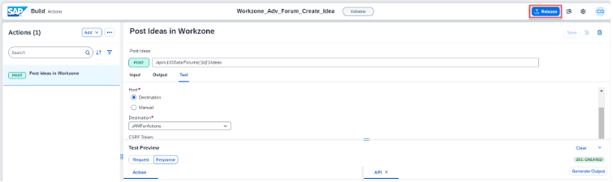
    
1. Enter Summary for Release Note. Click on Release

    <!-- size:400px -->
    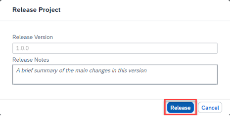

1. After Successful Release, click on **Publish to Library**.

    <!-- size:500px -->
    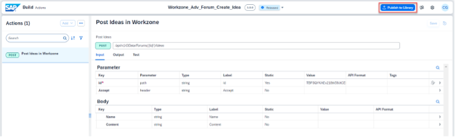

1. Click on **Publish** on Confirmation Dialog.

    <!-- size:300px -->
    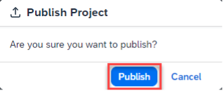

1. On successful publish, you can see the status of the Action project as **Published**.   

    >We have seen the process of creating an Action Project that can post an Idea to the Workzone Forum. With the Action Project now prepared, we can proceed to incorporate it into the SAP Build Process Automation - Process Artifact in the next steps.      