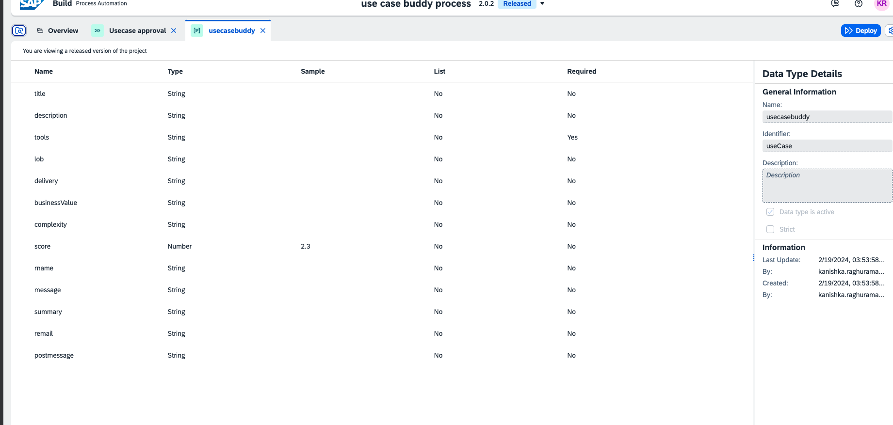
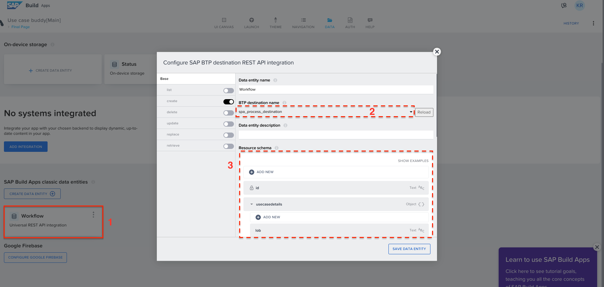
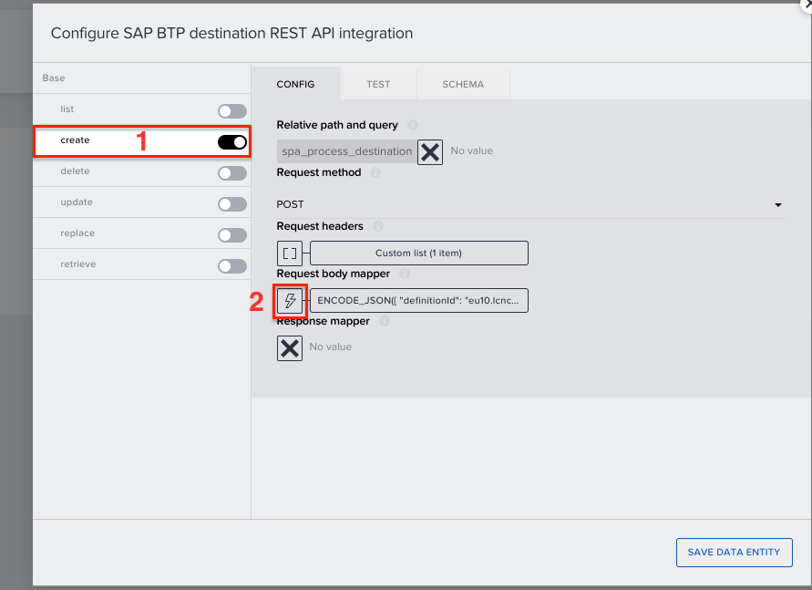

First make sure your process automation destination setup is completed. <a href="https://developers.sap.com/tutorials/spa-create-service-instance-destination.html">Process Destination setup</a>.

In the SAP Build Process Automation project, in the data type use case buddy, you can notice there are many parameters. 

In other words, these values are needed to trigger the approval process. These values are sent from SAP Build Apps through destination API. 

  
in the SAP Build Apps, check the data connection <b>Workflow</b>. 
- make sure the correct destination is selected to access SAP Build process automation. 
- The resource schema from SAP Build Apps should match the data types in SAP Build Process Automation.   

Select the <b>Create</b> tab and open the formula for <i>Request body mapper</i>.  

Using formula editor replace the destination id of your deployed process. 

Through the destinations, the SAP Build Apps, can access SAP Build Process automation service, and using the defition ID of the process, the app will be able to identify the right process. 
Now, this data connection will identify the process and deliver the values according to schema of the data type created in process automation project.

To get the definition ID, make sure your SAP Build Process automation project is deployed.  
Once deployed, go to the monitoring tab and select <b>Process and Workflows</b>.  

Search for your process, and select it. 
now copy this definition ID and use it in SAP Build Apps.  
