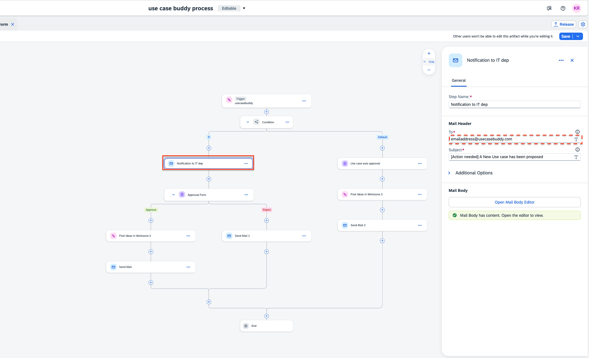
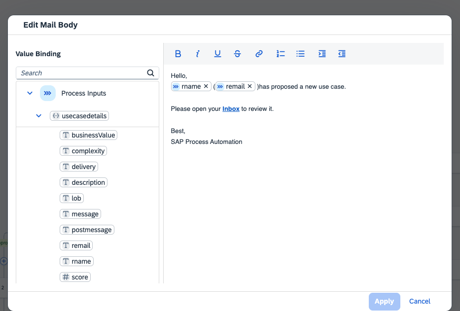

# Process Automation

To configure the setup, 

Select the email step called Notification to Build Admin and change the email adress to the Admin's email id who will reveiw the use cases.  
You can also change the body of the notification email. 

You can change the CTA link for Inbox, with the link of your Build inbox.  

Similarily you can edit the body of the other Email steps. 

