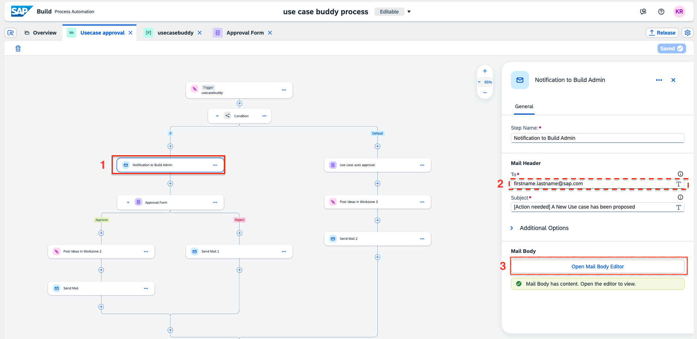

# Process Automation

To configure the setup, 

- Select the email step called Notification to Build Admin and change the email adress to the Admin's email id who will reveiw the use cases.  
You can also change the body of the notification email. 

You can change the link for Inbox with the link of your Build inbox.  

Similarily you can edit the body of the other Email steps. 

- for the configuration of the action step <b><i>Post Ideas in Build COE</b></i>, 
 make sure a destination variable is selected, if not create a destination variable and select it. 
 under <b>Run step on behalf of</b>, select the <b><i>Approval Form</b></i>  
Leave the Inputs configuraton as it is.

After all the changes, save and release your project and Deploy  

When deploying, select the destination that you created to conenct with SAP Build WorkZone. In this case it is <b>JAM_usecasebuddy</b>.  

