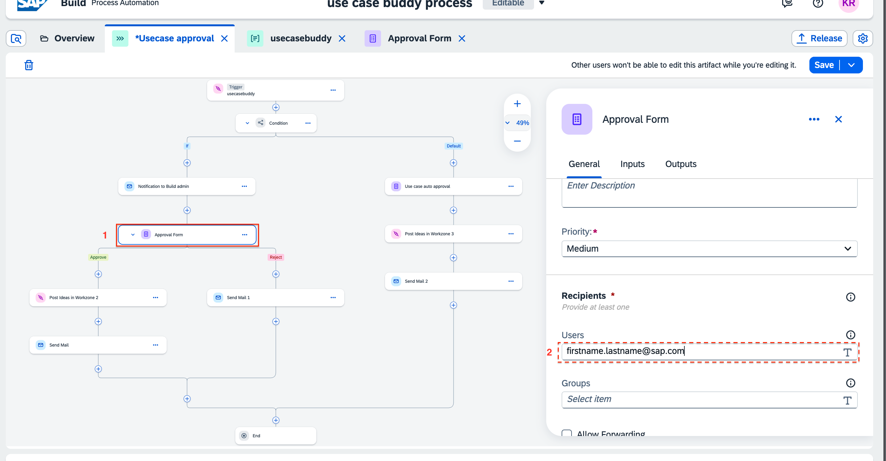

# Email configuration

The first email step in this process would be sent to the IT team/SAP build admins, who will review the use case information. An Email notification can be sent the them that a new use case idea has been submitted. 

- the email address can be entered in the email header.   

The mail body can also be edited.  <b>Please make sure to change the link of the inbox. </b>  

Similarily, email body of other email steps can be editied.

In the approval step recipients, enter the email address of Build Admin/IT admin. 

<b>Post Ideas in Build COE </b> is an action step, which will add the information in the Build COE template, (SAP Build WorkZone). 
In this step, make sure a destination variable is selected, if not create one. 
Under <b>Run step on behalf of</b>, select <b><i>Approval form</b></i>.
Leave the input parameters as it is.

After all the configuration, make sure to save it and Release it.

After release, deploy your project. 
select the destination for you created to connect with SAP Build WorkZone to define the destination variable.  
