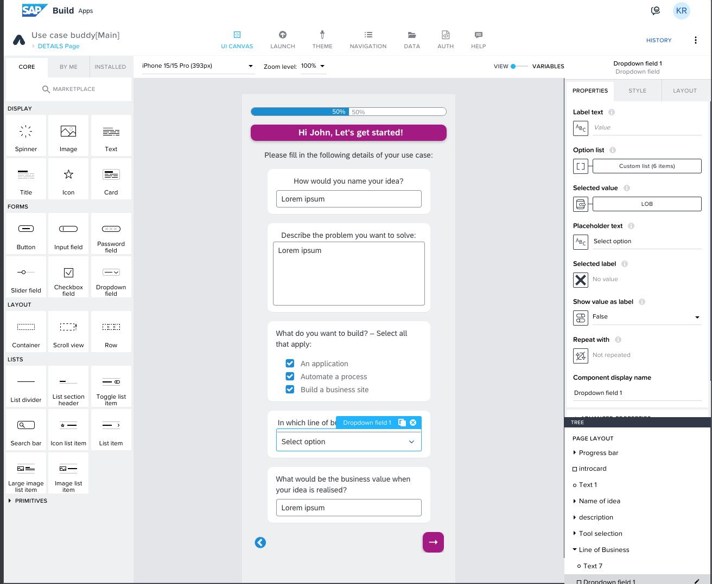
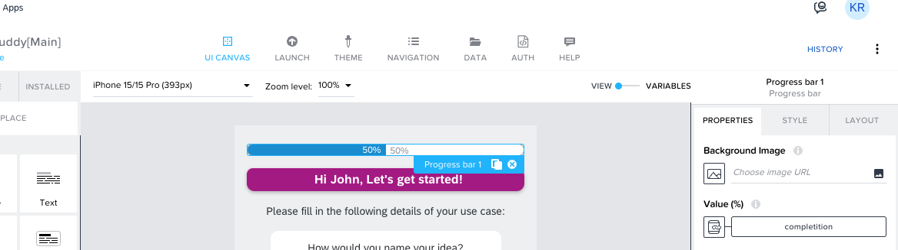
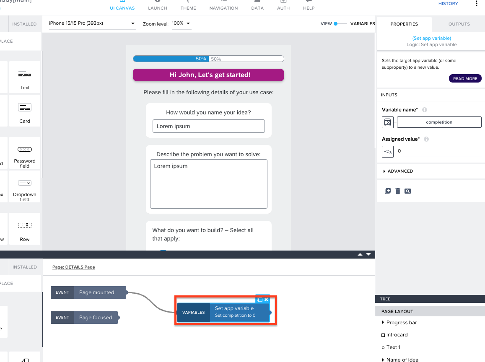
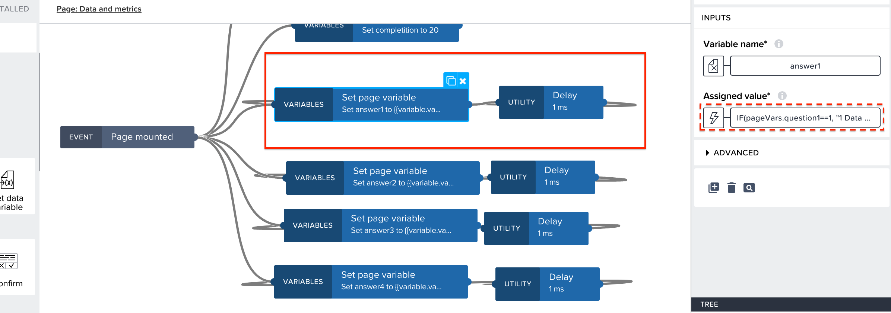
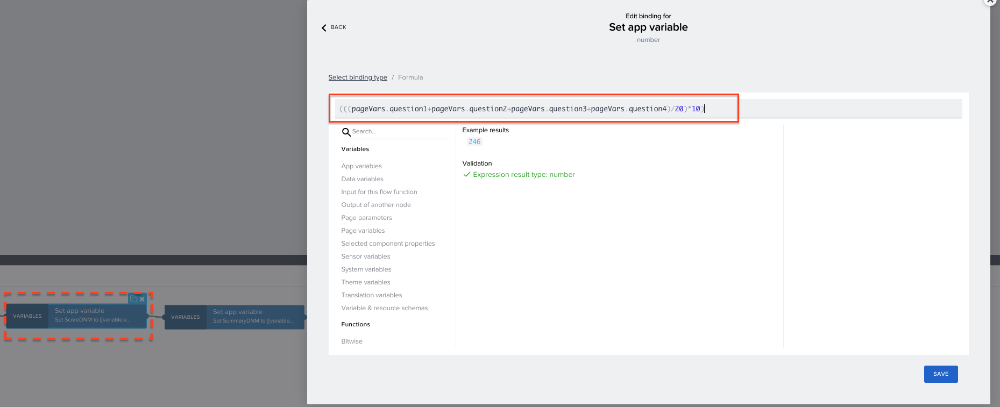
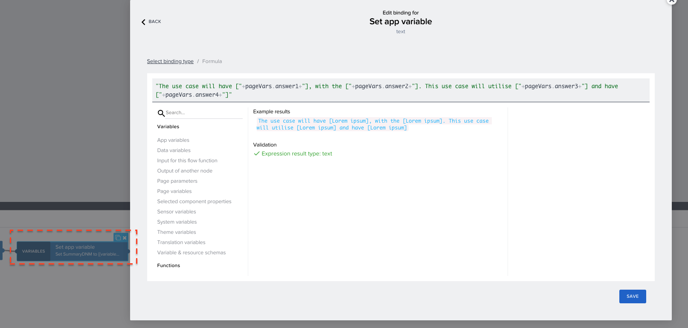
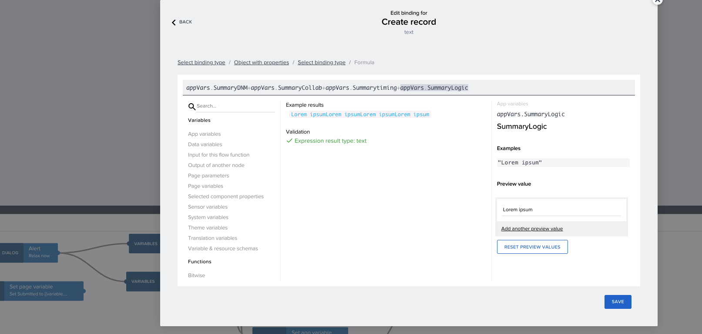

# UCB- Build Apps

# Details page (sub category). 

In the Details Page, basic information of the use case is collected, like Name, description, LoB and more. App variable has been used to collect this information.   

# Adding More Options to the "Line of Business" List

To add the more options in the list for <b><i>Line of Business</b></i>, open and binding menu for the <b>Option list</b> and add the options.

# Progress bar

A progress bar has been used in the app, to let the users track the progress of the questionnare using an app variable <i>completion</i> value.

Using <i>Set app variable</i> to assign value to progress bar, in every page to hardcode the progress based on the number of pages used.

# Creating question containers. 

Each question container will have a Title component and an Answer component.  
The questions are static, and can be changed in the properties of the component   

The Answer component will have a text component and a slider component, and have page variables answer and question binded to text and slider components respectively.  

The slider have 5 values and text component will display dynamic values based on the slider value with logic created on the page level.

The answer page variable is binded with a formula to check the slider value and show the respective option accordingly. 
for example
<pre>IF(pageVars.question1==1, "1 Data source", IF(pageVars.question1==2, "2 Data sources", IF(pageVars.question1==3, "3 Data sources", IF(pageVars.question1==4, "4 Data sources", IF(pageVars.question1==5, "not sure about the number of data resources","")))))</pre>

A delay with 1 ms is used and connected back to the same <b><i>set page variable</b></i> to make sure the value in answer page variable is updated immediately when the slider value is changed. 

Feel free to change the options and values accordingly. 

# Complexity score calculation

The complexity score is a straightforward aggregation of slider values. Each slider, ranging from 1 to 5, represents a level of difficulty (1 being easy, 5 being difficult). In our template, there are five values in each slider.

Consider a page with four questions, each with a slider having five values. The maximum complexity score for this page would be 5 values * 4 questions = 20. To make this more digestible, we calculate the average score on a 10-point scale for each page using the formula:

Averagescore=(sum of selected values/maximum value)*10

finally we aggreagate the score of all pages to calculate the overall complexity of the idea.

# Summary Generation

Similar to the score calculation, the summaries are concatinated using the page variables and some the static text in each page.  

And finally summaries from all the pages are concatinated when sending data to SAP Build Process Automation.  

