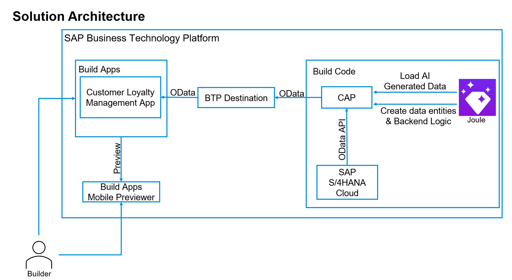

# New Era in Fusion Development: Use GenAI to create CAP Service in SAP Build Code (with Joule) + Use in SAP Build Apps

## Script Overview

### Highlights

In this tutorial, you will use GenAI capabilities of Joule to create a CAP Service with SAP Build Code. This will be the back-end service of a mobile application that will be created in SAP Build Apps.

### Goal

1. To display the power of Generative AI powered Development: Joule in SAP Build Code
-  Data Model and Service Creation
-  Sample Data
-  Application Logic

2. To demonstrate the oneclick deployment in SAP Build Code and integrate it to SAP Build Apps

3. Create UI extensions with SAP Build Apps

4. Use SAP Build Apps Mobile Preview

## [Start Exercise](../251_TA_BTP-Build_Code_Using-Joule/251-1_Build_Code.md) >
