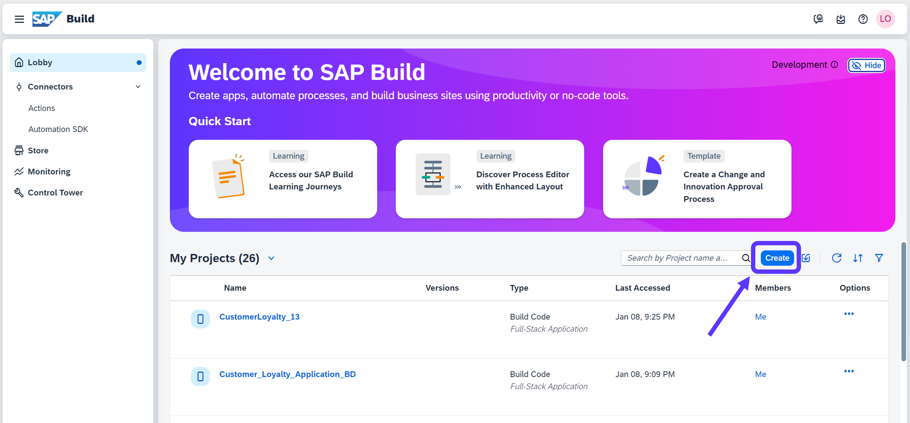
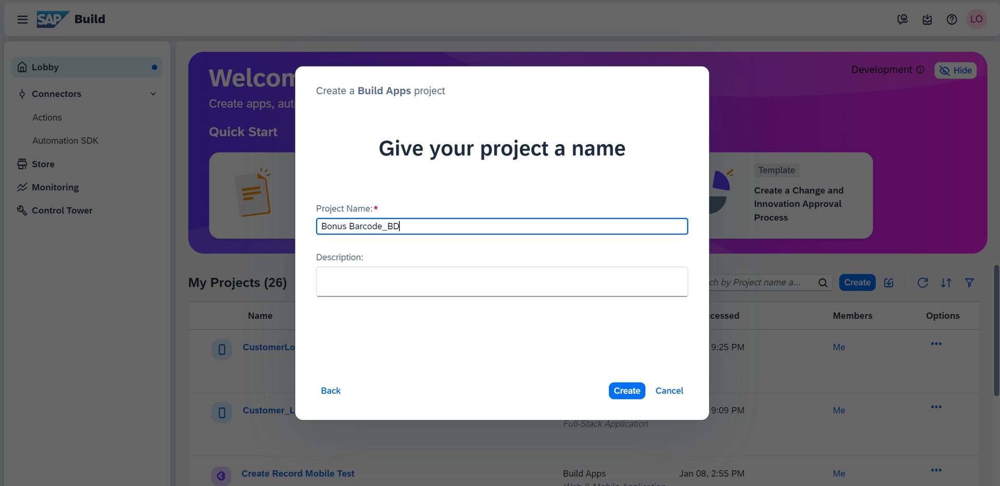
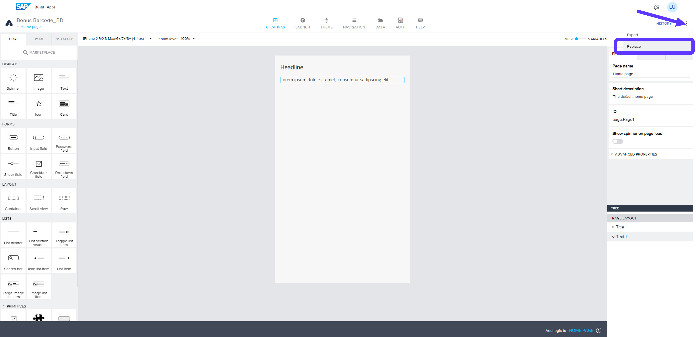
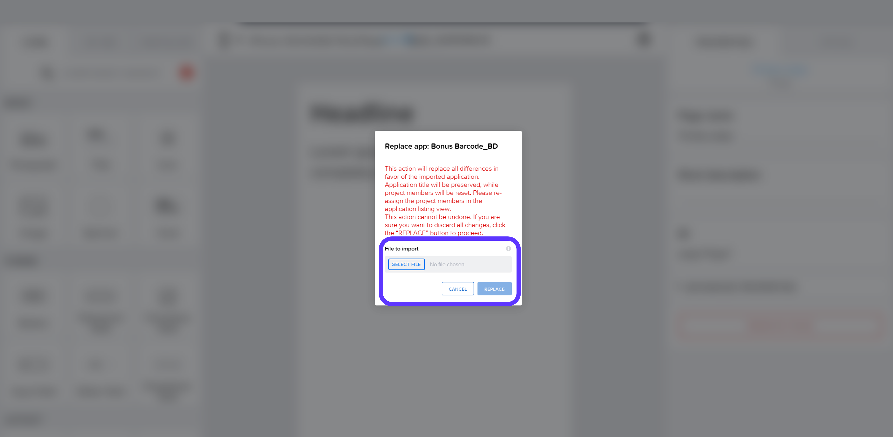

# Module 2 - Unit 2: Upload UI  

1. Create a project

2. Follow: Build an Application > SAP Build Apps > Web & Mobile Application and name your project

**Note**: you can use your initials to name your project. So that it will not be confusing for you if you are using the same lobby with outhers in a common workshop

3. Click on the 3 dots on the top right corner > Replace 

4. Import the project file below > Replace

**[Next Module 2 - Unit 3: Authentication and Data Integration](./252-3_Authentication_and_Data_Integration.md) >**
