# Module 2 - Unit 6: Preview and Test  

1. Go to Launch Tab > Open Preview portal

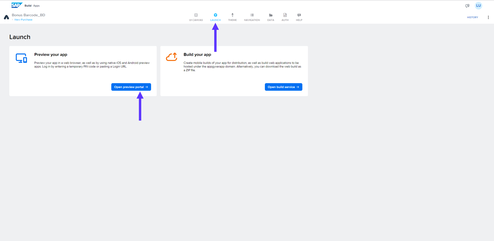

2. Download *SAP Build Apps Preview* from your mobile store

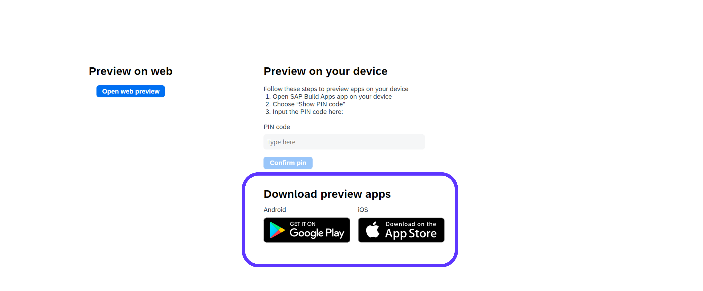

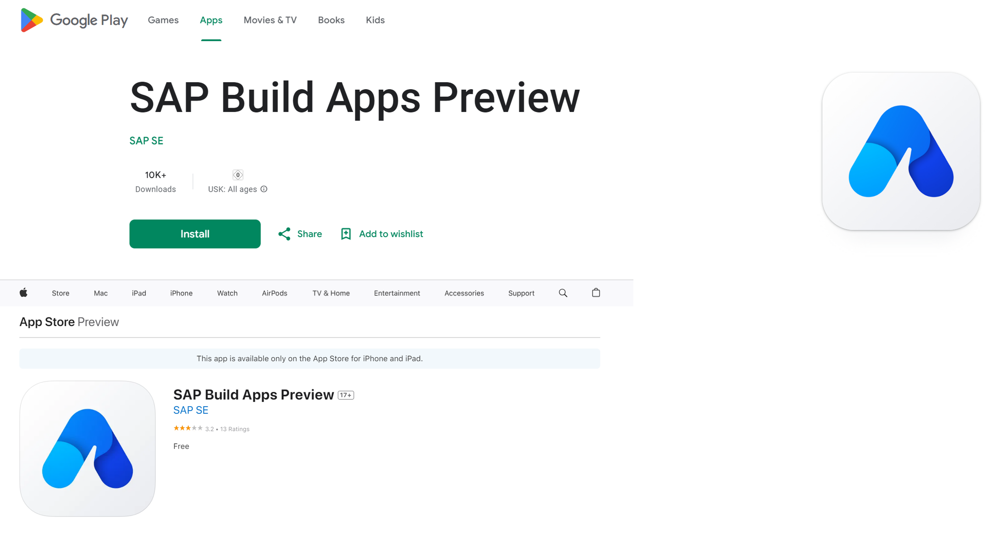

3. Launch *SAP Build Apps Preview* in your mobile device > Select SAP Build Apps

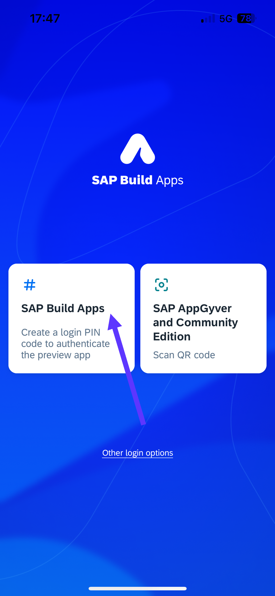

4. Note down the PIN Code here

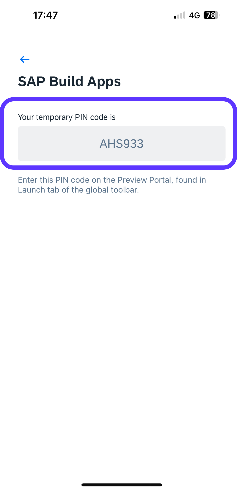

5. Use the PIN Code here 

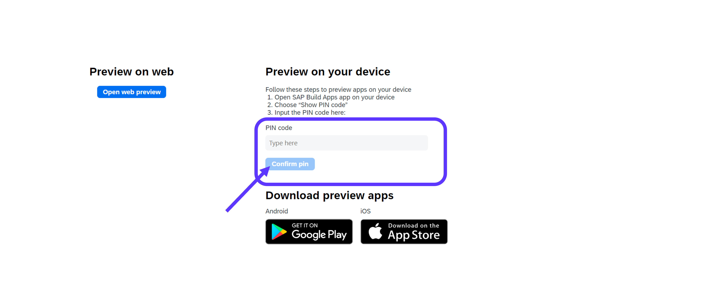

6. Mobile Previewer will show you the list of projects in your lobby > Run your app > Click on *New Purchase*

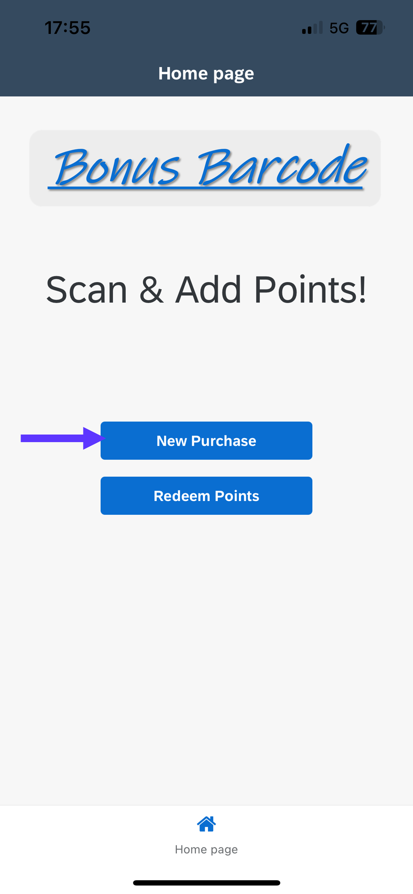

7. Scan the Customer Loyalty Card here using Barcode Scanner

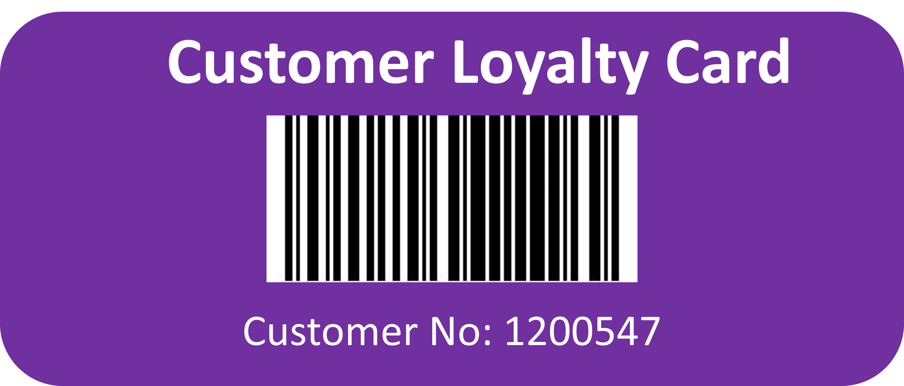

8. Select a Product from dropdown list > Add some value for the Purchase Value > Add Points!

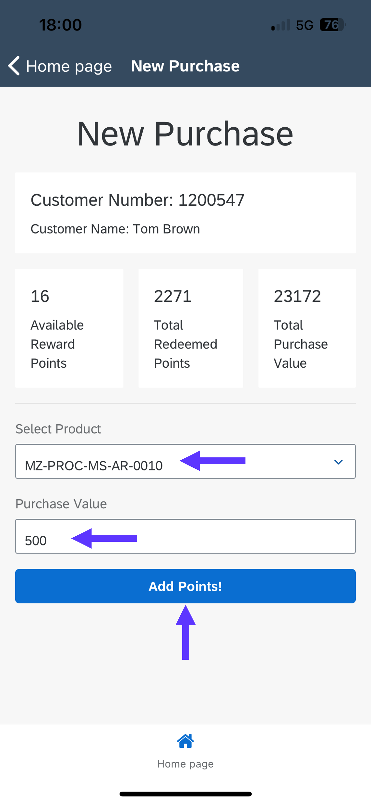

9. See the Response from the backend service

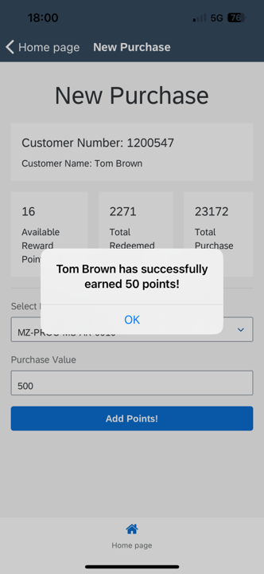

10. Go to Redeem Points > Redeem some points from the same customer and experience the flow

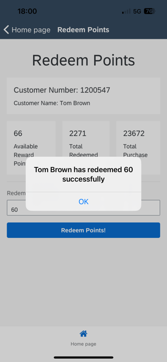

11. Go to SAP Build Apps Desing Time > Select the data entity

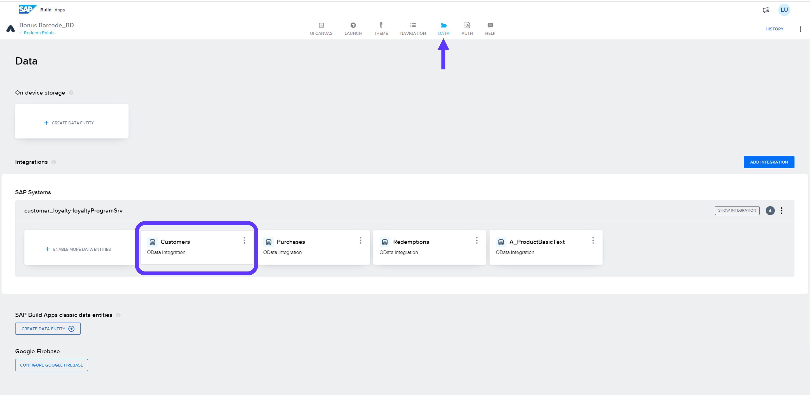

12. Browse Real Data > See the updates in your data entity 

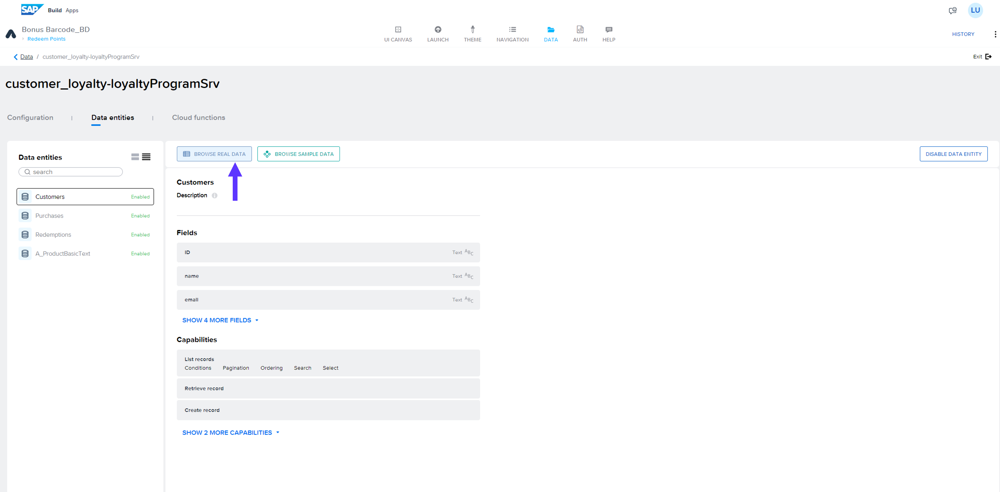