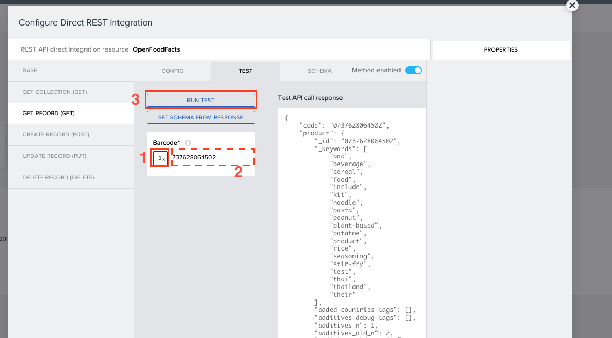
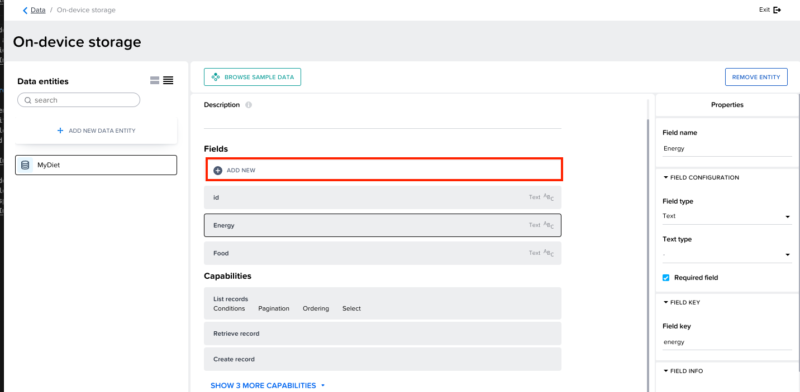

# Data connection

- Input data : Open Food Facts
- Output data : On-device storage

## Adding OpenFoodFacts.

1. Click on Data Tab to add the Data integrations.  

2. Luckily, the Build App developers has made this open food facts integration as template.  
Click on <b>CREATE DATA ENTITY</b> and select <b>Marketplace search</b>.  

3. Select OpenFoodFacts data integration here.
  

4. Install it.  

5. Now select the integration. 
   Open <b>Get Record</b>. 
   Select barcode <b>URL Parameter</b> and change the value type to <b>Number</b>.  

6. Change the binding type to Static number and enter the following value <i>737628064502</i> and run the test.  

7. SET SCHEMA from the response. 

8. Click on SAVE DATA ENTITY.
.

## Adding On-Device storage.

1. Click on <b>CREATE DATA ENTITY</b>.  

2. Give a name to your Data Enity and click on ADD.   

3. Select the <b>ID</b> under fields and rename it to <b>food</b>. 

4. Add another field and name it as <b>energy</b>.  You can also more fields if you want to track more facts about the food.(Ex, Sugar levels, protiens etc.,)   

## Create Data Variables. 

- Open your UI Canvas.  
- Switch to variables view 
- Select Data Variables. 
- Add Data Variable 
 

- Under variable type select single data record. 
- Below in the logic composer, select all the logic and remove them by using either backspace key or delete key on your keyboard.  

