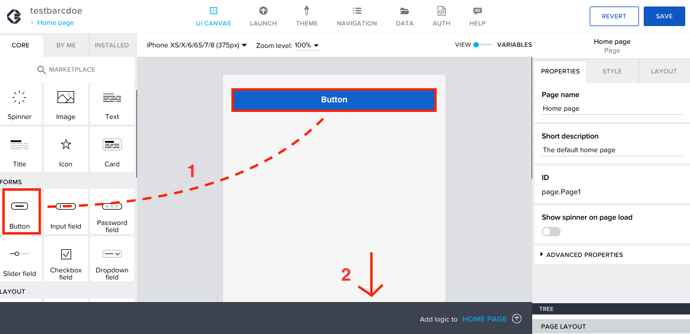

# Logic for Open Food facts

1. Now select the Button component and then click anywhere on the Grey tab below to add a logic for the button.  

2. In the logic component, under Device you can find <b><i>Scan QR/barcode component</b></i>. Drag and drop the <b>QR component</b> to the logic canvas.  

3. Now connect the nodes.  

4. Now Drag and drop <b><i>Get Record</b></i> logic component.  

5. Connect the <b>Get record</b> and <b>Scan QR/barcode</b> nodes.  Now select <b>Get record</b> component and click on <b>ABC</b> icon under Barcode to open the binding menu for the Get record.  

6. Select <b>Output value of another node</b>.  

7. Under <i>select logic node</i>, select <b>Scan QR/barcode</b>.   
Under <i>select node output</i>, select <b>Scan QR/barcode / QR barcode content</b>. 
Now click on <b>SAVE</b>.  

8. Now drag and drop <b>Set data variable component</b> to the logic canvas and connect it with <b>Get record</b>  node.  

9. Now select the <b>Set data variable</b> component. Click on the <b>{&ensp;}</b> icon under data to open the binding menu for the logic component.  

10. Select <b>Output value of another node</b>.  

11. Under <i>Select logic node</i>, select <b>Get record</b>  
Under <i>select node output</i>, select <b>Record</b>  
Now click on <b>SAVE</b>.  

# Logic for On-Device storage

1. Add another button to your canvas and open the logic composer for the button.  

2. Add <b>Create record</b> logic to composer and connect it with Component tap node. 
under the properties we configure where to create the data. Reveiw the Resource name once if it is your On-Device storage. 
Open the binding menu.  

3. In the binding menu select <b>Object with properties</b>, and you can see the fields that will be tracked. bind the appropriate values.  
For example, open the binding menu for the Food value and open the formula.  

4. In the previous logic for openfoodfacts, we saved the response to the data variable. We need to save the response from the openfoodfacts to the tracker so, we will now call the data variable using the formula bar. 
  
Select the <b>Data variables</b>, and now scroll down to find the property <i>product.product_name</i> and double click on it and <b>SAVE</b>  
 
or
enter the formula directly.

<pre>data.OpenFoodFacts1.product.product_name</pre>

Observing the formula you will understand the nomeclature of the formula. The above formula instructs to call data variable openfoodfacts' product name from the product information. you can also start typing the formula and you will get suggestions which will be helpful.

{Optional}

As a preference I would also want to save the brand of the food, so I will add the below formula
<pre>data.OpenFoodFacts1.product.brands+" "+data.OpenFoodFacts1.product.product_name</pre>
you can also preview how the result will look like below.   

5. Similarily open the binding menu for the energy and use the below formula. 

For Kcal 
<pre>data.OpenFoodFacts1.product.nutriments["energy-kcal_value"]+" kcal"</pre>

For kJ
<pre>data.OpenFoodFacts1.product.nutriments.energy+" kJ"</pre>

6. If you have more fields, like fat, sugar etc.,
you can use <i>data.OpenFoodFacts1.product.nutriments.</i> and select the values you would like to use. 

