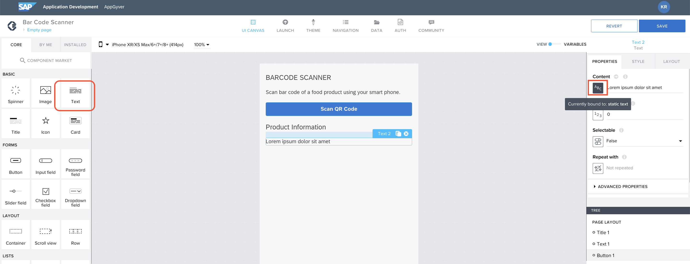
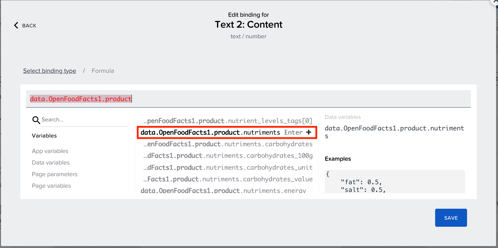

Previous Step : <a href="https://github.com/SAP-samples/build-apps/blob/main/Workshops/front-end-applications/Bar-code-scanner-app/04%20Create%20Logic/Readme.md"> 04 Create Logic</a>

# Add New Component

1. Drag and drop <b>Title component</b> to UI canvas and change the content to “<b><i>Product Information</b></i>”.<br><br>
  

2. Drag and drop a <b>Text component</b> to UI canvas and click on <b>ABC</b> icon to open the Binding menu. <br><br>


3. Select <b>Formula</b>. <br><br>


4. Open formula editor. <br><br>


5. Clear the formula editor. <br>Now select <b>Data Variable</b>. A list of available data variables will be displayed, now select <i><b>data.OpenFoodFacts1</i></b> and click on the <b>Enter+</b> icon.  <br><br>


6. Now a list of values available under <b>data.OpenFoodFacts1</b> appears. Now select <b>data.OpenFoodFacts1.product</b> and click on the <b>Enter+</b> icon to include it in the formula.<br><br>


7. A big list of values under <b>data.OpenFoodFacts1.product</b> will be shown. Scroll down to <b>data.OpenFoodFacts1.product.nutriments</b> and click on the <b>Enter+</b> icon to include it in the formula. <br>If you are not able to find it, type ``` .nutriments``` after <b>data.OpenFoodFacts1.product</b> in the formula editor. <br><br>



8. Under <b>data.OpenFoodFacts1.product.nutriments</b>, a big list of values will be displayed. Here you can select what value you want your app to show. To display the energy per 100g select <b>data.OpenFoodFacts1.product.nutriments.energy_100g</b> and click on the <b>Enter+</b>. <br><br>


9.{Optional} Or you can simply enter this formula : <pre> "Energy(kJ per 100g) : "+data.OpenFoodFacts1.product.nutriments.energy_100g
</pre>

&emsp;&emsp;click on Save


10. Click on <b>Save</b> to save the changes made to the application.


Now it's time to see how your app works!!

Next Step: <a href="https://github.com/KanishkaRaghuraman/Bar-Code-Scanner-App/blob/main/06%20Preview%20the%20App/Readme.md"> 06 Preview App</a>.
