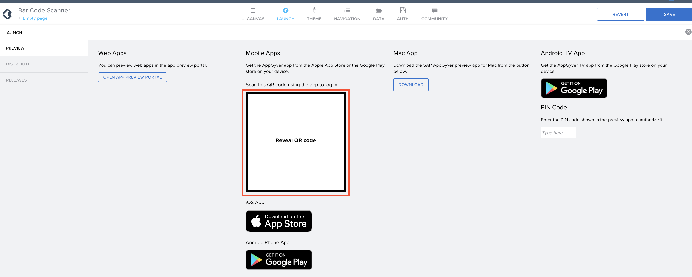
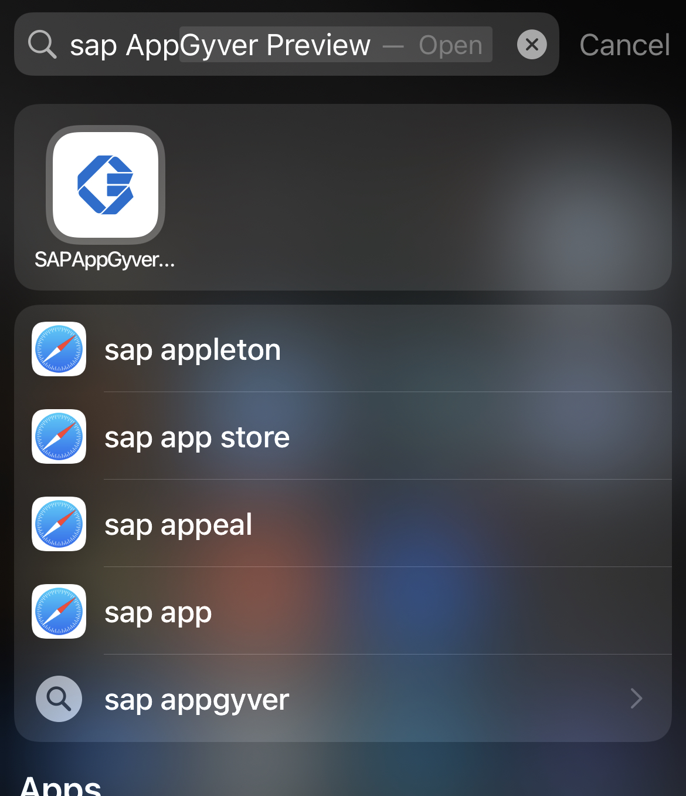
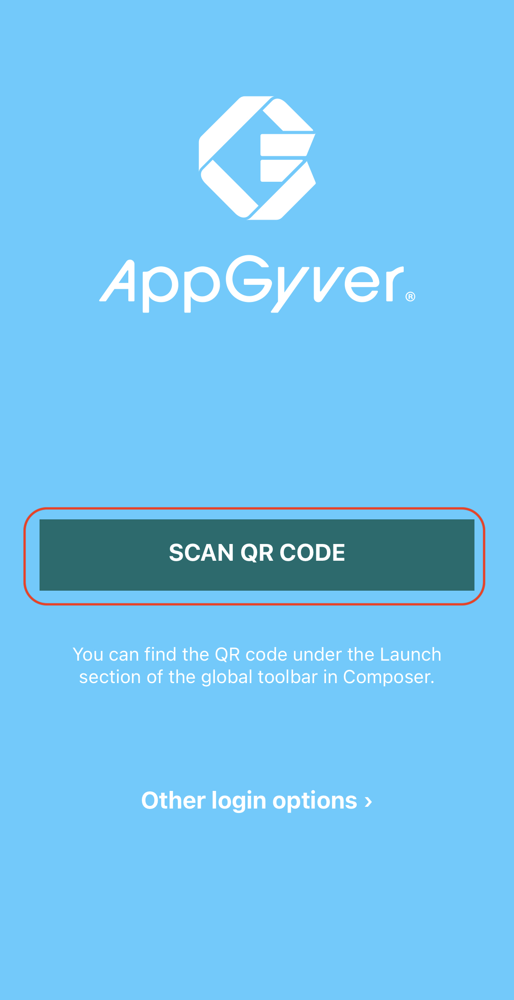
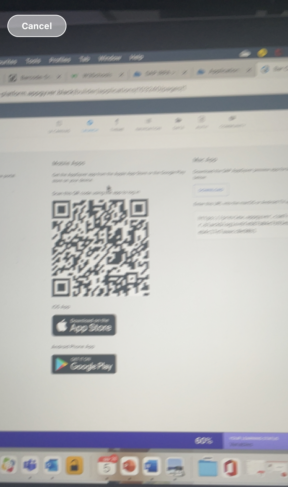
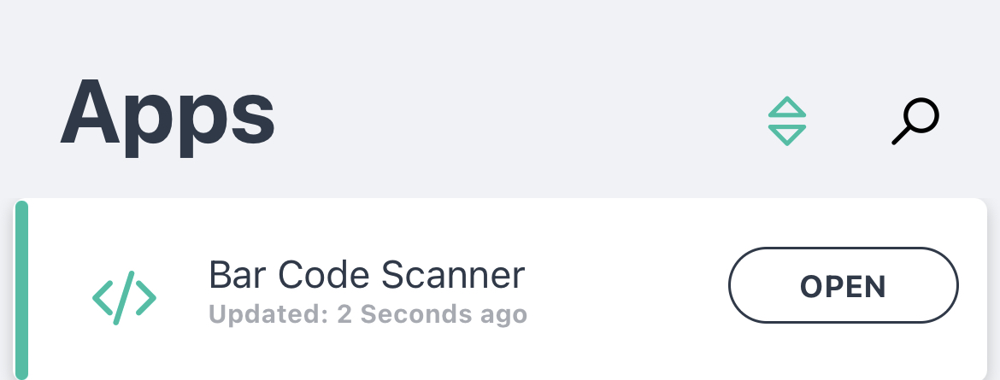
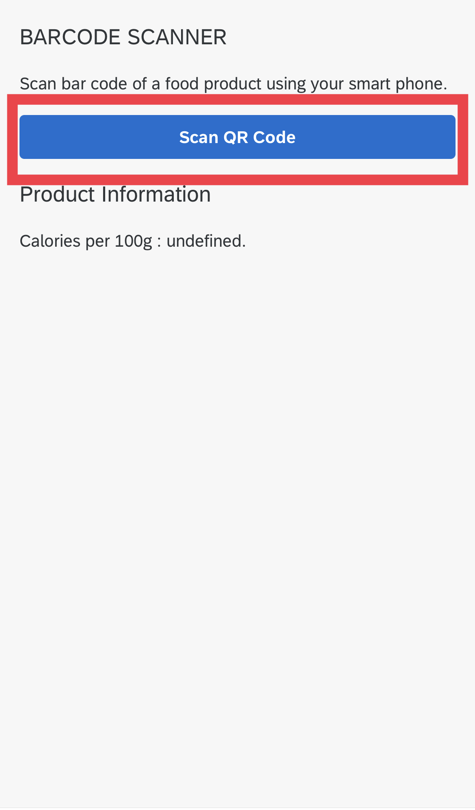
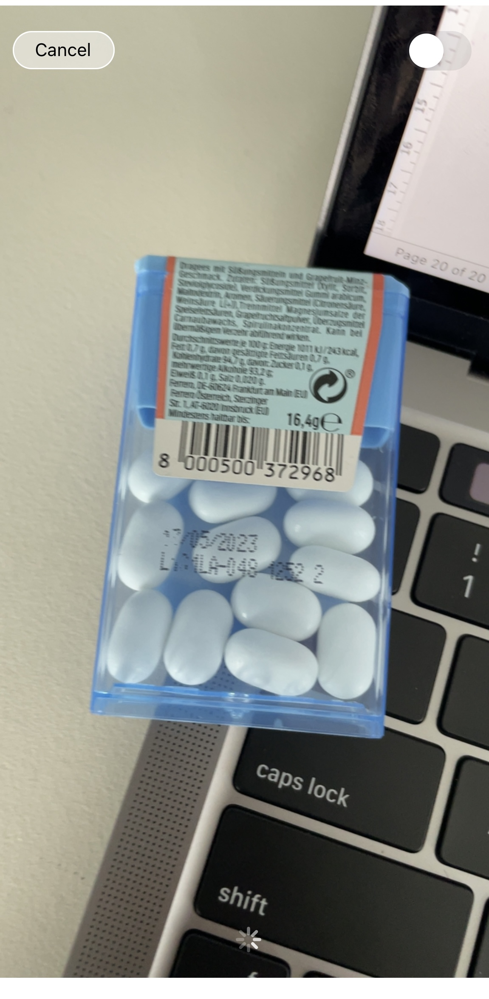
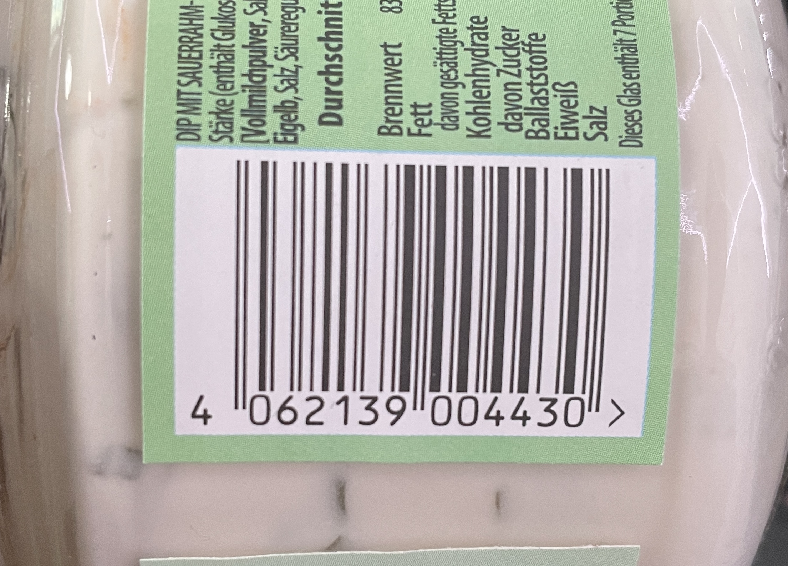
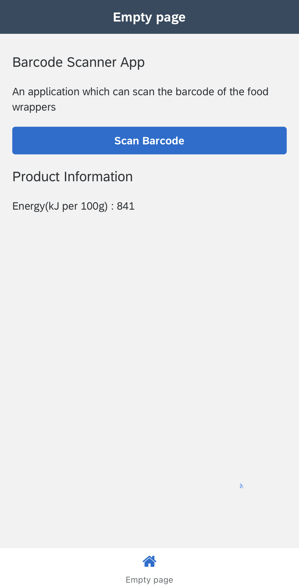

Previous Step: <a href="https://github.com/SAP-samples/sap-build-apps/blob/main/Workshops/front-end-applications/Bar-code-scanner-app/05%20Add%20New%20Component/Readme.md"> 05 Add New Component</a>

# Preview the App

1. Click on the <b>Launch</b> tab on the top.  

2. Click on <b>Reveal QR code</b>.  

3. In your mobile device, open <b><i>SAP AppGyver Preview</b></i> app.  

4. Select <b>Scan QR Code</b>.  

5. Scan the QR on your Computer screen.  

6. Now your <b>SAP Appgyver Preview</b> app is connected to <b>AppGyver Composer Pro</b>. 
  select the project you created.  
  
  
  
 7. Now click on <i>Scan BarCode</i> button in your application.  
 

  
 8. Now, take any Snack or food item with a QR code and scan it with your phone.  
 
if you do not have a Snack with Barcode nearby, you can scan the below bardcode to check your App.  

9. Now you can see the calories of that food. 
   <b>Voilaa!!</b>  
   Congrats on building your first <i>no-code</i> app.
   
 

<b>Option step : <a href="https://github.com/SAP-samples/build-apps-enablement/blob/main/Workshops/front-end-applications/Bar-code-scanner-app/07%20Diet%20Tracker%20Extension/readme.md">Diet tracker Extenstion</a>
