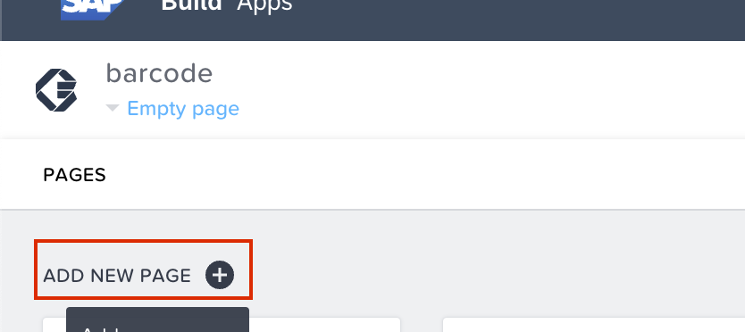

# Diet Tracker Extesnsion (Optional)

Now, as an optional step we can extend your barcord scanner app to a diet tracker by exploring on-device storage capabilities of Build Apps.

1. Open <b>Data</b> tab and select <b>CREATE DATA ENTITY</b> under <b>On-Device storage</b>.  

2. Give a name to the on-device storage enity and click on <b>ADD</b>.  

3. In the newly created Data entity, add a Data Enities to save your data from application.  
Click on <b>ADD NEW DATA ENTITY</b>. 
In the Field name enter "<i>food</i>", select <b>ABC text</b> as Field type.   

4. Similarily, Add another data entity and name it as "<i>energy</i>" and select its field type as <b>123 Number</b>.  

5. Click on <b>SAVE</b> and go back to the <b>UI Canvas</b>.  

6. Add a <b>button</b> component to your UI and rename it as "<i>Add to my Diet</i>".

7. Open Logic composer for the button.  
select the button and tap on the gray bar on the bottom of the screen.  
Add <b>Create record</b> logic to composer and connect it with <b>Component tap</b> node.

8. Select the <b>Create record</b> node on your composer to open its properties. 
By default your on-device data entity will be selected as data source. 
Open the <b>binding menu</b> under <b>Record</b> in the properties.   

9. Select <b> Object with properties</b>.  

10. Now the values need to be binded to the Data entities of your on-device storage.  
Open the binding menu and select Formula  

11. Now enter the follwing formula <PRE>data.OpenFoodFacts1.product.brands </PRE> which will save the brand your barcode scanned. click on save.  

12. Similarily, bind the following value for <b>energy</b> data enity using <b>formula</b> binding <pre>data.OpenFoodFacts1.product.nutriments.energy_100g</pre>
Click on save.  

13. Now, Click on <b>SAVE</b>  

14. Add a <b> Card</b> component to your UI.  

15. Change the title of the card to "<i> Tap to view your Diet</i>" and bind the content value with the following formula. <pre>SUM_BY_KEY(data.tracker1, "energy")+" KJ"</pre>

16. Now we need to create a new page. To create a new page click on the page name on top left.  

17. Click on <b>ADD NEW PAGE</b>.  

18. Call the new page as "<i>diet</i>".  

19. Now open the <b>MARKETPLACE</b> of component library.  

20. Search for "<i>table</i>" and select <b>Basic table with data adapter</b>.  

21. Open the <b>INSTALLED</b> tab of your component library, and the newly installed <b>Basic table with adapter</b> to your UI Canvas.  

22. In the properties of the table component open the <b>Configure</b> menu under <b>Table resource</b>.   

23. Select your On-device storage entity, i.e., <b>tracker</b>.  

24. Make sure <b>food ,energy</b> data enity fields are selected.  
Click on <b>SAVE AND EXIT</b>.  

25. Now, SAVE the changes and go back to the main page.  

26. open the logic composer for your card component, and add a logic <b>Open page</b>.  
make sure <b>diet</b> page is selected in the properties of Open page logic node.

# Congratulations your barcode scanner is a diet tracker now, preview your app to see how it works!!!