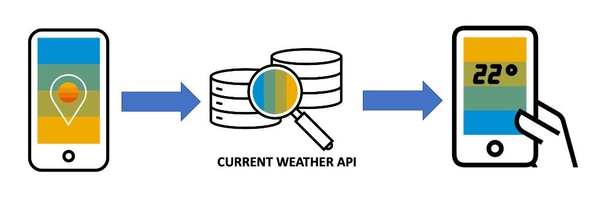

# Weather App

A step-by-step guide to create a weather app using SAP Build Apps

In this exercise you will learn how to create a no-code application using the SAP Build Apps tool on SAP BTP. The application you create will enable you to get weather information of your location using current weather API. To do this, you will need to download the 'SAP Build Apps Preview' app/‘AppGyver Preview' app (available through AppStore and Google Play store) and sign up for an account using the same email address that your SAP BTP account uses.

All applications are created, edited, and managed within what we call a project, with one application created per project. Projects, and their related applications, are not automatically saved in this service, so care should be taken before closing a browser.

